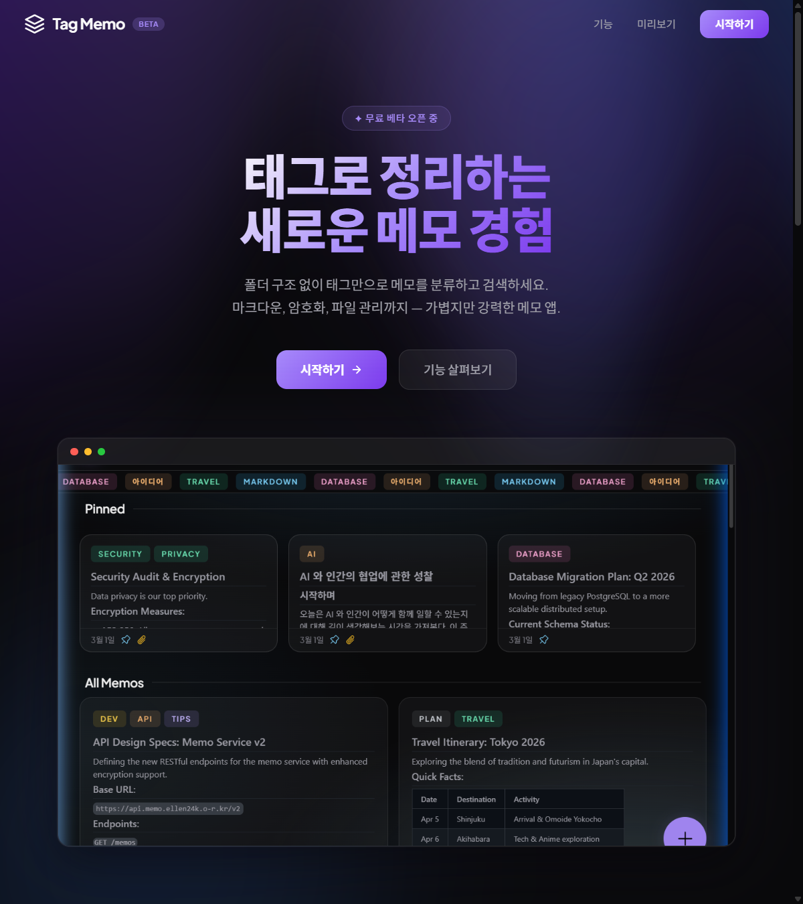


https://github.com/user-attachments/assets/5243cf21-3acd-489f-abef-23ccf5ce481b


---

<details open>
<summary><b>목차 (Table of Contents)</b></summary>

- [기능 소개](#기능-소개)
- [인프라 및 기술 스택](#인프라-및-기술-스택)
  - [시스템 인프라 구성도](#시스템-인프라-구성도)
  - [기술 스택](#기술-스택)
  - [배포 아키텍처](#배포-아키텍처)
  - [Nexus Repository](#nexus-repository)
- [주요 기술 및 구현 사항](#주요-기술-및-구현-사항)
  - [인증 처리](#인증-처리)
  - [암호화 처리](#암호화-처리)
  - [파일 저장 전략](#파일-저장-전략)
  - [태그 시스템](#태그-시스템)
  - [에러 처리 체계](#에러-처리-체계)
  - [커스텀 라이브러리](#커스텀-라이브러리)
- [소프트웨어 아키텍처](#소프트웨어-아키텍처)
  - [프론트엔드 아키텍처](#프론트엔드-아키텍처)
  - [백엔드 아키텍처](#백엔드-아키텍처)
- [데이터베이스 및 API](#데이터베이스-및-api)
  - [데이터베이스](#데이터베이스)
  - [API 엔드포인트](#api-엔드포인트)
- [운영 및 모니터링 환경](#운영-및-모니터링-환경)
- [상세 문서 모음](#상세-문서-모음)

</details>

---

## 기능 소개

### 홈

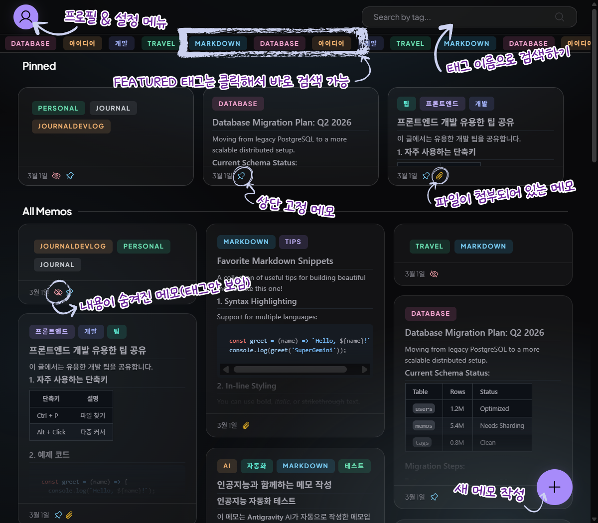

---

### 메모 작성

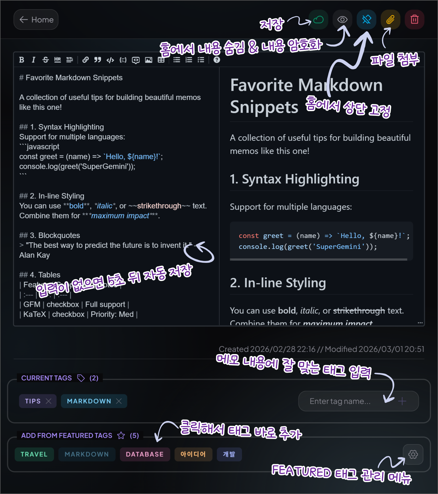

---

### 파일 첨부

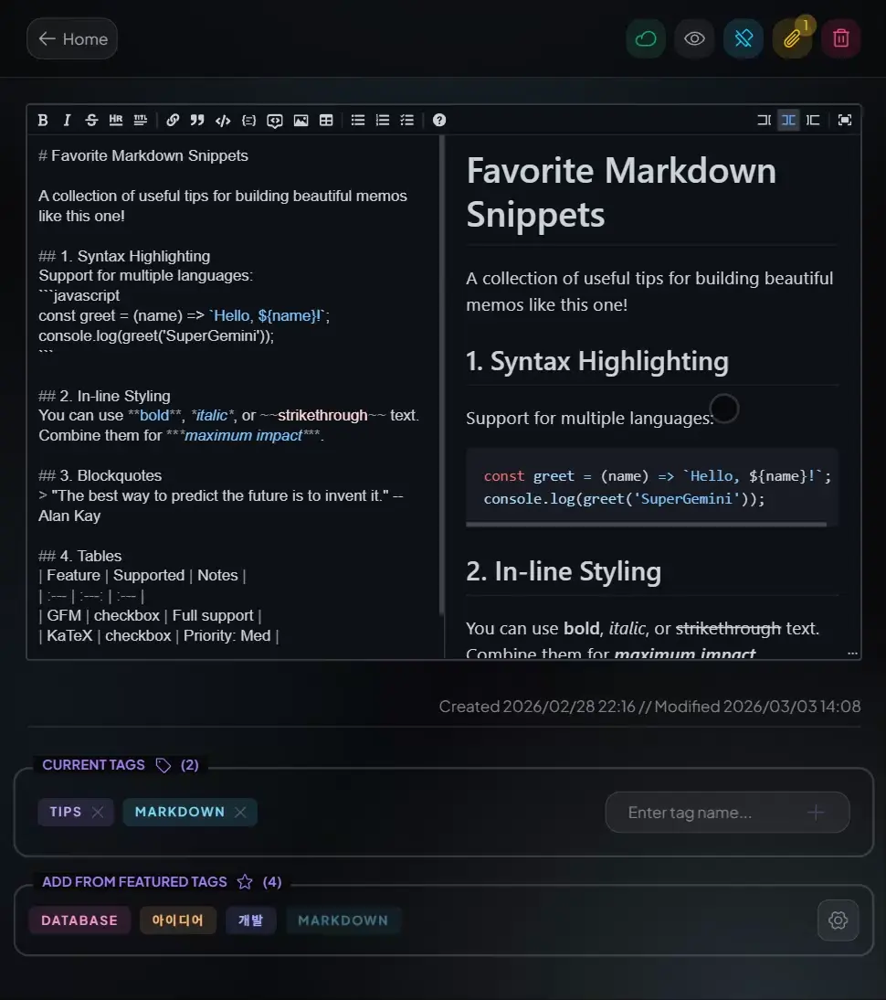


---

### 태그 시스템


### 그 외 기능
- Markdown 에디터 기본 모드 설정(live preview / edit)
- 로그인 만료 3분 전 자동 알림

---

## 인프라 및 기술 스택

### 시스템 인프라 구성도

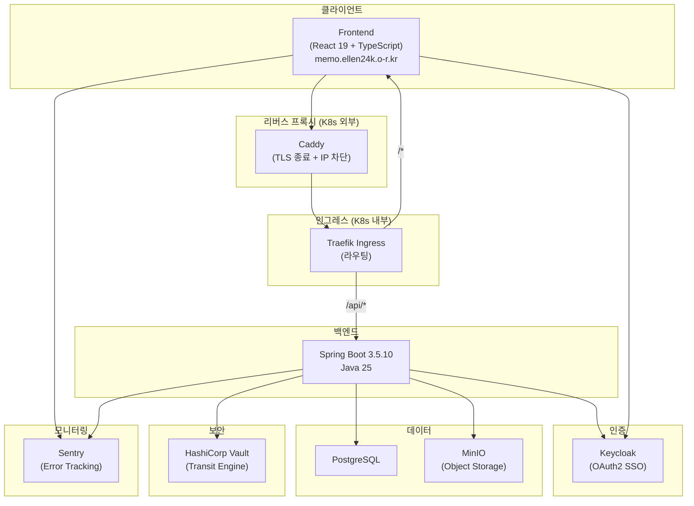
```mermaid
graph TB
    subgraph "클라이언트"
        Frontend["Frontend<br/>(React 19 + TypeScript)<br/>memo.ellen24k.o-r.kr"]
    end

    subgraph "리버스 프록시 (K8s 외부)"
        Caddy["Caddy<br/>(TLS 종료 + IP 차단)"]
    end

    subgraph "인그레스 (K8s 내부)"
        Traefik["Traefik Ingress<br/>(라우팅)"]
    end

    subgraph "백엔드"
        Boot["Spring Boot 3.5.10<br/>Java 25"]
    end

    subgraph "인증"
        Keycloak["Keycloak<br/>(OAuth2 SSO)"]
    end

    subgraph "데이터"
        PG["PostgreSQL"]
        MinIO["MinIO<br/>(Object Storage)"]
    end

    subgraph "보안"
        Vault["HashiCorp Vault<br/>(Transit Engine)"]
    end

    subgraph "모니터링"
        Sentry["Sentry<br/>(Error Tracking)"]
    end

    Frontend --> Sentry
    Frontend --> Caddy
    Caddy --> Traefik
    Traefik -->|"/api/*"| Boot
    Traefik -->|"/*"| Frontend
    Boot --> PG
    Boot --> MinIO
    Boot --> Vault
    Boot --> Sentry
    Boot --> Keycloak
    Frontend --> Keycloak
```

### 기술 스택

| 항목 | Backend | Frontend |
|---|---|---|
| **프레임워크** | Spring Boot 3.5.10 / Java 25 | React 19 + TypeScript |
| **빌드 도구** | Gradle | Vite 6 |
| **데이터베이스** | PostgreSQL | — |
| **파일 스토리지** | MinIO | — |
| **상태 관리** | — | TanStack React Query |
| **HTTP 클라이언트** | — | Axios |
| **인증** | Keycloak | Keycloak |
| **암호화** | HashiCorp Vault Transit Engine | — |
| **에러 트래킹** | Sentry | Sentry |
| **배포** | Docker → K8s | Docker (Nginx) → K8s |

### 배포 아키텍처

#### Docker 멀티스테이지 빌드

| | Backend | Frontend |
|---|---|---|
| **Builder** | `gradle:9-jdk25` → `bootJar -Pprod` | `node:20-alpine` → `npm run build` |
| **Runtime** | `eclipse-temurin:25-jre` | `nginx:alpine` |

#### Kubernetes

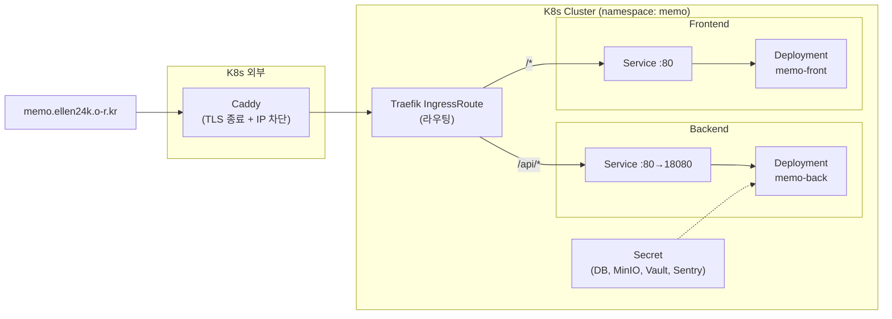
```mermaid
graph LR
    subgraph "K8s 외부"
        Caddy["Caddy<br/>(TLS 종료 + IP 차단)"]
    end

    subgraph "K8s Cluster (namespace: memo)"
        ING["Traefik IngressRoute<br/>(라우팅)"]

        subgraph "Backend"
            DEPLOY_B["Deployment<br/>memo-back"]
            SVC_B["Service :80→18080"]
        end

        subgraph "Frontend"
            DEPLOY_F["Deployment<br/>memo-front"]
            SVC_F["Service :80"]
        end

        SEC["Secret<br/>(DB, MinIO, Vault, Sentry)"]
    end

    Client["memo.ellen24k.o-r.kr"] --> Caddy --> ING
    ING -->|"/api/*"| SVC_B --> DEPLOY_B
    ING -->|"/*"| SVC_F --> DEPLOY_F
    SEC -.-> DEPLOY_B
```

### Nexus Repository

> Nexus Repository Manager가 **Docker · Maven · npm** 세 가지 형식의 패키지를 통합 관리한다.  
> 자체 개발한 라이브러리와 애플리케이션 이미지가 모두 Nexus를 경유하여 배포된다.

#### 전체 구성도

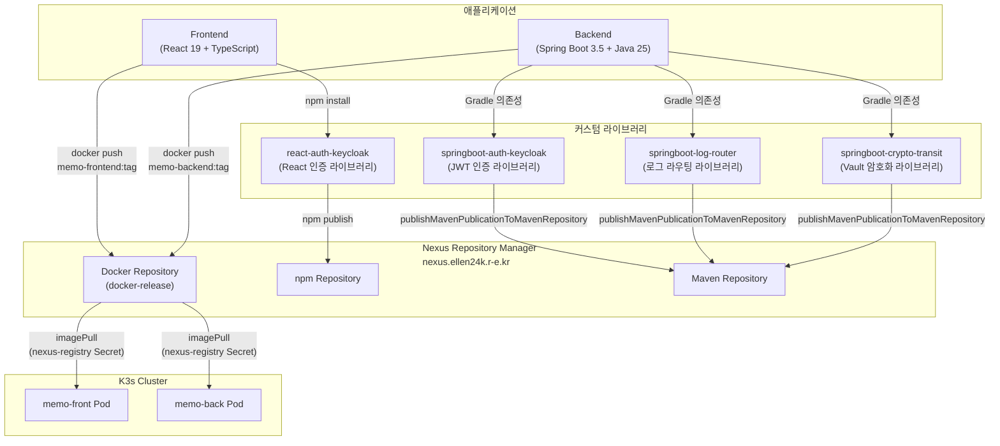
```mermaid
graph TB
    subgraph APPS["애플리케이션"]
        FE["Frontend<br/>(React 19 + TypeScript)"]
        BE["Backend<br/>(Spring Boot 3.5 + Java 25)"]
    end

    subgraph LIBS["커스텀 라이브러리"]
        RAK["react-auth-keycloak<br/>(React 인증 라이브러리)"]
        SAK["springboot-auth-keycloak<br/>(JWT 인증 라이브러리)"]
        SLR["springboot-log-router<br/>(로그 라우팅 라이브러리)"]
        SCT["springboot-crypto-transit<br/>(Vault 암호화 라이브러리)"]
    end

    subgraph NEXUS["Nexus Repository Manager<br />nexus.ellen24k.r-e.kr"]
        DOCKER_REPO["Docker Repository<br/>(docker-release)"]
        NPM_REPO["npm Repository"]
        MAVEN_REPO["Maven Repository"]
    end

    subgraph K3S["K3s Cluster<br/>"]
        FE_POD["memo-front Pod"]
        BE_POD["memo-back Pod"]
    end

    FE -->|"npm install"| RAK
    BE -->|"Gradle 의존성"| SAK
    BE -->|"Gradle 의존성"| SLR
    BE -->|"Gradle 의존성"| SCT

    RAK -->|"npm publish"| NPM_REPO
    SAK -->|"publishMavenPublicationToMavenRepository"| MAVEN_REPO
    SLR -->|"publishMavenPublicationToMavenRepository"| MAVEN_REPO
    SCT -->|"publishMavenPublicationToMavenRepository"| MAVEN_REPO

    FE -->|"docker push<br/>memo-frontend:tag"| DOCKER_REPO
    BE -->|"docker push<br/>memo-backend:tag"| DOCKER_REPO

    DOCKER_REPO -->|"imagePull<br/>(nexus-registry Secret)"| FE_POD
    DOCKER_REPO -->|"imagePull<br/>(nexus-registry Secret)"| BE_POD
```

#### Docker Repository (`docker-release`)

애플리케이션 Docker 이미지를 저장하고, K3s 클러스터가 배포 시 이미지를 Pull한다.

| 이미지 | 빌드 방식 | Runtime |
|---|---|---|
| `memo-frontend:tag` | `node:20-alpine` → `nginx:alpine` | Nginx (정적 파일 서빙) |
| `memo-backend:tag` | `gradle:9-jdk25` → `eclipse-temurin:25-jre` | Spring Boot JAR |

#### npm Repository

Frontend 전용 커스텀 React 라이브러리를 배포한다.

| 패키지 | 사용처 | 핵심 기능 |
|---|---|---|
| `react-auth-keycloak` | Frontend | `AuthProvider`, `useAuth`, `useRoles`, PKCE S256 |

#### Maven Repository

Backend 전용 커스텀 Spring Boot Starter 라이브러리를 배포한다.

| 패키지 | 사용처 | 핵심 기능 |
|---|---|---|
| `springboot-auth-keycloak` | Backend | JWT 파싱 → `KeycloakUserContext`, public path 설정 |
| `springboot-log-router` | Backend | `@UseLogRouter` → File/Sentry 로그 분기 |
| `springboot-crypto-transit` | Backend | `@UseCryptoTransit` → Vault Transit 필드 암·복호화 |


---

## 주요 기술 및 구현 사항

### 인증 처리

**Keycloak**에 인증을 위임하고, 백엔드는 JWT 토큰 검증을 통해 요청 사용자를 식별한다.
- API 요청에는 사용자 식별 정보를 포함하지 않고, 토큰에서 추출한 userId 기반으로 소유권 검증 및 비즈니스 로직을 수행하도록 하였다.

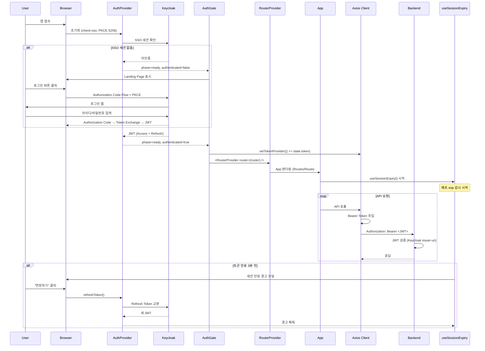
```mermaid
sequenceDiagram
    participant User
    participant Browser
    participant AuthProvider
    participant Keycloak
    participant AuthGate
    participant Router as RouterProvider
    participant App
    participant Client as Axios Client
    participant Backend
    participant SessionHook as useSessionExpiry

    User->>Browser: 앱 접속
    Browser->>AuthProvider: 초기화 (check-sso, PKCE S256)
    AuthProvider->>Keycloak: SSO 세션 확인
    
    alt SSO 세션 없음
        Keycloak-->>AuthProvider: 미인증
        AuthProvider-->>AuthGate: phase=ready, authenticated=false
        AuthGate->>Browser: Landing Page 표시
        User->>Browser: 로그인 버튼 클릭
        Browser->>Keycloak: Authorization Code Flow + PKCE
        Keycloak->>User: 로그인 폼
        User->>Keycloak: 아이디/비밀번호 입력
        Keycloak-->>Browser: Authorization Code → Token Exchange → JWT
    end
    
    Keycloak-->>AuthProvider: JWT (Access + Refresh)
    AuthProvider-->>AuthGate: phase=ready, authenticated=true
    
    AuthGate->>Client: setTokenProvider(() => state.token)
    AuthGate->>Router: <RouterProvider router={router} />
    Router->>App: App 렌더링 (Routes/Route)
    
    App->>SessionHook: useSessionExpiry() 시작
    Note over SessionHook: 매초 exp 감시 시작

    loop API 요청
        App->>Client: API 호출
        Client->>Client: Bearer Token 주입
        Client->>Backend: Authorization: Bearer <JWT>
        Backend->>Backend: JWT 검증 (Keycloak issuer-uri)
        Backend-->>Client: 응답
    end

    alt 토큰 만료 3분 전
        SessionHook->>Browser: 세션 만료 경고 모달
        User->>Browser: "연장하기" 클릭
        Browser->>AuthProvider: refreshToken()
        AuthProvider->>Keycloak: Refresh Token 교환
        Keycloak-->>AuthProvider: 새 JWT
        AuthProvider-->>SessionHook: 경고 해제
    end
```

#### 세션 만료 관리

프론트엔드는 JWT의 `exp` 클레임을 이용해 세션 만료를 감지한다.

- 만료 3분 전 경고 모달 표시
- 연장하기 클릭 시 토큰 갱신
- 만료 시간 도달 시 자동 로그아웃

### 암호화 처리

invisible 메모의 내용은 `springboot-crypto-transit` 라이브러리를 통해 Vault Transit Engine으로 암호화해 저장된다. 목록 페이지에서는 내용을 마스킹 처리하고, 메모 상세 페이지 접근 시점에 복호화하여 보여준다.

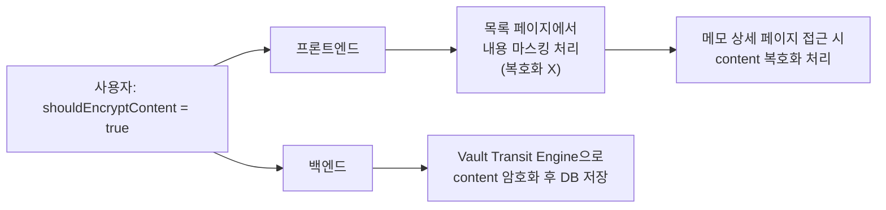
```mermaid
flowchart LR
    A["사용자: shouldEncryptContent = true"] --> B["프론트엔드"]
    B --> C["목록 페이지에서<br/>내용 마스킹 처리<br/>(복호화 X)"]
    C --> F["메모 상세 페이지 접근 시<br/>content 복호화 처리"]
    A --> D["백엔드"]
    D --> E["Vault Transit Engine으로<br/>content 암호화 후 DB 저장"]
```


### 파일 저장 전략

CAS(Content-Addressable Storage) 기반으로 동일 파일의 중복 저장을 방지한다.
- 파일 업로드 시 SHA-256 해시를 계산해 기존 파일과 비교
- 동일 파일이면 재사용(refCount++), 신규 파일만 MinIO에 저장

Pre-signed URL을 사용한 파일 다운로드
- 다운로드 시 30분 유효한 임시 URL을 발급해 백엔드 경유 없이 MinIO에서 직접 다운로드(백엔드 부하↓)

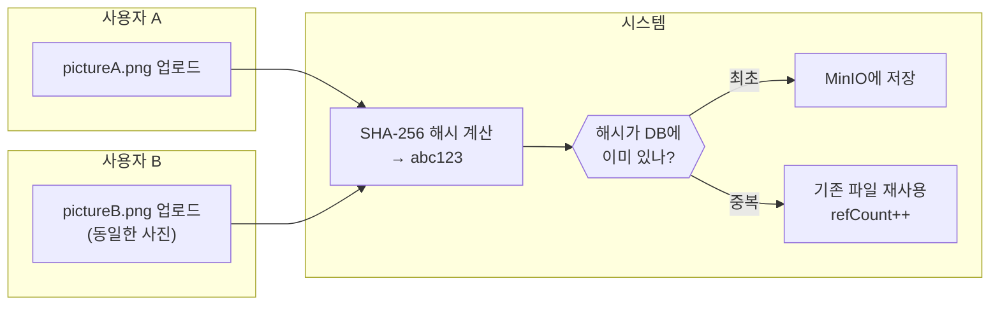
```mermaid
flowchart LR
    subgraph "사용자 A"
        A1["pictureA.png 업로드"]
    end

    subgraph "사용자 B"
        B1["pictureB.png 업로드<br/>(동일한 사진)"]
    end

    subgraph "시스템"
        HASH["SHA-256 해시 계산<br/>→ abc123"]
        CHECK{{"해시가 DB에<br/>이미 있나?"}}
        UPLOAD["MinIO에 저장"]
        REUSE["기존 파일 재사용<br/>refCount++"]
    end

    A1 --> HASH --> CHECK
    B1 --> HASH
    CHECK -->|"최초"| UPLOAD
    CHECK -->|"중복"| REUSE
```

### 태그 시스템


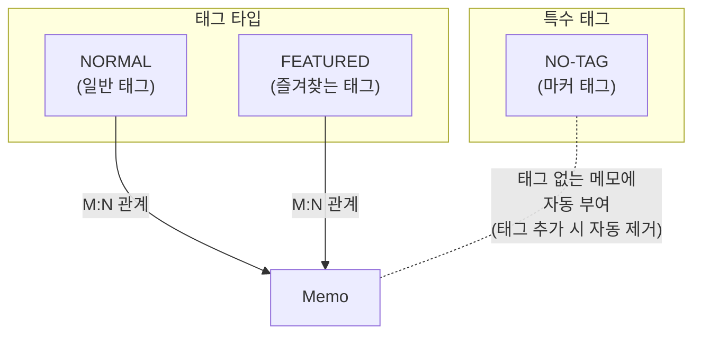
```mermaid
flowchart TD
    subgraph "태그 타입"
        NORMAL["NORMAL<br/>(일반 태그)"]
        FEATURED["FEATURED<br/>(즐겨찾는 태그)"]
    end

    subgraph "특수 태그"
        NOTAG["NO-TAG<br/>(마커 태그)"]
    end

    NORMAL & FEATURED -->|"M:N 관계"| MEMO["Memo"]
    NOTAG -.- |"태그 없는 메모에<br/>자동 부여<br/>(태그 추가 시 자동 제거)"| MEMO
```

### 에러 처리 체계

백엔드와 프론트엔드가 **동일한 에러 코드 체계**를 사용한다.

#### 응답 구조

모든 API가 성공/실패 여부와 무관하게 동일한 구조를 반환한다:
```json
{
  "code": "응답.코드",
  "args": null,
  "data": { 응답 데이터... }
}
```
- 백엔드의 Enum 상수명이 자동으로 응답 코드가 된다.

```
MEMO_NOT_FOUND → "memo.not.found"
MINIO_UPLOAD_FAILED → "minio.upload.failed"
FILE_SIZE_EXCEEDED → "file.size.exceeded"
```

#### 프론트엔드 에러 처리 흐름

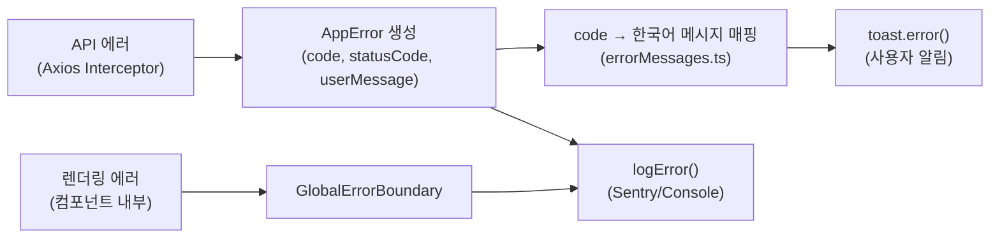
```mermaid
graph LR
    A["API 에러<br/>(Axios Interceptor)"] --> B["AppError 생성<br/>(code, statusCode, userMessage)"]
    D["렌더링 에러<br/>(컴포넌트 내부)"] --> E["GlobalErrorBoundary"]

    B --> F["code → 한국어 메시지 매핑<br/>(errorMessages.ts)"]
    F --> G["toast.error()<br/>(사용자 알림)"]
    B --> H["logError()<br/>(Sentry/Console)"]
    E --> H
```

> Axios Interceptor에서 AppError 생성 및 `logError()` 호출까지 처리하므로, Mutation 레벨에서 별도 로깅은 수행하지 않는다.

#### Sentry 로깅 전략

| 환경 | 조건 | Sentry 처리 |
|---|---|---|
| **dev** | 모든 에러 | `captureException` (level: debug) + console.error |
| **prod** | `isReportable = true` | `captureException` (5xx → error, 4xx → warning) |
| **prod** | `isReportable = false` | `addBreadcrumb` (level: info) |

`isReportable`은 AppError 생성 시 결정된다. prod에서 보고 불필요한 에러는 Breadcrumb으로만 남겨 Sentry 이벤트 쿼터를 절약하면서도, 이후 5xx 발생 시 맥락 정보가 함께 전송된다.

### 커스텀 라이브러리

이 프로젝트는 자체 개발한 3개의 Spring Boot 라이브러리와 1개의 React 라이브러리를 사용한다.

#### Backend

| 라이브러리 | 용도 | 핵심 기능 |
|---|---|---|
| `springboot-auth-keycloak` | 인증 | JWT 파싱 → `KeycloakUserContext` 제공, public path 설정 가능 |
| `springboot-log-router` | 로그 라우팅 | `@UseLogRouter` → File/Sentry 분기, 로깅 지원 |
| `springboot-crypto-transit` | 암호화 | `@UseCryptoTransit` → Vault Transit 기반 필드 암·복호화 |

#### Frontend

| 라이브러리 | 용도 | 핵심 기능 |
|---|---|---|
| `react-auth-keycloak` | 인증 | `AuthProvider`, `useAuth`, `useRoles` 제공, PKCE S256 지원 |

---

## 소프트웨어 아키텍처

### 프론트엔드 아키텍처

#### 계층 구조

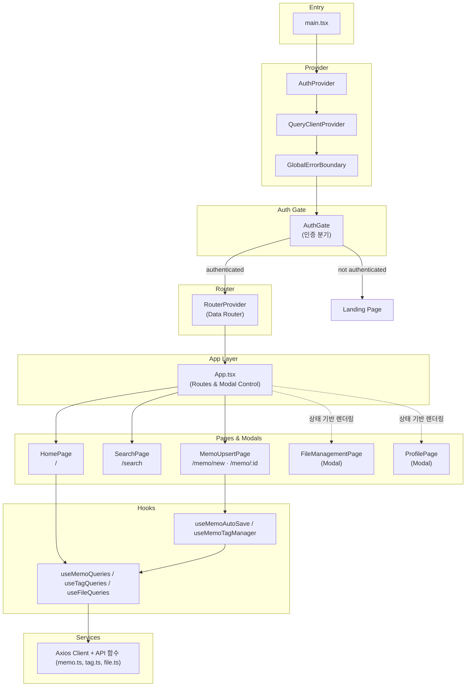
```mermaid
graph TD
    subgraph "Entry"
        main["main.tsx"]
    end

    subgraph "Provider"
        AP["AuthProvider"]
        QCP["QueryClientProvider"]
        GEB["GlobalErrorBoundary"]
    end

    subgraph "Auth Gate"
        AG["AuthGate<br/>(인증 분기)"]
    end

    subgraph "Router"
        RP["RouterProvider<br/>(Data Router)"]
    end

    subgraph "App Layer"
        APP["App.tsx<br/>(Routes & Modal Control)"]
    end

    subgraph "Pages & Modals"
        HP["HomePage<br/>/"] & SP["SearchPage<br/>/search"] & MUP["MemoUpsertPage<br/>/memo/new · /memo/:id"] 
        FMP["FileManagementPage<br/>(Modal)"] & PP["ProfilePage<br/>(Modal)"]
    end

    subgraph "Hooks"
        AH["useMemoQueries / useTagQueries / useFileQueries"]
        CH["useMemoAutoSave / useMemoTagManager"]
    end

    subgraph "Services"
        AS["Axios Client + API 함수 (memo.ts, tag.ts, file.ts)"]
    end

    main --> AP --> QCP --> GEB --> AG
    AG -->|authenticated| RP --> APP
    AG -->|not authenticated| DB["Landing Page"]
    APP --> HP & SP & MUP
    APP -.->|"상태 기반 렌더링"| FMP & PP
    HP --> AH --> AS
    MUP --> CH --> AH
```

| Provider | 역할 |
|---|---|
| `AuthProvider` | Keycloak 인증 상태 공급 (check-sso, PKCE S256) |
| `QueryClientProvider` | 전역 캐시 및 기본 옵션 (retry: 1, staleTime: 5분) |
| `GlobalErrorBoundary` | 렌더링 에러 포착 → Sentry 전송 |
| `Toaster` | 전역 토스트 알림 (richColors, top-center) |

#### React Router Data Router

`react-router-dom`의 **Data Router** (`createBrowserRouter`) 를 사용한다. `AuthGate`가 인증 성공 시 `RouterProvider`를 렌더링하고, `App.tsx`에서 `<Routes>` / `<Route>`로 URL 기반 페이지 전환을 수행한다.

| 파일 | 역할 |
|---|---|
| `config/router.tsx` | `createBrowserRouter` — Data Router 생성 (`useBlocker` 등 훅 활성화) |
| `AuthGate.tsx` | 인증 성공 시 `<RouterProvider router={router} />` 렌더링 |
| `App.tsx` | `<Routes>` / `<Route>`로 URL ↔ 페이지 매핑,<br/>`useNavigate`로 페이지 전환 및 모달 상태 공유 |

##### 라우트 테이블

| Path | Component | 설명 |
|---|---|---|
| `/` | `HomePage` | 메모 목록 (고정 + 전체) |
| `/search` | `SearchPage` | 태그 기반 메모 검색 |
| `/memo/new` | `MemoUpsertPage` (create) | 새 메모 작성 |
| `/memo/:id` | `MemoUpsertPage` (update) | 메모 편집 (`useParams`로 memoId 추출) |

> `ProfilePage` 및 `FileManagementPage`는 URL 기반 라우팅과 별개로, `App.tsx`에서 컴포넌트 내부 상태(`showProfile`, `showFileManagement`)에 따라 모달 형태로 조건부 렌더링된다.

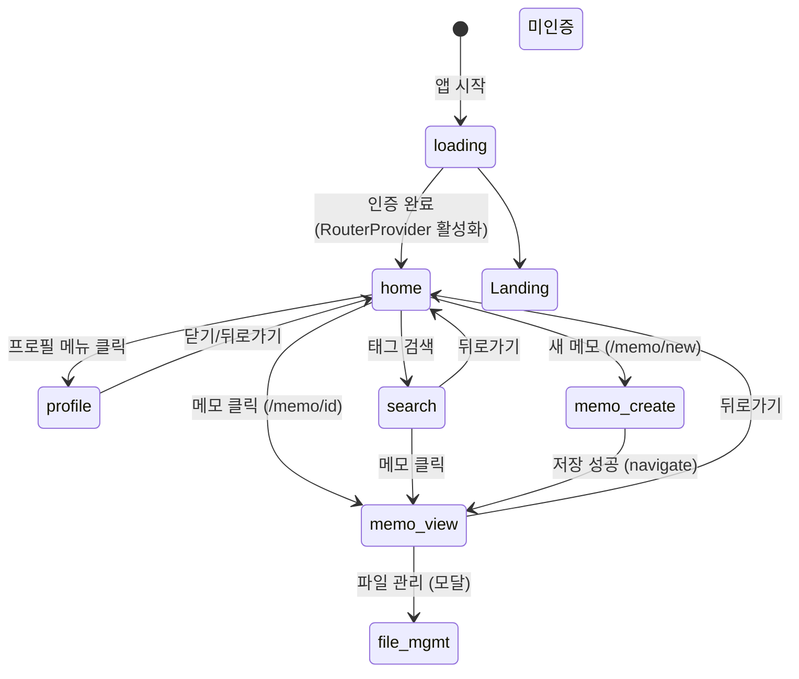
```mermaid
stateDiagram-v2
    [*] --> loading : 앱 시작

    loading --> home : 인증 완료<br/>(RouterProvider 활성화)
    loading --> Landing Page : 미인증

    home --> profile : 프로필 메뉴 클릭
    profile --> home : 닫기/뒤로가기

    home --> memo_view : 메모 클릭 (/memo/id)

    home --> search : 태그 검색
    search --> memo_view : 메모 클릭
    search --> home : 뒤로가기
    
    home --> memo_create : 새 메모 (/memo/new)
    memo_create --> memo_view : 저장 성공 (navigate)
    
    memo_view --> home : 뒤로가기

    memo_view --> file_mgmt : 파일 관리 (모달)
```

##### 네비게이션 가드

`MemoUpsertPage`에서 `useBlocker`를 사용하여 미저장 변경이 있는 상태에서 페이지를 떠나려 할 때 자동 저장 후 이동을 허용한다. 브라우저의 뒤로/앞으로 버튼도 동일하게 동작한다.

#### API 통신 3계층

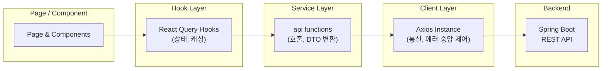
```mermaid
graph LR
    subgraph "Page / Component"
        P["Page & Components"]
    end

    subgraph "Hook Layer"
        H["React Query Hooks<br/>(상태, 캐싱)"]
    end

    subgraph "Service Layer"
        S["api functions<br/>(호출, DTO 변환)"]
    end

    subgraph "Client Layer"
        C["Axios Instance<br/>(통신, 에러 중앙 제어)"]
    end

    subgraph "Backend"
        B["Spring Boot<br/>REST API"]
    end

    P --> H --> S --> C --> B
```


| 계층 | 책임 |
|---|---|
| **React Query Hook** | 캐싱, 재시도, 무효화, 무한 스크롤 |
| **Service 함수** | 엔드포인트 호출, DTO 변환 (`MemoResponse` → `Memo`) |
| **Axios Client** | JWT 자동 주입, `ApiBaseResponse` 래핑 해제, 에러 → `AppError` 변환 |

#### 타입 디커플링 패턴

백엔드 DTO를 그대로 쓰지 않고 프론트엔드 모델로 변환하여, API 규격 변경의 영향 범위를 Service 계층으로 국한한다.

| Backend DTO (`MemoResponse`) | Frontend Model (`Memo`) | 변환 로직 |
|---|---|---|
| `tags: TagResponse[]` | `tags: string[]` | tag.name 배열로 평탄화 (컴포넌트 복잡도 ↓) |
| `createdAt`, `updatedAt` | `createdDate`, `updatedDate` | ISO 8601 → JS `Date` 즉시 파싱 |
| `fileCount: number` | `fileCount`, `hasFile` | `fileCount > 0` 여부를 미리 계산 |
| (미존재) | `raw?: MemoResponse` | deep access 비상 상황 대비 원본 보존 |

#### 캐시 무효화 전략

| 전략 | 동작 | 사용 시점 |
|---|---|---|
| `resetQueries` | 캐시 완전 삭제 → 처음부터 refetch | 메모 생성/삭제 후 (목록 전체 갱신) |
| `invalidateQueries` | stale 마킹 → 관찰 중이면 refetch | 메모 수정/태그 변경 후 (특정 항목 갱신) |

### 백엔드 아키텍처

#### 계층 구조

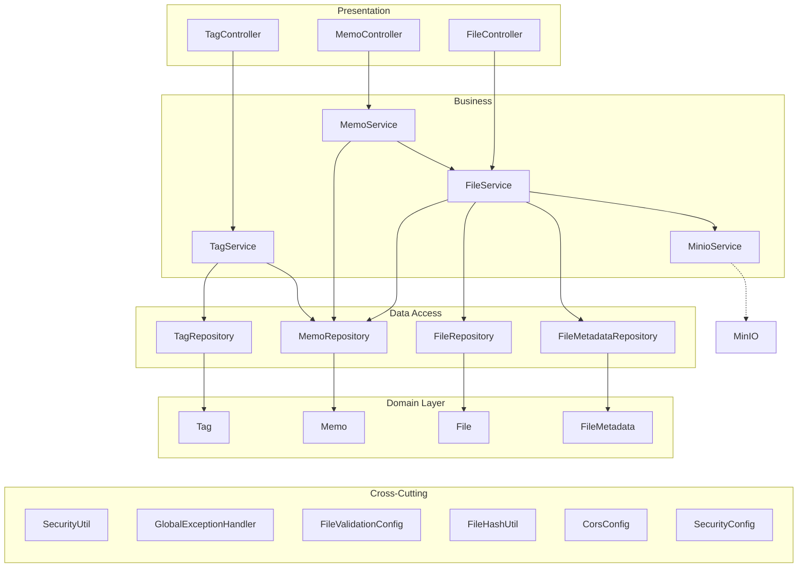
```mermaid
graph TD

    subgraph P["Presentation"]
        TC["TagController"] & MC["MemoController"] & FC["FileController"]
    end

    subgraph B ["Business"]
        TS["TagService"] & MS["MemoService"] & MINIO_S["MinioService"] & FS["FileService"]
    end

    subgraph "Data Access"
        TR["TagRepository"] & MR["MemoRepository"] & FR["FileRepository"] & FMR["FileMetadataRepository"]
    end

    subgraph "Domain Layer"
        TAG["Tag"] & MEMO["Memo"] & FILE["File"] & FM["FileMetadata"]
    end

    subgraph CC ["Cross-Cutting"]
        direction TB
        SEC["SecurityUtil"]
        GEH["GlobalExceptionHandler"]
        FVC["FileValidationConfig"]
        FHU["FileHashUtil"]
        CORSCONF["CorsConfig"] & SECCONF["SecurityConfig"]
    end


    TC --> TS --> TR & MR
    MC --> MS --> MR & FS
    FC --> FS --> MR & FR & FMR & MINIO_S
    MINIO_S ~~~ FMR
    MINIO_S -.-> MinIO_ext["MinIO"]
    
    TR --> TAG
    MR --> MEMO
    FR --> FILE
    FMR --> FM
    TAG & MEMO & FILE & FM ~~~ CC
```

#### 트랜잭션 관리

| Service | 기본 | 조회 메서드 |
|---|---|---|
| `MemoService` | `@Transactional` | `@Transactional(readOnly = true)` |
| `TagService` | `@Transactional` | `@Transactional(readOnly = true)` |
| `FileService` | `@Transactional` | `@Transactional(readOnly = true)` |
| `MinioService` | MinIO 업로드 실패 시 `FileService`의 `try-catch`에서 트랜잭션 전체 롤백 ||

#### N+1 문제 해결

| 해결 전략 | 역할 |
|---|---|
| **@EntityGraph (주)** | 목록 조회 시 `tags`를 JOIN으로 한 번에 fetch → 1회 쿼리 |
| **Batch Fetching (보조)** | `@EntityGraph` 미적용 구간에서 LAZY 프록시 초기화 시 최대 100개를 묶어서 조회 |

---

## 데이터베이스 및 API

### 데이터베이스

#### ERD

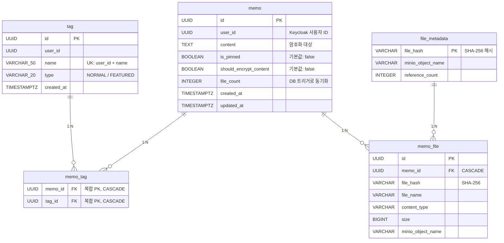
```mermaid
erDiagram
    tag ||--o{ memo_tag : "1:N"
    memo ||--o{ memo_file : "1:N"
    memo ||--o{ memo_tag : "1:N"
    file_metadata ||--o{ memo_file : "1:N"

    memo {
        UUID id PK
        UUID user_id "Keycloak 사용자 ID"
        TEXT content "암호화 대상"
        BOOLEAN is_pinned "기본값: false"
        BOOLEAN should_encrypt_content "기본값: false"
        INTEGER file_count "DB 트리거로 동기화"
        TIMESTAMPTZ created_at
        TIMESTAMPTZ updated_at
    }

    memo_tag {
        UUID memo_id FK "복합 PK, CASCADE"
        UUID tag_id FK "복합 PK, CASCADE"
    }

    tag {
        UUID id PK
        UUID user_id
        VARCHAR_50 name "UK: user_id + name"
        VARCHAR_20 type "NORMAL / FEATURED"
        TIMESTAMPTZ created_at
    }

    memo_file {
        UUID id PK
        UUID memo_id FK "CASCADE"
        VARCHAR file_hash "SHA-256"
        VARCHAR file_name
        VARCHAR content_type
        BIGINT size
        VARCHAR minio_object_name
    }


    file_metadata {
        VARCHAR file_hash PK "SHA-256 해시"
        VARCHAR minio_object_name
        INTEGER reference_count
    }
```

#### Cascade 설계

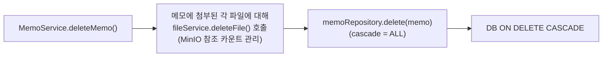
```mermaid
flowchart LR
    A["MemoService.deleteMemo()"]
    A --> B["메모에 첨부된 각 파일에 대해<br/>fileService.deleteFile() 호출<br/>(MinIO 참조 카운트 관리)"]
    B --> C["memoRepository.delete(memo)<br/>(cascade = ALL)"]
    C --> D["DB ON DELETE CASCADE"]
```

#### DB 트리거 로직 분리

`memo.file_count`는 `memo_file` 테이블 레코드의 INSERT/DELETE 변경 사항을 수신하는 **PostgreSQL 트리거**(`trg_memo_file_count`)에 의해 자동 동기화된다. 이를 통해 애플리케이션 계층의 연산 부하 및 동시성 충돌을 방어한다.

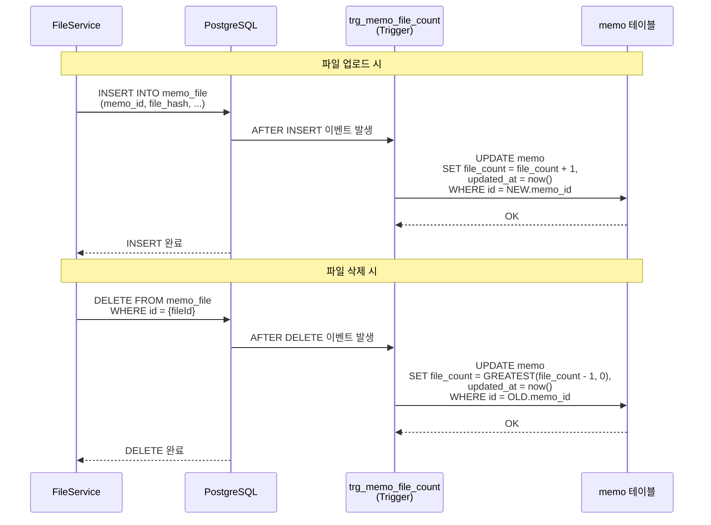
```mermaid
sequenceDiagram
    participant FS as FileService
    participant DB as PostgreSQL
    participant TRG as trg_memo_file_count<br/>(Trigger)
    participant MEMO as memo 테이블

    Note over FS,MEMO: 파일 업로드 시

    FS->>DB: INSERT INTO memo_file<br/>(memo_id, file_hash, ...)
    DB->>TRG: AFTER INSERT 이벤트 발생
    TRG->>MEMO: UPDATE memo<br/>SET file_count = file_count + 1,<br/>    updated_at = now()<br/>WHERE id = NEW.memo_id
    MEMO-->>TRG: OK
    DB-->>FS: INSERT 완료

    Note over FS,MEMO: 파일 삭제 시

    FS->>DB: DELETE FROM memo_file<br/>WHERE id = {fileId}
    DB->>TRG: AFTER DELETE 이벤트 발생
    TRG->>MEMO: UPDATE memo<br/>SET file_count = GREATEST(file_count - 1, 0),<br/>    updated_at = now()<br/>WHERE id = OLD.memo_id
    MEMO-->>TRG: OK
    DB-->>FS: DELETE 완료
```

`GREATEST(file_count - 1, 0)`으로 카운트가 음수가 되는 것을 방어한다. `FileService`는 `file_count` 값을 직접 건드리지 않으며, 트리거가 DB 레벨에서 원자적으로 처리하므로 동시 요청 시에도 카운트 정합성이 보장된다.


### API 엔드포인트

#### Memo API (`/memo`)

| Method | Path | 설명 |
|---|---|---|
| GET | `/memo` | 메모 목록 조회 (페이징, updatedAt DESC) |
| POST | `/memo` | 메모 생성 |
| GET | `/memo/{id}` | 메모 상세 조회 |
| PUT | `/memo/{id}` | 메모 수정 (Partial Update) |
| DELETE | `/memo/{id}` | 메모 삭제 (Hard Delete) |

#### Tag API (`/tag`)

| Method | Path | 설명 |
|---|---|---|
| GET | `/tag` | 사용자 전체 태그 조회 |
| POST | `/tag` | 태그 생성 |
| PUT | `/tag/{tagId}` | 태그 타입 수정 (NORMAL ↔ FEATURED) |
| GET | `/tag/{tagId}/memo` | 태그별 메모 목록 조회 |
| GET | `/tag/memo/{memoId}` | 메모별 태그 목록 조회 |
| POST | `/tag/memo/{memoId}/{tagId}` | 메모-태그 연결 |
| DELETE | `/tag/memo/{memoId}/{tagId}` | 메모-태그 해제 |
| GET | `/tag/search` | 태그명으로 태그 검색 |

#### File API (`/file`)

| Method | Path | 설명 |
|---|---|---|
| GET | `/file/memo/{memoId}` | 메모의 파일 목록 조회 |
| POST | `/file/memo/{memoId}` | 파일 업로드 (multipart) |
| DELETE | `/file/{fileId}` | 파일 삭제 (참조 카운트 기반) |
| GET | `/file/{fileId}/download-url` | Pre-signed 다운로드 URL |

---

## 운영 및 모니터링 환경

### 설정 관리 - 프로필 전략 (dev / prod)

| 항목 | dev | prod |
|---|---|---|
| DDL 전략 | `update` (자동 스키마 갱신) | `none` (수동 관리) |
| SQL 모니터링 | P6Spy 포함 | P6Spy 제외 |
| root 로그 | `info` | `warn` |
| Swagger | 인증 없이 접근 | 사용 불가 |
| CORS | localhost + 내부 도메인 | `memo.ellen24k.o-r.kr` |
| Sentry 샘플링 | 100% | 10% |

### 모니터링 도구

| 도구 | 역할 | 환경 |
|---|---|---|
| **P6Spy** | 실행 SQL + 소요 시간 로깅 | dev only |
| **Sentry** | 에러 수집·대시보드 | dev + prod |
| **Log Router** | 로그를 File(warn↑)과 Sentry(debug↑)로 분기 | dev + prod |

#### Sentry 에러 수집 화면

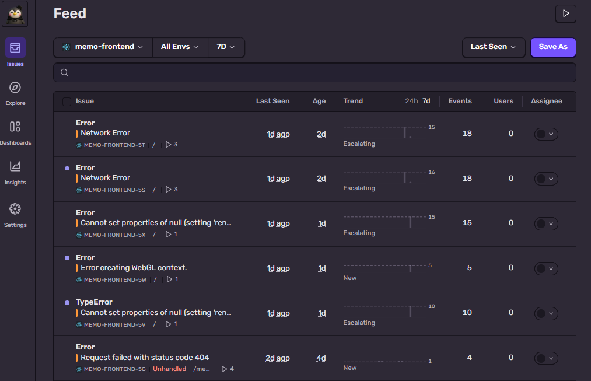

#### Sentry replay (버그 재현 영상: 메모 자동 저장 완료 전 삭제 시 에러 발생)

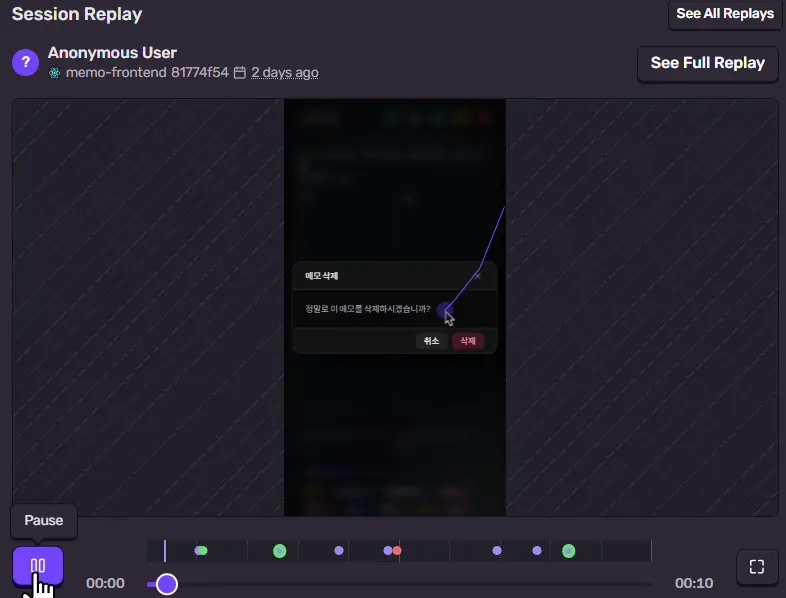


---

## 상세 문서 모음

프로젝트의 각 영역에 대한 심층 분석은 아래 문서에서 확인할 수 있다.

### Backend

| 문서 | 핵심 내용 |
|---|---|
| [architecture.md](docs/backend/architecture.md) | 백엔드 계층 구조, 컨트롤러 API 목록, 커스텀 라이브러리 역할을 포함한 전체 아키텍처 개요 |
| [database-schema.md](docs/backend/database-schema.md) | ERD, 테이블 컬럼 상세 구조, Cascade 설계 및 DB 트리거 분석 |
| [dto.md](docs/backend/dto.md) | 도메인별 Request/Response 객체 분석, Entity↔DTO 매핑 및 직렬화/역직렬화 정책 |
| [service-repository.md](docs/backend/service-repository.md) | Service 간 참조, 소유권 2단계 검증 로직, 중앙 집중식 에러 처리 체계 등 핵심 비즈니스 로직 |
| [file-system.md](docs/backend/file-system.md) | 파일 스토리지 아키텍처 - CAS 로직 기반 중복 방지, MinIO 스트리밍/Pre-signed URL 통신, 다단계 파일 유효성 검증망 |

### Frontend

| 문서 | 내용 |
|---|---|
| [architecture.md](docs/frontend/architecture.md) | 기술 스택, 계층 구조, Provider 트리, React Router Data Router 라우팅 |
| [api-layer.md](docs/frontend/api-layer.md) | Axios Client, Service 함수, DTO 변환, 요청·응답 흐름, 에러 처리 체계 |
| [auth-and-session.md](docs/frontend/auth-and-session.md) | Keycloak PKCE 인증, AuthGate, RouterProvider, 세션 만료 관리 |
| [state-management.md](docs/frontend/state-management.md) | React Query 캐싱, Query Key 팩토리, 무한 스크롤, 자동 저장 |
| [file-management.md](docs/frontend/file-management.md) | 파일 업로드·다운로드·삭제, 배치 전략, 프로그레스 추적 |
