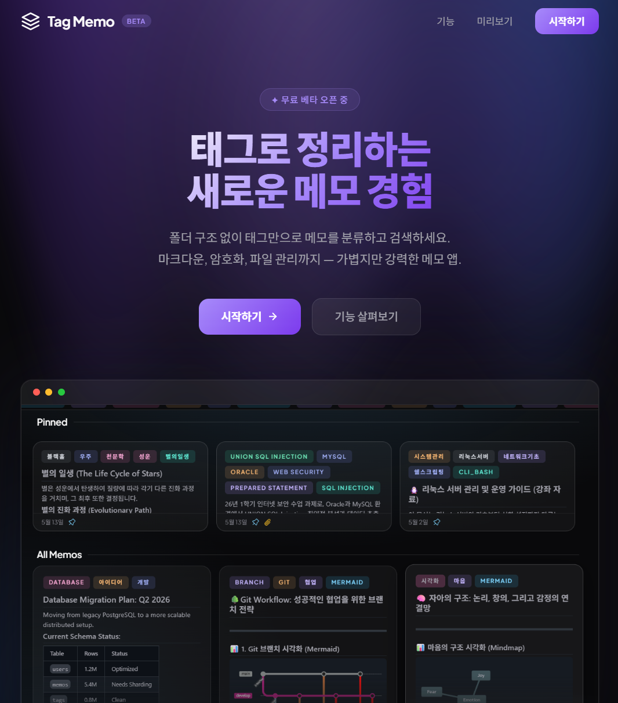


https://github.com/user-attachments/assets/17f30b9f-a873-4654-8990-ac5eec2313e3

---

<details open>
<summary><b>목차 (Table of Contents)</b></summary>

- [기능 소개](#기능-소개)
  - [홈](#홈)
  - [메모 작성](#메모-작성)
  - [태그 관리](#태그-관리)
  - [파일 첨부](#파일-첨부)
  - [그 외 기능](#그-외-기능)
- [인프라 및 기술 스택](#인프라-및-기술-스택)
  - [시스템 인프라 구성도](#시스템-인프라-구성도)
  - [기술 스택](#기술-스택)
  - [Nexus Repository](#nexus-repository)
- [주요 기술 및 구현 사항](#주요-기술-및-구현-사항)
  - [인증 처리 및 세션 관리](#인증-처리)
  - [암호화 처리](#암호화-처리)
  - [파일 저장 전략](#파일-저장-전략)
  - [태그 시스템](#태그-시스템)
  - [에러 처리 체계](#에러-처리-체계)
  - [커스텀 라이브러리](#커스텀-라이브러리)
  - [기타 외부 라이브러리](#기타-외부-라이브러리)
- [소프트웨어 아키텍처](#소프트웨어-아키텍처)
  - [프론트엔드 아키텍처](#프론트엔드-아키텍처)
  - [백엔드 아키텍처](#백엔드-아키텍처)
- [데이터베이스 및 API](#데이터베이스-및-api)
  - [데이터베이스](#데이터베이스)
  - [API 엔드포인트](#api-엔드포인트)
- [운영 및 모니터링 환경](#운영-및-모니터링-환경)
  - [설정 관리 - 환경별 프로필 전략 (Local / Dev / Prod)](#설정-관리---환경별-프로필-전략-local--dev--prod)
  - [모니터링 도구](#모니터링-도구)
- [빌드 및 배포](#빌드-및-배포)
  - [빌드 파이프라인](#빌드-파이프라인)
  - [ArgoCD 기반 GitOps 배포](#argocd-기반-gitops-배포)
- [프로젝트의 기능 확장](#프로젝트의-기능-확장)
  - [TAGMEMO MCP](#tagmemo-mcp-pdf-to-text-tagmemo-backend-api-연동)
- [상세 문서 모음](#상세-문서-모음)
  - [Backend](#backend)
  - [Frontend](#frontend)
  - [기타](#기타)

</details>

---

## 기능 소개

### 홈

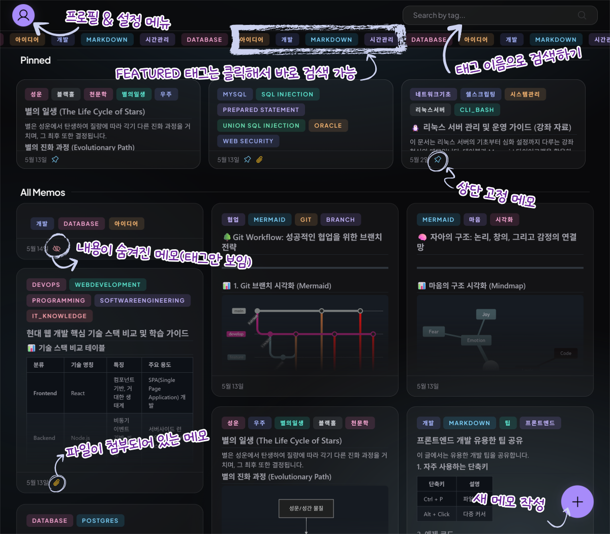

---

### 메모 작성

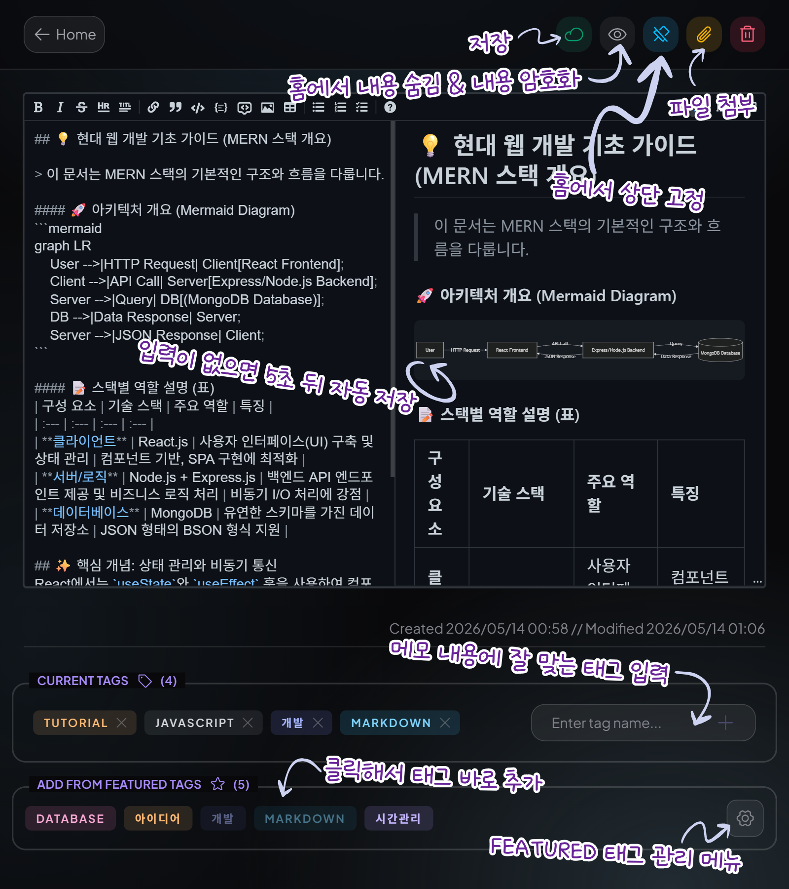

---

### 태그 관리

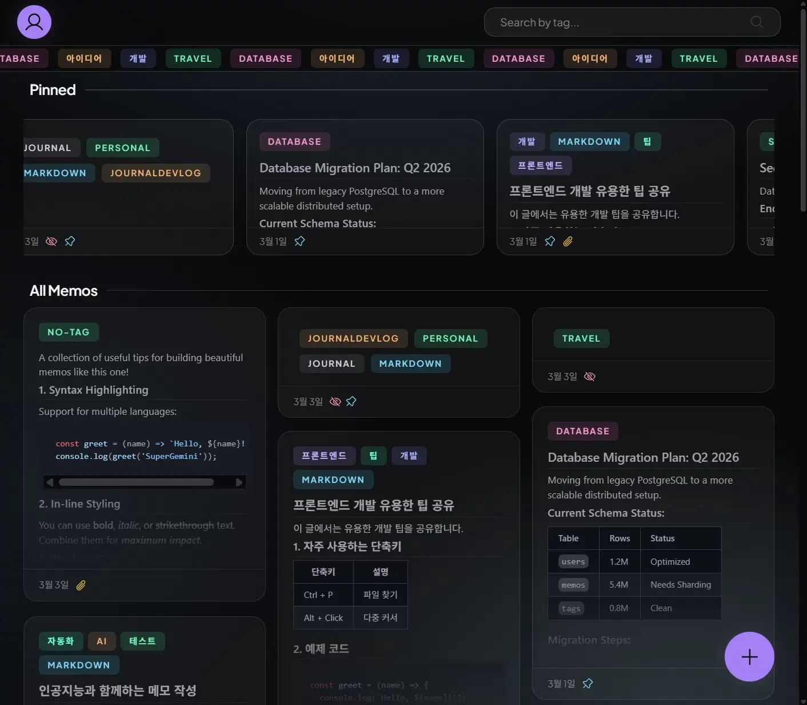

---

### 파일 첨부

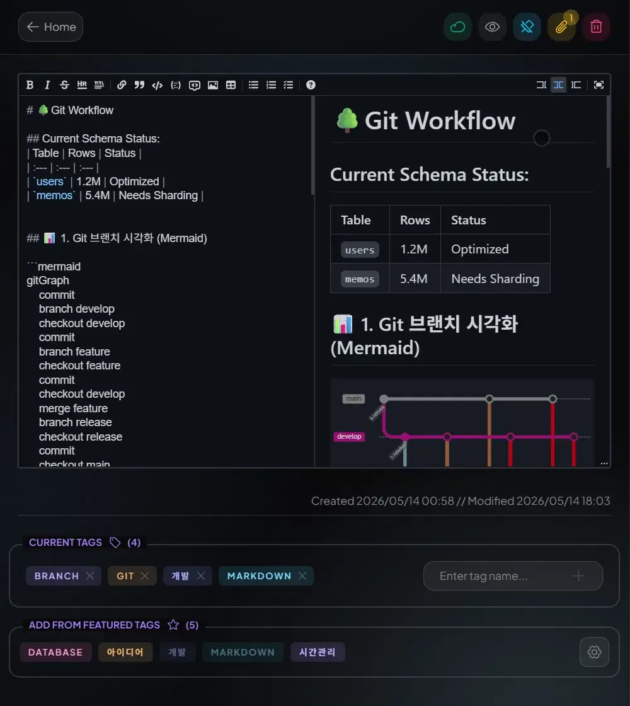

---

### 그 외 기능
- Markdown 에디터 기본 모드 설정(live preview / edit)
- 로그인 만료 3분 전 자동 알림

---

## 인프라 및 기술 스택

### 시스템 인프라 구성도

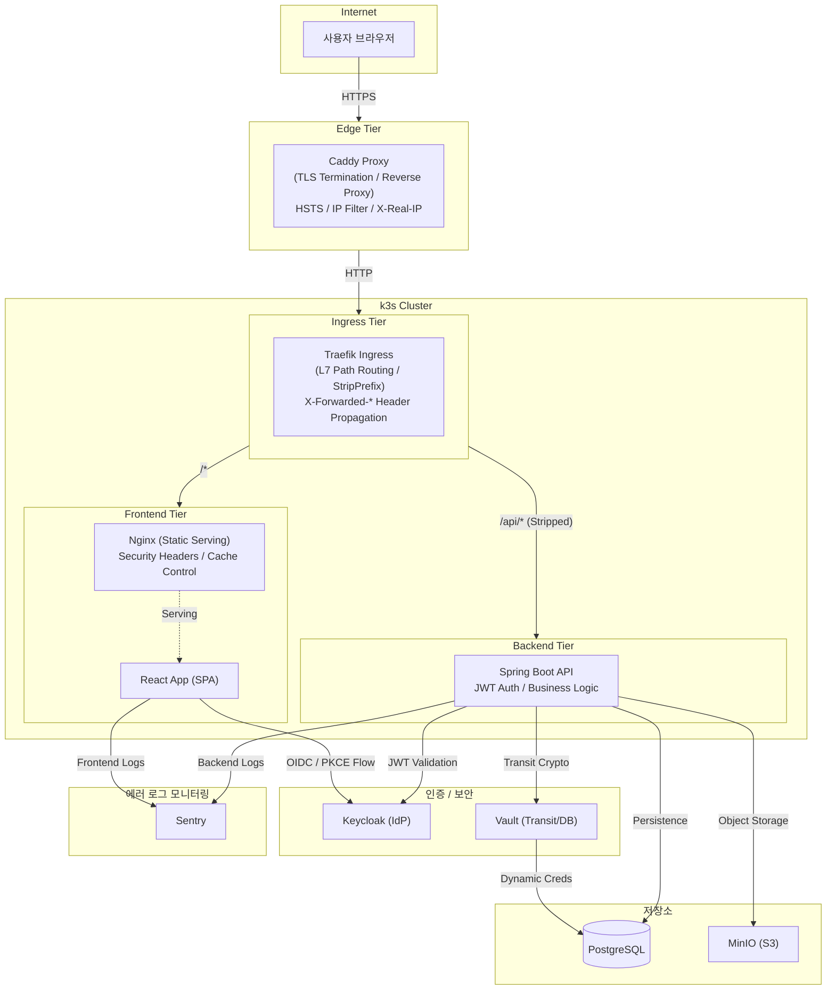
```mermaid
flowchart TB
  subgraph Internet["Internet"]
    Browser["사용자 브라우저"]
  end

  subgraph L1["Edge Tier"]
    Caddy["Caddy Proxy<br/>(TLS Termination / Reverse Proxy)<br/>HSTS / IP Filter / X-Real-IP"]
  end

  subgraph K3S["k3s Cluster"]
    subgraph L2["Ingress Tier"]
      Traefik["Traefik Ingress<br/>(L7 Path Routing / StripPrefix)<br/>X-Forwarded-* Header Propagation"]
    end

    subgraph FE["Frontend Tier"]
      Nginx["Nginx (Static Serving)<br/>Security Headers / Cache Control"]
      React["React App (SPA)"]
    end

    subgraph BE["Backend Tier"]
      SpringBoot["Spring Boot API<br/>JWT Auth / Business Logic"]
    end
  end

  subgraph Storage["저장소"]
    PG[("PostgreSQL")]
    MinIO["MinIO (S3)"]
  end

  subgraph Security["인증 / 보안"]
    Keycloak["Keycloak (IdP)"]
    Vault["Vault (Transit/DB)"]
  end

  subgraph Monitoring["에러 로그 모니터링"]
    Sentry["Sentry"]
  end

  Browser -->|" HTTPS "| L1
  L1 -->|" HTTP "| L2
  L2 -->|" /* "| FE
  L2 -->|" /api/* (Stripped) "| BE
  Nginx -.->|" Serving "| React
%% Auth & Security
  React -->|" OIDC / PKCE Flow "| Keycloak
  SpringBoot -->|" JWT Validation "| Keycloak
  SpringBoot -->|" Transit Crypto "| Vault
  Vault -->|" Dynamic Creds "| PG
%% Monitoring
  React -->|" Frontend Logs "| Sentry
  SpringBoot -->|" Backend Logs "| Sentry
%% Data
  SpringBoot -->|" Persistence "| PG
  SpringBoot -->|" Object Storage "| MinIO
```

### 기술 스택

| 항목                | Backend                                                                                         | Frontend                                      |
|-------------------|-------------------------------------------------------------------------------------------------|-----------------------------------------------|
| **프레임워크**         | Spring Boot 3.5 / Java 25                                                                       | React 19 + TypeScript                         |
| **빌드 도구**         | Gradle 9.3                                                                                      | Vite 7                                        |
| **상태 관리**         | —                                                                                               | TanStack React Query (v5)                     |
| **라우팅**           | —                                                                                               | React Router (v7)                             |
| **UI/스타일**        | —                                                                                               | Tailwind CSS 4, Shadcn UI                     |
| **컴포넌트**          | —                                                                                               | React Hook Form, Sonner (Toast), Lucide React |
| **데이터베이스**        | PostgreSQL (Data JPA, P6Spy)                                                                    | —                                             |
| **파일 스토리지**       | MinIO (S3 SDK)                                                                                  | —                                             |
| **인증**            | Keycloak (JWT 검증)                                                                               | Keycloak (SSO)                                |
| **암호화<BR/>자격 증명** | HashiCorp Vault - Transit Engine,<BR/>**DB Engine (Dynamic Credentials)**,<BR/>KV Secret Engine | PKCE S256 (보안 인증)                             |
| **모니터링**          | Sentry, Actuator                                                                                | Sentry                                        |
| **API 문서화**       | Swagger (OpenAPI)                                                                               | —                                             |
| **CI/CD**         | Jenkins (Pipeline), Docker Buildx                                                               | Jenkins (Pipeline), Docker Buildx             |
| **아티팩트 관리**       | Nexus (Docker, Maven)                                                                           | Nexus (Docker, npm)                           |
| **GitOps**        | **ArgoCD**, **Kustomize**                                                                       | **ArgoCD**, **Kustomize**                     |
| **시크릿 관리**        | **External Secrets Operator (ESO)**                                                             | —                                             |
| **서버 갱신**         | **Stakater Reloader** (자동 재시작)                                                                  | **Stakater Reloader** (자동 재시작)                |
| **잉그레스**          | Traefik IngressRoute                                                                            | Traefik IngressRoute                          |
| **리버스 프록시**       | Caddy Proxy (SSL / IP 차단)                                                                       | Caddy Proxy (SSL / IP 차단)                     |
| **패키징/운영**        | Docker, Kubernetes                                                                              | Docker (Nginx), Kubernetes                    |

### Nexus Repository

> Nexus Repository Manager가 **Docker · Maven · npm** 세 가지 형식의 패키지를 통합 관리한다.
> 자체 개발한 라이브러리와 애플리케이션 이미지가 모두 Nexus를 경유하여 배포된다.

#### 전체 구성도

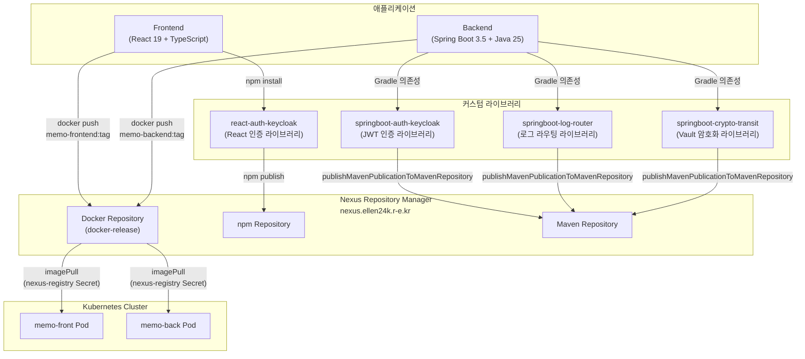
```mermaid
graph TB
    subgraph APPS["애플리케이션"]
        FE["Frontend<br/>(React 19 + TypeScript)"]
        BE["Backend<br/>(Spring Boot 3.5 + Java 25)"]
    end

    subgraph LIBS["커스텀 라이브러리"]
        RAK["react-auth-keycloak<br/>(React 인증 라이브러리)"]
        SAK["springboot-auth-keycloak<br/>(JWT 인증 라이브러리)"]
        SLR["springboot-log-router<br/>(로그 라우팅 라이브러리)"]
        SCT["springboot-crypto-transit<br/>(Vault 암호화 라이브러리)"]
    end

    subgraph NEXUS["Nexus Repository Manager<br />nexus.ellen24k.r-e.kr"]
        DOCKER_REPO["Docker Repository<br/>(docker-release)"]
        NPM_REPO["npm Repository"]
        MAVEN_REPO["Maven Repository"]
    end

    subgraph Kubernetes["Kubernetes Cluster<br/>"]
        FE_POD["memo-front Pod"]
        BE_POD["memo-back Pod"]
    end

    FE -->|"npm install"| RAK
    BE -->|"Gradle 의존성"| SAK
    BE -->|"Gradle 의존성"| SLR
    BE -->|"Gradle 의존성"| SCT

    RAK -->|"npm publish"| NPM_REPO
    SAK -->|"publishMavenPublicationToMavenRepository"| MAVEN_REPO
    SLR -->|"publishMavenPublicationToMavenRepository"| MAVEN_REPO
    SCT -->|"publishMavenPublicationToMavenRepository"| MAVEN_REPO

    FE -->|"docker push<br/>memo-frontend:tag"| DOCKER_REPO
    BE -->|"docker push<br/>memo-backend:tag"| DOCKER_REPO

    DOCKER_REPO -->|"imagePull<br/>(nexus-registry Secret)"| FE_POD
    DOCKER_REPO -->|"imagePull<br/>(nexus-registry Secret)"| BE_POD
```

#### Docker Repository (`docker-release`)

애플리케이션 Docker 이미지를 저장하고, Kubernetes 클러스터가 배포 시 이미지를 Pull한다.

| 이미지 | 빌드 방식 | Runtime |
|---|---|---|
| `memo-frontend:tag` | `node:24.12.0-alpine` → `cgr.dev/chainguard/nginx` | Nginx (Non-Root, 정적 파일 서빙) |
| `memo-backend:tag` | `gradle:9-jdk25` → `cgr.dev/chainguard/jre` | Spring Boot JAR |

#### npm Repository

Frontend 전용 커스텀 React 라이브러리를 배포한다.

| 패키지 | 사용처 | 핵심 기능 |
|---|---|---|
| `react-auth-keycloak` | Frontend | `AuthProvider`, `useAuth`, `useRoles`, PKCE S256 |

#### Maven Repository

Backend 전용 커스텀 Spring Boot Starter 라이브러리를 배포한다.

| 패키지 | 사용처 | 핵심 기능 |
|---|---|---|
| `springboot-auth-keycloak` | Backend | JWT 파싱 → `KeycloakUserContext`, public path 설정 |
| `springboot-log-router` | Backend | `@UseLogRouter` → File/Sentry 로그 분기 |
| `springboot-crypto-transit` | Backend | `@UseCryptoTransit` → Vault Transit 필드 암·복호화 |


---

## 주요 기술 및 구현 사항

### 인증 처리

**Keycloak**에 인증을 위임하고, 백엔드는 JWT 토큰 검증을 통해 요청 사용자를 식별한다.
- API 요청에는 사용자 식별 정보를 포함하지 않고, 토큰에서 추출한 userId 기반으로 소유권 검증 및 비즈니스 로직을 수행하도록 하였다.

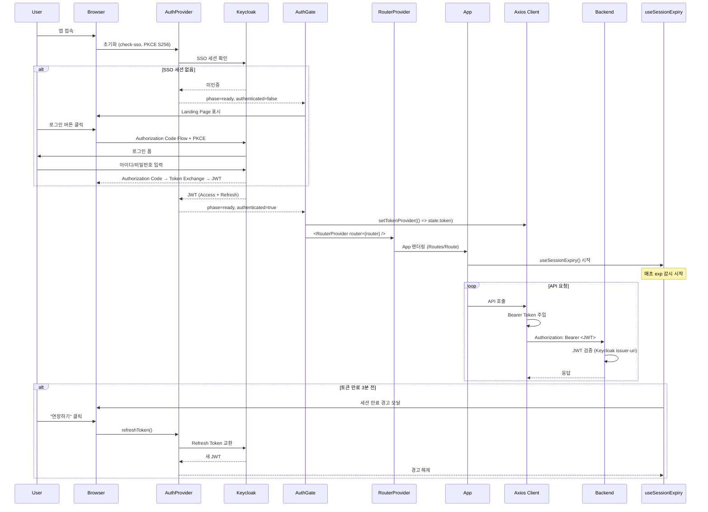
```mermaid
sequenceDiagram
    participant User
    participant Browser
    participant AuthProvider
    participant Keycloak
    participant AuthGate
    participant Router as RouterProvider
    participant App
    participant Client as Axios Client
    participant Backend
    participant SessionHook as useSessionExpiry

    User->>Browser: 앱 접속
    Browser->>AuthProvider: 초기화 (check-sso, PKCE S256)
    AuthProvider->>Keycloak: SSO 세션 확인

    alt SSO 세션 없음
        Keycloak-->>AuthProvider: 미인증
        AuthProvider-->>AuthGate: phase=ready, authenticated=false
        AuthGate->>Browser: Landing Page 표시
        User->>Browser: 로그인 버튼 클릭
        Browser->>Keycloak: Authorization Code Flow + PKCE
        Keycloak->>User: 로그인 폼
        User->>Keycloak: 아이디/비밀번호 입력
        Keycloak-->>Browser: Authorization Code → Token Exchange → JWT
    end

    Keycloak-->>AuthProvider: JWT (Access + Refresh)
    AuthProvider-->>AuthGate: phase=ready, authenticated=true

    AuthGate->>Client: setTokenProvider(() => state.token)
    AuthGate->>Router: <RouterProvider router={router} />
    Router->>App: App 렌더링 (Routes/Route)

    App->>SessionHook: useSessionExpiry() 시작
    Note over SessionHook: 매초 exp 감시 시작

    loop API 요청
        App->>Client: API 호출
        Client->>Client: Bearer Token 주입
        Client->>Backend: Authorization: Bearer <JWT>
        Backend->>Backend: JWT 검증 (Keycloak issuer-uri)
        Backend-->>Client: 응답
    end

    alt 토큰 만료 3분 전
        SessionHook->>Browser: 세션 만료 경고 모달
        User->>Browser: "연장하기" 클릭
        Browser->>AuthProvider: refreshToken()
        AuthProvider->>Keycloak: Refresh Token 교환
        Keycloak-->>AuthProvider: 새 JWT
        AuthProvider-->>SessionHook: 경고 해제
    end
```

### 세션 만료 관리

프론트엔드는 JWT의 `exp` 클레임을 이용해 세션 만료를 감지한다.

- 만료 3분 전 경고 모달 표시
- 연장하기 클릭 시 토큰 갱신
- 만료 시간 도달 시 자동 로그아웃

### 암호화 처리

invisible 메모의 내용은 `springboot-crypto-transit` 라이브러리를 통해 Vault Transit Engine으로 암호화해 저장된다. 목록 페이지에서는 내용을 마스킹 처리하고, 메모 상세 페이지 접근 시점에 복호화하여 보여준다.

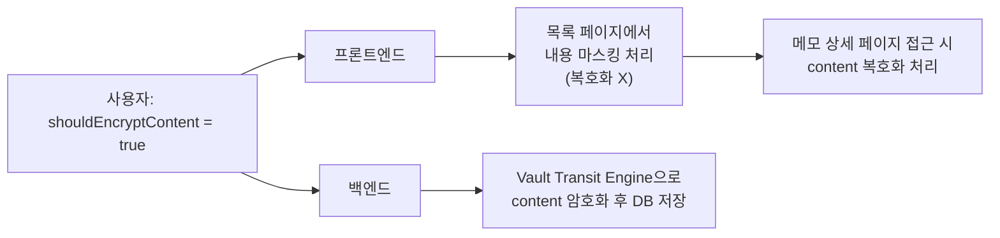
```mermaid
flowchart LR
    A["사용자: shouldEncryptContent = true"] --> B["프론트엔드"]
    B --> C["목록 페이지에서<br/>내용 마스킹 처리<br/>(복호화 X)"]
    C --> F["메모 상세 페이지 접근 시<br/>content 복호화 처리"]
    A --> D["백엔드"]
    D --> E["Vault Transit Engine으로<br/>content 암호화 후 DB 저장"]
```

### 파일 저장 전략

CAS(Content-Addressable Storage) 기반으로 동일 파일의 중복 저장을 방지한다.
- 파일 업로드 시 SHA-256 해시를 계산해 기존 파일과 비교
- 동일 파일이면 재사용(refCount++), 신규 파일만 MinIO에 저장

Pre-signed URL을 사용한 파일 다운로드
- 다운로드 시 30분 유효한 임시 URL을 발급해 백엔드 경유 없이 MinIO에서 직접 다운로드

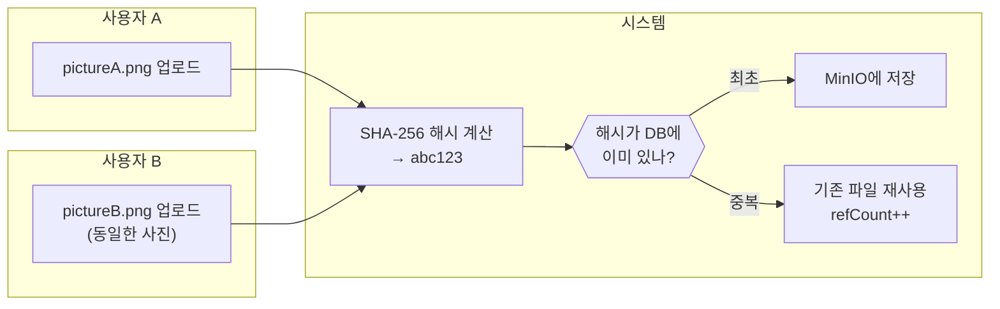
```mermaid
flowchart LR
    subgraph "사용자 A"
        A1["pictureA.png 업로드"]
    end

    subgraph "사용자 B"
        B1["pictureB.png 업로드<br/>(동일한 사진)"]
    end

    subgraph "시스템"
        HASH["SHA-256 해시 계산<br/>→ abc123"]
        CHECK{{"해시가 DB에<br/>이미 있나?"}}
        UPLOAD["MinIO에 저장"]
        REUSE["기존 파일 재사용<br/>refCount++"]
    end

    A1 --> HASH --> CHECK
    B1 --> HASH
    CHECK -->|"최초"| UPLOAD
    CHECK -->|"중복"| REUSE
```

### 태그 시스템


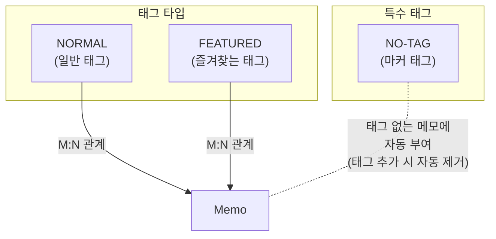
```mermaid
flowchart TD
    subgraph "태그 타입"
        NORMAL["NORMAL<br/>(일반 태그)"]
        FEATURED["FEATURED<br/>(즐겨찾는 태그)"]
    end

    subgraph "특수 태그"
        NOTAG["NO-TAG<br/>(마커 태그)"]
    end

    NORMAL & FEATURED -->|"M:N 관계"| MEMO["Memo"]
    NOTAG -.- |"태그 없는 메모에<br/>자동 부여<br/>(태그 추가 시 자동 제거)"| MEMO
```

### 에러 처리 체계

백엔드와 프론트엔드가 **동일한 에러 코드 체계**를 사용한다.

#### 응답 구조

모든 API가 성공/실패 여부와 무관하게 동일한 구조를 반환한다:
```json
{
  "code": "응답.코드",
  "args": null,
  "data": { 응답 데이터... }
}
```
- 백엔드의 Enum 상수명이 자동으로 응답 코드가 된다.

```
MEMO_NOT_FOUND → "memo.not.found"
MINIO_UPLOAD_FAILED → "minio.upload.failed"
FILE_SIZE_EXCEEDED → "file.size.exceeded"
```

#### 프론트엔드 에러 처리 흐름

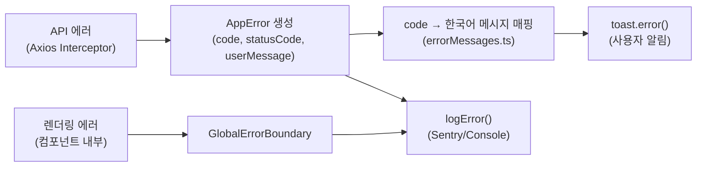
```mermaid
graph LR
    A["API 에러<br/>(Axios Interceptor)"] --> B["AppError 생성<br/>(code, statusCode, userMessage)"]
    D["렌더링 에러<br/>(컴포넌트 내부)"] --> E["GlobalErrorBoundary"]

    B --> F["code → 한국어 메시지 매핑<br/>(errorMessages.ts)"]
    F --> G["toast.error()<br/>(사용자 알림)"]
    B --> H["logError()<br/>(Sentry/Console)"]
    E --> H
```

> Axios Interceptor에서 AppError 생성 및 `logError()` 호출까지 처리하므로, Mutation 레벨에서 별도 로깅은 수행하지 않는다.

#### Sentry 로깅 전략

| 환경 | 조건 | Sentry 처리 |
|---|---|---|
| **dev** | 모든 에러 | `captureException` (level: debug) + console.error |
| **prod** | `isReportable = true` | `captureException` (5xx → error, 4xx → warning) |
| **prod** | `isReportable = false` | `addBreadcrumb` (level: info) |

`isReportable`은 AppError 생성 시 `statusCode >= 400 && ≠ 401, 403` 기준으로 결정된다. prod에서 보고 불필요한 에러(401, 403 등)는 Breadcrumb으로만 남겨 Sentry 이벤트 쿼터를 절약하면서도, 이후 5xx 발생 시 맥락 정보가 함께 전송된다.

### 커스텀 라이브러리

이 프로젝트는 자체 개발한 3개의 Spring Boot 라이브러리와 1개의 React 라이브러리를 사용한다.

### - react-auth-keycloak

React용 Keycloak 인증 라이브러리. TypeScript 기반, SSR 호환, RBAC 내장.

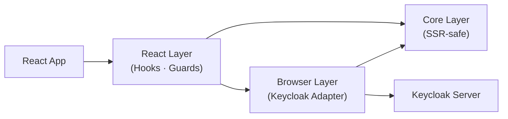
```mermaid
graph LR
    App["React App"] --> React["React Layer<br/>(Hooks · Guards)"]
    React --> Browser["Browser Layer<br/>(Keycloak Adapter)"]
    React --> Core["Core Layer<br/>(SSR-safe)"]
    Browser --> Core
    Browser --> KC["Keycloak Server"]
```

**설치**
```bash
npm config set @io.github.ellen24k:registry https://nexus.ellen24k.r-e.kr/repository/npm-release/
npm install @io.github.ellen24k/react-auth-keycloak keycloak-js
```

**핵심 사용법**
```tsx
import { AuthProvider, useAuth, useRoles, RequireAuth, RequireRole } from '@io.github.ellen24k/react-auth-keycloak/react';

// AuthProvider로 앱 래핑
<AuthProvider options={{
  keycloak: { url: '...', realm: '...', clientId: '...' },
  init: { onLoad: 'check-sso', pkceMethod: 'S256' },
  refresh: { enabled: true, minValiditySeconds: 30 },
}}>
  <App />
</AuthProvider>

// 인증 상태 접근
const { state, login, logout, refreshToken } = useAuth();

// 역할 확인
const { hasRole, hasAnyRole, hasAllRoles } = useRoles();
hasRole({ kind: 'realm', name: 'admin' });

// Guard 컴포넌트
<RequireAuth fallback={<p>로그인 필요</p>}><Dashboard /></RequireAuth>
<RequireRole roles={[{ kind: 'realm', name: 'admin' }]} fallback={<p>권한 없음</p>}><AdminPanel /></RequireRole>
```


---

### - springboot-auth-keycloak

Spring Boot용 Keycloak OAuth2 JWT 인증 라이브러리. Auto-Configuration으로 Security Filter Chain 자동 구성, `KeycloakUserContext`로 사용자 정보 즉시 접근.

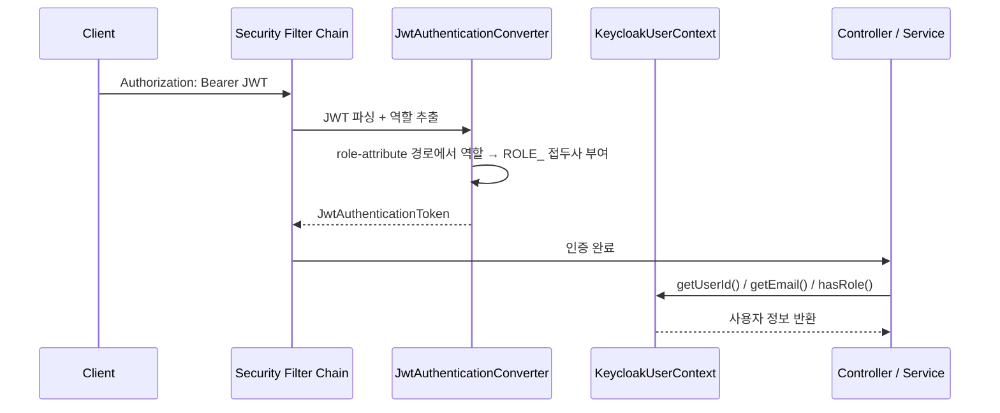
```mermaid
sequenceDiagram
    participant Client
    participant Filter as Security Filter Chain
    participant Converter as JwtAuthenticationConverter
    participant Context as KeycloakUserContext
    participant API as Controller / Service

    Client->>Filter: Authorization: Bearer JWT
    Filter->>Converter: JWT 파싱 + 역할 추출
    Converter->>Converter: role-attribute 경로에서 역할 → ROLE_ 접두사 부여
    Converter-->>Filter: JwtAuthenticationToken
    Filter->>API: 인증 완료
    API->>Context: getUserId() / getEmail() / hasRole()
    Context-->>API: 사용자 정보 반환
```

**설치**
```gradle
dependencies {
    implementation 'io.github.ellen24k:springboot-auth-keycloak:+'
    implementation 'org.springframework.boot:spring-boot-starter-web'
    implementation 'org.springframework.boot:spring-boot-starter-security'
}
```

**설정**
```properties
spring.security.oauth2.resource-server.jwt.issuer-uri=https://keycloak.example.com/realms/my-realm
springboot-auth-keycloak.public-paths=/api/public,/actuator/health,/actuator/health/**,/api-docs/**
springboot-auth-keycloak.cors.allowed-origins=http://localhost:3000
```

**핵심 사용법**
```java
@Service
@RequiredArgsConstructor
public class MyService {
    private final KeycloakUserContext userContext;

    public void example() {
        String userId = userContext.getUserId();       
        String email  = userContext.getEmail();        
        boolean admin = userContext.hasRole("admin");  
    }
}

// 메서드 레벨 보안
@PreAuthorize("hasRole('admin')")
public List<User> getUsers() { ... }
```


---

### - springboot-crypto-transit

HashiCorp Vault Transit 엔진 기반 **필드 레벨 자동 암/복호화** Spring Boot Starter. `@UseCryptoTransit` 어노테이션으로 AOP 기반 자동 처리.

**설치**
```gradle
repositories {
    maven { url "https://nexus.ellen24k.r-e.kr/repository/maven-public/" }
}
dependencies {
    implementation('io.github.ellen24k:springboot-crypto-transit:+')
}
```

**설정**
```properties
springboot-crypto-transit.addr=${VAULT_ADDR}
springboot-crypto-transit.token=${VAULT_TOKEN}
springboot-crypto-transit.transit.key=${VAULT_TRANSIT_KEY}
```

**핵심 사용법**
```java
// Entity/DTO 필드에 어노테이션
public class User {
    @UseCryptoTransit
    private String phoneNumber;                              // 항상 암호화

    @UseCryptoTransit(enabledBy = "shouldEncryptEmail")
    private String email;                                     // 조건부 암호화

    private boolean shouldEncryptEmail;
}

// 서비스 메서드에 어노테이션 → AOP 트리거
@Service
@RequiredArgsConstructor
public class UserService {
    @UseCryptoTransit
    public User saveUser(User user) {
        // 진입 시: 파라미터 필드 암호화 → "vault:v1:..."
        return repository.save(user);
        // 반환 시: 리턴값 필드 복호화 → 원본 평문
    }
}
```


---

### - springboot-log-router

Spring Boot 로깅 라이브러리. 카테고리별 Logger API로 로그를 **단일 라우팅 대상**(File / Sentry / Both)으로 집중.

**설치**
```gradle
dependencies {
    implementation('io.github.ellen24k:springboot-log-router:+')
}
```

**핵심 사용법**
```java
import io.github.ellen24k.log.router.api.app;

app.http.info("GET /api/users - 200 OK");
app.service.info("User registration completed: {}", email);
app.security.error("Unauthorized access attempt from IP {}", clientIp);
app.audit.warn("User {} modified critical data", userId);
app.core.debug("Business rule validation passed");
app.persistence.debug("Query executed: {} rows affected", count);
app.integration.info("External API call succeeded");

// 커스텀 로거
app.custom("payment").info("결제 승인: orderId={}", orderId);
```

| 카테고리 | Logger 이름 | 용도 |
|---|---|---|
| `app.http` | `app.http` | Controller, Filter, HTTP Client |
| `app.service` | `app.service` | Service 계층 |
| `app.core` | `app.core` | 핵심 도메인, 비즈니스 규칙 |
| `app.persistence` | `app.persistence` | Repository, DB |
| `app.integration` | `app.integration` | 외부 API, MQ, Kafka |
| `app.security` | `app.security` | 인증/인가/암호화 |
| `app.audit` | `app.audit` | 감사 로그 |
| `app.custom("name")` | `app.{name}` | 동적 커스텀 로거 |

**Target 설정**

```properties
springboot-log-router.target=2
```

| 값 | 이름 | 설명 |
|---|---|---|
| `0` | `DISABLE` | 비활성화 |
| `1` | `FILE` | `logs/router/application.log` (JsonLayout) |
| `2` | `SENTRY` (기본) | Sentry 전송, 실패 시 FILE 폴백 |
| `3` | `BOTH` | FILE + SENTRY 동시 |

**환경별 레벨 설정**
```properties
springboot-log-router.file-level=DEBUG
springboot-log-router.sentry-level=ERROR
```

### 기타 외부 라이브러리

- UI 애니메이션 : Hyperspeed, Aurora, GlitchText, BlurText
- 마크다운 에디터 : react-md-editor

---

## 소프트웨어 아키텍처

### 프론트엔드 아키텍처

#### 계층 구조

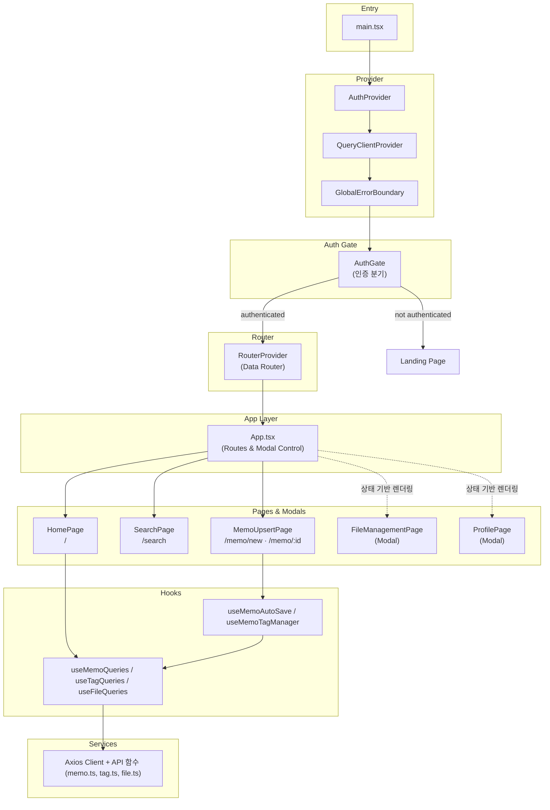
```mermaid
graph TD
    subgraph "Entry"
        main["main.tsx"]
    end

    subgraph "Provider"
        AP["AuthProvider"]
        QCP["QueryClientProvider"]
        GEB["GlobalErrorBoundary"]
    end

    subgraph "Auth Gate"
        AG["AuthGate<br/>(인증 분기)"]
    end

    subgraph "Router"
        RP["RouterProvider<br/>(Data Router)"]
    end

    subgraph "App Layer"
        APP["App.tsx<br/>(Routes & Modal Control)"]
    end

    subgraph "Pages & Modals"
      HP["HomePage<br/>/"] & SP["SearchPage<br/>/search"] & MUP["MemoUpsertPage<br/>/memo/new · /memo/:id"]
        FMP["FileManagementPage<br/>(Modal)"] & PP["ProfilePage<br/>(Modal)"]
    end

    subgraph "Hooks"
        AH["useMemoQueries / useTagQueries / useFileQueries"]
        CH["useMemoAutoSave / useMemoTagManager"]
    end

    subgraph "Services"
        AS["Axios Client + API 함수 (memo.ts, tag.ts, file.ts)"]
    end

    main --> AP --> QCP --> GEB --> AG
    AG -->|authenticated| RP --> APP
    AG -->|not authenticated| DB["Landing Page"]
    APP --> HP & SP & MUP
    APP -.->|"상태 기반 렌더링"| FMP & PP
    HP --> AH --> AS
    MUP --> CH --> AH
```

| Provider | 역할 |
|---|---|
| `AuthProvider` | Keycloak 인증 상태 공급 (check-sso, PKCE S256) |
| `QueryClientProvider` | 전역 캐시 및 기본 옵션 (retry: 1, staleTime: 5분) |
| `GlobalErrorBoundary` | 렌더링 에러 포착 → Sentry 전송 |
| `Toaster` | 전역 토스트 알림 (richColors, top-center) |

#### React Router Data Router

`react-router-dom`의 **Data Router** (`createBrowserRouter`) 를 사용한다. `AuthGate`가 인증 성공 시 `RouterProvider`를 렌더링하고, `App.tsx`에서 `<Routes>` / `<Route>`로 URL 기반 페이지 전환을 수행한다.

| 파일 | 역할 |
|---|---|
| `config/router.tsx` | `createBrowserRouter` — Data Router 생성 (`useBlocker` 등 훅 활성화) |
| `AuthGate.tsx` | 인증 성공 시 `<RouterProvider router={router} />` 렌더링 |
| `App.tsx` | `<Routes>` / `<Route>`로 URL ↔ 페이지 매핑,<br/>`useNavigate`로 페이지 전환 및 모달 상태 공유 |

##### 라우트 테이블

| Path | Component | 설명 |
|---|---|---|
| `/` | `HomePage` | 메모 목록 (고정 + 전체) |
| `/search` | `SearchPage` | 태그 기반 메모 검색 |
| `/memo/new` | `MemoUpsertPage` (create) | 새 메모 작성 |
| `/memo/:id` | `MemoUpsertPage` (update) | 메모 편집 (`useParams`로 memoId 추출) |

> `ProfilePage` 및 `FileManagementPage`는 URL 기반 라우팅과 별개로, `App.tsx`에서 컴포넌트 내부 상태(`showProfile`, `showFileManagement`)에 따라 모달 형태로 조건부 렌더링된다.

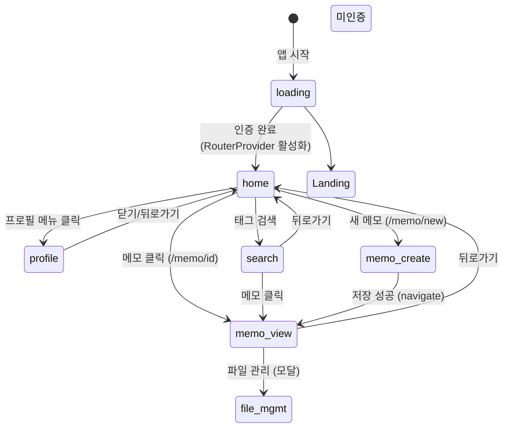
```mermaid
stateDiagram-v2
    [*] --> loading : 앱 시작

    loading --> home : 인증 완료<br/>(RouterProvider 활성화)
    loading --> Landing Page : 미인증

    home --> profile : 프로필 메뉴 클릭
    profile --> home : 닫기/뒤로가기

    home --> memo_view : 메모 클릭 (/memo/id)

    home --> search : 태그 검색
    search --> memo_view : 메모 클릭
    search --> home : 뒤로가기

    home --> memo_create : 새 메모 (/memo/new)
    memo_create --> memo_view : 저장 성공 (navigate)

    memo_view --> home : 뒤로가기

    memo_view --> file_mgmt : 파일 관리 (모달)
```

##### 네비게이션 가드

`MemoUpsertPage`에서 `useBlocker`를 사용하여 미저장 변경이 있는 상태에서 페이지를 떠나려 할 때 자동 저장 후 이동을 허용한다. 브라우저의 뒤로/앞으로 버튼도 동일하게 동작한다.

#### API 통신 3계층

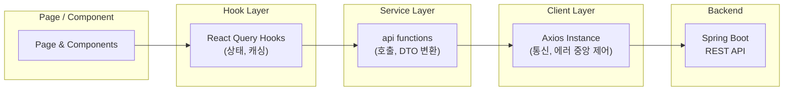
```mermaid
graph LR
    subgraph "Page / Component"
        P["Page & Components"]
    end

    subgraph "Hook Layer"
        H["React Query Hooks<br/>(상태, 캐싱)"]
    end

    subgraph "Service Layer"
        S["api functions<br/>(호출, DTO 변환)"]
    end

    subgraph "Client Layer"
        C["Axios Instance<br/>(통신, 에러 중앙 제어)"]
    end

    subgraph "Backend"
        B["Spring Boot<br/>REST API"]
    end

    P --> H --> S --> C --> B
```


| 계층 | 책임 |
|---|---|
| **React Query Hook** | 캐싱, 재시도, 무효화, 무한 스크롤 |
| **Service 함수** | 엔드포인트 호출, DTO 변환 (`MemoResponse` → `Memo`) |
| **Axios Client** | JWT 자동 주입, `ApiBaseResponse` 래핑 해제, 에러 → `AppError` 변환 |

#### 타입 디커플링 패턴

백엔드 DTO를 그대로 쓰지 않고 프론트엔드 모델로 변환하여, API 규격 변경의 영향 범위를 Service 계층으로 국한한다.

| Backend DTO (`MemoResponse`) | Frontend Model (`Memo`) | 변환 로직 |
|---|---|---|
| `tags: TagResponse[]` | `tags: string[]` | tag.name 배열로 평탄화 (컴포넌트 복잡도 ↓) |
| `createdAt`, `updatedAt` | `createdDate`, `updatedDate` | ISO 8601 → JS `Date` 즉시 파싱 |
| `fileCount: number` | `fileCount`, `hasFile` | `fileCount > 0` 여부를 미리 계산 |
| (미존재) | `raw?: MemoResponse` | deep access 비상 상황 대비 원본 보존 |

#### 캐시 무효화 전략

| 전략 | 동작 | 사용 시점 |
|---|---|---|
| `resetQueries` | 캐시 완전 삭제 → 처음부터 refetch | 메모 생성/삭제 후 (목록 전체 갱신) |
| `invalidateQueries` | stale 마킹 → 관찰 중이면 refetch | 메모 수정/태그 변경 후 (특정 항목 갱신) |

### 백엔드 아키텍처

#### 계층 구조

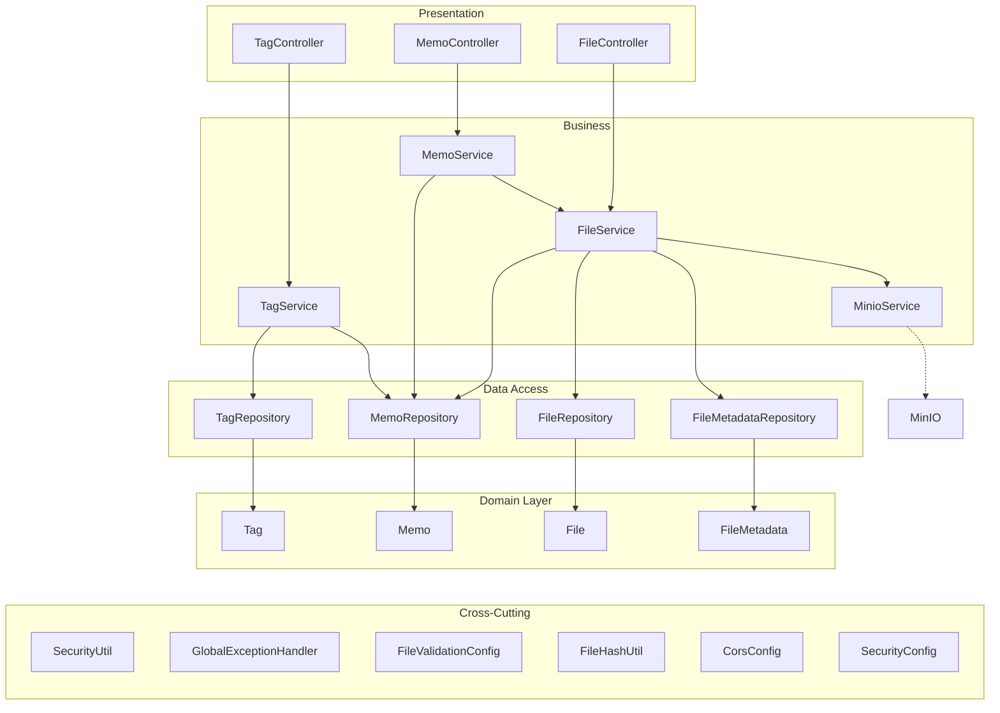
```mermaid
graph TD

    subgraph P["Presentation"]
        TC["TagController"] & MC["MemoController"] & FC["FileController"]
    end

    subgraph B ["Business"]
        TS["TagService"] & MS["MemoService"] & MINIO_S["MinioService"] & FS["FileService"]
    end

    subgraph "Data Access"
        TR["TagRepository"] & MR["MemoRepository"] & FR["FileRepository"] & FMR["FileMetadataRepository"]
    end

    subgraph "Domain Layer"
        TAG["Tag"] & MEMO["Memo"] & FILE["File"] & FM["FileMetadata"]
    end

    subgraph CC ["Cross-Cutting"]
        direction TB
        SEC["SecurityUtil"]
        GEH["GlobalExceptionHandler"]
        FVC["FileValidationConfig"]
        FHU["FileHashUtil"]
        CORSCONF["CorsConfig"] & SECCONF["SecurityConfig"]
    end


    TC --> TS --> TR & MR
    MC --> MS --> MR & FS
    FC --> FS --> MR & FR & FMR & MINIO_S
    MINIO_S ~~~ FMR
    MINIO_S -.-> MinIO_ext["MinIO"]

    TR --> TAG
    MR --> MEMO
    FR --> FILE
    FMR --> FM
    TAG & MEMO & FILE & FM ~~~ CC
```

#### 트랜잭션 관리

| Service | 기본 | 조회 메서드 |
|---|---|---|
| `MemoService` | `@Transactional` | `@Transactional(readOnly = true)` |
| `TagService` | `@Transactional` | `@Transactional(readOnly = true)` |
| `FileService` | `@Transactional` | `@Transactional(readOnly = true)` |
| `MinioService` | MinIO 업로드 실패 시 `FileService`의 `try-catch`에서 트랜잭션 전체 롤백 ||

---

## 데이터베이스 및 API

### 데이터베이스

#### ERD

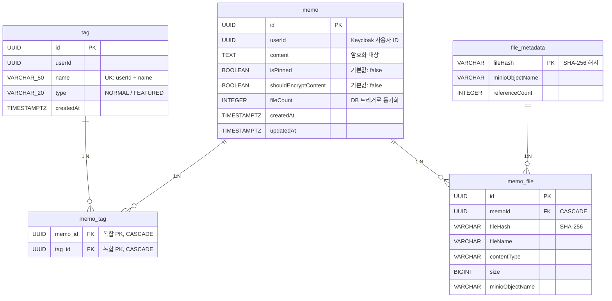
```mermaid
erDiagram
    tag ||--o{ memo_tag : "1:N"
    memo ||--o{ memo_file : "1:N"
    memo ||--o{ memo_tag : "1:N"
    file_metadata ||--o{ memo_file : "1:N"

    memo {
        UUID id PK
        UUID userId "Keycloak 사용자 ID"
        TEXT content "암호화 대상"
        BOOLEAN isPinned "기본값: false"
        BOOLEAN shouldEncryptContent "기본값: false"
        INTEGER fileCount "DB 트리거로 동기화"
        TIMESTAMPTZ createdAt
        TIMESTAMPTZ updatedAt
    }

    memo_tag {
        UUID memo_id FK "복합 PK, CASCADE"
        UUID tag_id FK "복합 PK, CASCADE"
    }

    tag {
        UUID id PK
        UUID userId
        VARCHAR_50 name "UK: userId + name"
        VARCHAR_20 type "NORMAL / FEATURED"
        TIMESTAMPTZ createdAt
    }

    memo_file {
        UUID id PK
        UUID memoId FK "CASCADE"
        VARCHAR fileHash "SHA-256"
        VARCHAR fileName
        VARCHAR contentType
        BIGINT size
        VARCHAR minioObjectName
    }


    file_metadata {
        VARCHAR fileHash PK "SHA-256 해시"
        VARCHAR minioObjectName
        INTEGER referenceCount
    }
```

#### Cascade 설계

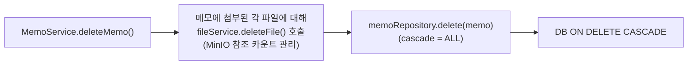
```mermaid
flowchart LR
    A["MemoService.deleteMemo()"]
    A --> B["메모에 첨부된 각 파일에 대해<br/>fileService.deleteFile() 호출<br/>(MinIO 참조 카운트 관리)"]
    B --> C["memoRepository.delete(memo)<br/>(cascade = ALL)"]
    C --> D["DB ON DELETE CASCADE"]
```

#### DB 트리거 로직

memo_file 테이블의 Insert / Delete 후에 작동하는 트리거가 memo.fileCount 필드 값을 처리하는 함수를 호출 하여 값을 업데이트

#### N+1 문제 해결

N+1 문제 해결: Memo 엔터티의 tags, files 컬렉션에 @BatchSize(size = 100)를 적용하여, LAZY 프록시 초기화 시 개별 SELECT 대신 IN 절로 최대 100건을 묶어 조회한다.

#### PostgreSQL ssl 적용

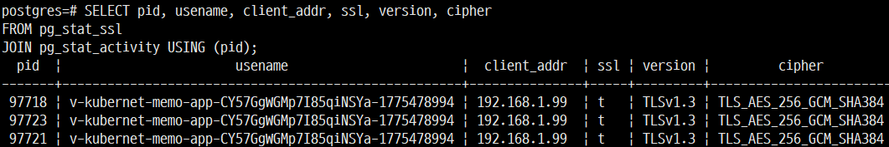

### API 엔드포인트

#### Memo API (`/memo`)

| Method | Path | 설명 |
|---|---|---|
| GET | /memo | 메모 목록 조회 (페이징, updatedAt DESC) |
| POST | /memo | 메모 생성 |
| GET | /memo/{id} | 메모 상세 조회 |
| PUT | /memo/{id} | 메모 수정 (Partial Update) |
| DELETE | /memo/{id} | 메모 삭제 (Hard Delete) |

#### Tag API (`/tag`)

| Method | Path | 설명 |
|---|---|---|
| GET | /tag | 사용자 전체 태그 조회 |
| POST | /tag | 태그 생성 |
| PUT | /tag/{tagId} | 태그 타입 수정 (NORMAL ↔ FEATURED) |
| GET | /tag/{tagId}/memo | 태그별 메모 목록 조회 |
| GET | /tag/memo/{memoId} | 메모별 태그 목록 조회 |
| POST | /tag/memo/{memoId}/{tagId} | 메모-태그 연결 |
| DELETE | /tag/memo/{memoId}/{tagId} | 메모-태그 해제 |
| GET | /tag/search | 태그명으로 태그 검색 |

#### File API (`/file`)

| Method | Path | 설명 |
|---|---|---|
| GET | /file/memo/{memoId} | 메모의 파일 목록 조회 |
| POST | /file/memo/{memoId} | 파일 업로드 (multipart) |
| DELETE | /file/{fileId} | 파일 삭제 (참조 카운트 기반) |
| GET | /file/{fileId}/download-url | Pre-signed 다운로드 URL |

### 헬스체크

| 서비스 | Liveness Probe 경로 | Readiness Probe 경로 |
|---|---|---|
| **memo-front** | `/health` | `/health` |
| **memo-back** | `/actuator/health/liveness` | `/actuator/health/readiness` |

---

## 운영 및 모니터링 환경

### 설정 관리 - 환경별 프로필 전략 (Local / Dev / Prod)

| 항목                    | Local (`.env`)       | Dev (`configmap.env`)          | Prod (`configmap.env`)                                            |
|-----------------------|----------------------|--------------------------------|-------------------------------------------------------------------|
| **DDL 전략**            | `update` (자동 스키마 갱신) | `none` (수동 관리)                 | `none` (수동 관리)                                                    |
| **Swagger**           | `true` (접근 가능)       | `false`                        | `false`                                                           |
| **CORS**              | `.env` 설정에 따름        | `https://memo.ellen24k.o-r.kr` | `https://memo.ellen24k.kro.kr` |
| **root 로그**           | `info`               | `info`                         | `warn`                                                            |
| **app 로그**            | `debug`               | `debug`                        | `warn`                                                            |
| **log-router 로그**     | `debug`               | `debug`                        | `warn`                                                            |
| **P6Spy (SQL)**       | `true` (로깅 활성화)      | `true`                | `false`                                                 |
| **Sentry Breadcrumb** | `debug`              | `debug`                         | `info`                                                            |
| **Sentry 전송율**       | `0.0` (비활성화)        | `1.0` (활성화)                  | `1.0` (활성화)                                                      |
| **Sentry Tracing**    | `0.0` (비활성화)        | `0.1`                          | `0.05`                                                            |
| **Sentry PII 전송**     | `true`              | `true`                         | `false`                                                           |

### 모니터링 도구

| 도구             | 역할                                           |
|----------------|----------------------------------------------|
| **P6Spy**      | 실행 SQL + 소요 시간 로깅                            |
| **Sentry**     | 에러 수집·대시보드                                   |
| **Log Router** | 로그를 영역별로 세분화 하여 출력. 로그를 File 이나 Sentry 로 분기. |

#### Sentry 에러 수집 화면

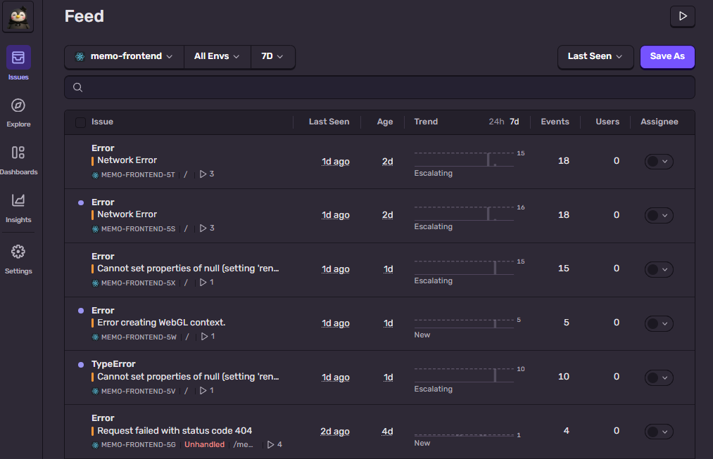

#### Sentry replay (버그 재현 영상: 메모 자동 저장 완료 전 삭제 시 에러 발생)

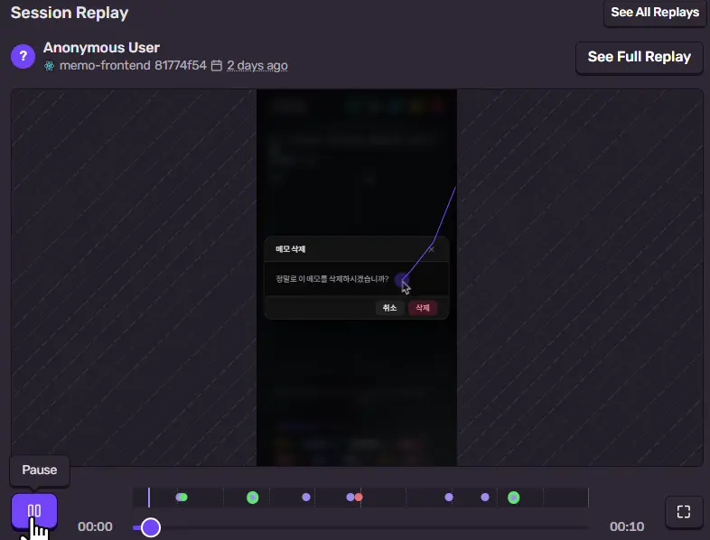


---

## 빌드 및 배포

### 빌드 파이프라인

#### Jenkins 기반 자동화 빌드 파이프라인

GitHub Webhook을 수신한 Jenkins가 브랜치명(Dev/Prod)을 분석하고 타겟 환경을 결정한 뒤, **도커 원격 컨텍스트(Docker Context)를 활용하여 빌드를 원격으로 위임 실행**한다.

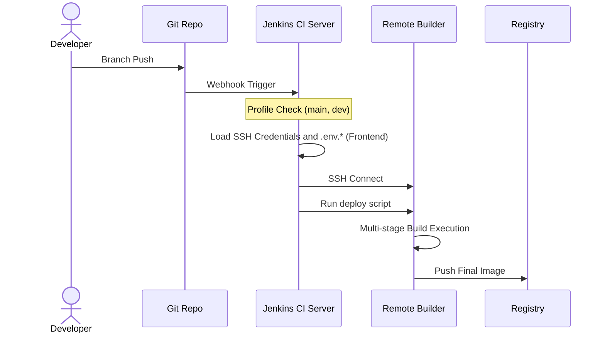
```mermaid
sequenceDiagram
  actor Dev as Developer
  participant Git as Git Repo
  participant Jenkins as Jenkins CI Server
  participant Builder as Remote Builder
  participant Nexus as Registry
  Dev ->> Git: Branch Push
  Git ->> Jenkins: Webhook Trigger
  Note over Jenkins: Profile Check (main, dev)
  Jenkins ->> Jenkins: Load SSH Credentials and .env.* (Frontend)
  Jenkins ->> Builder: SSH Connect
  Jenkins ->> Builder: Run deploy script
  Builder ->> Builder: Multi-stage Build Execution
  Builder ->> Nexus: Push Final Image
```

- **단일 파이프라인 동적 분기**: `env.BRANCH_NAME`(또는 `env.GIT_BRANCH`)을 분석하여 `main`이면 `prod` 전용 스크립트 및 타겟팅(`arm64`), 그 외 브랜치는
  `dev` 타겟팅(`amd64`)으로 자동 스위칭한다.
- **Docker Context 원격 스트리밍**: 젠킨스가 워크스페이스 내 소스 코드들을 도커 원격 소켓(`ssh://...`)을 통해 원격 빌드 서버로 **직접 스트리밍**한다. `.dockerignore`가
  구동되어 불필요한 빌드 컨텍스트가 제외되므로 빌드 속도 및 서버 리소스 이용이 최적화된다.
- **안전한 시크릿 주입 (Frontend)**: 보안 파일의 하드코딩 없이 젠킨스 Credentials를 런타임에 호출하여 `.env` 파일을 준비해 두고, 도커 컨텍스트 스트리밍 과정에 엮어 빌드 서버에 안전하게 주입한다.
- **스크립트 파라미터화**: 환경(`dev` 또는 `prod`) 파라미터를 받는 단일 스크립트로 구성했다.
- **도커 컨텍스트 투명성**: 파라미터에 따라 타겟 빌드 호스트(`BUILD_HOST`)가 결정되며, 로컬 또는 Jenkins 서버 등 어디서 실행하든 도커가 자동으로 해당 원격 컨텍스트를 생성·연결하여 빌드를 위임한다.
- **멀티 Dockerfile 자동 분기 및 CDS 지원**: 백엔드의 경우 `Dockerfile.dev`, `Dockerfile.prod`, `Dockerfile.prod.cds`와 같이 목적별로 분리된 도커파일을 스크립트가 파라미터를 식별하여 능동적으로 선택한다. 특히 `prod.cds` 버전은 애플리케이션 기동 시간(Cold Start) 단축과 메모리 사용량 최적화를 위해 **CDS(Class Data Sharing)** 훈련용 캐시 모듈(`.jsa`)을 생성하고 적용하도록 설계되어 있다.

#### 공통 빌드 및 Dockerfile 최적화

단순 파이프라인 실행 목적을 넘어 배포 속도, 보안 커버리지, 이미지 사이즈를 모두 고려하여 공통 최적화 전략을 구성했다.

- **자동 버전 추출 및 환경별 타겟 아키텍처 빌드**: Backend는 `build.gradle`, Frontend는 `package.json`에서 버전을 추출하여 자동으로 태깅한다. `docker buildx`를 활용하여 대상 환경에 최적화된 아키텍처(`dev: amd64`, `prod: arm64`) 이미지를 빌드하여 Push 한다.
- **BuildKit 캐시 마운트 전략 (`--mount=type=cache`)**:
  - Gradle(`.gradle`) 및 NPM(`.npm`) 의존성 디렉토리를 원격 빌더 환경에 마운트한다. 소스코드 변경만 일어날 경우 의존성 분석 및 다운로드 단계를 전면 생략하여 시간을 대폭 단축한다.
- **Spring Boot Layered Jar (Custom Extract)**:
  - 백엔드 빌드 결과물을 `dependencies`, `spring-boot-loader`, `application` 등 층별로 분리(extract)하여 구성한다. 코드가 달라진 최상단 Application
    영역만 새로 덮어쓰므로 즉각적인 배포를 보장한다.
- **경량화 (Distroless) 및 보안 격리 (Non-Root User)**:
  - 런타임에 셸(Shell)이나 패키지 매니저 등 불필요한 빌드 요소가 아예 포함되어 있지 않은 `cgr.dev/chainguard/jre` 및 `cgr.dev/chainguard/nginx` 등 Chainguard의 **순수 경량화(Distroless)** 런타임 이미지를 선택하여 공격 표면을 극단적으로 줄였다.
  - 외부 침입에 의한 호스트 시스템 제어 탈취를 원천적으로 차단하기 위해, 컨테이너 런타임 User Namespace를 UID/GID `65532:65532`(nonroot)로 직접 하향 적용했다.
- **Kubernetes OOM 방지 지시어 구성 (Memory Tuning)**:
  - 쿠버네티스가 컨테이너의 메모리 초과로 인해 강제 종료(OOMKilled)하지 않으면서 최적으로 리소스를 수용하도록 `ENTRYPOINT`에
    `-XX:MaxRAMPercentage=75.0 -XX:+ExitOnOutOfMemoryError`를 명시했다.

### ArgoCD 기반 GitOps 배포

Kustomize 오버레이 설정을 통해 지정된 외부 클러스터로 배포를 자동 동기화한다.
특히, **External Secrets Operator (ESO)**와 **HashiCorp Vault**를 통합하여 선언적 인프라 관리와 시크릿 관리를 엄격히 분리하여 DevSecOps 환경을 구축하였다.

#### ArgoCD

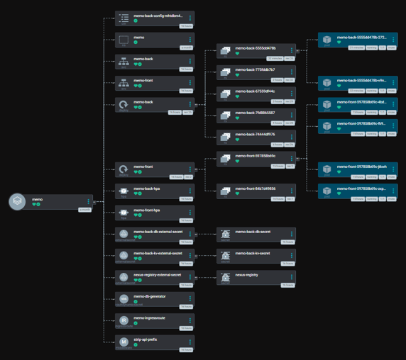

#### 시크릿 관리 (ESO + Vault)

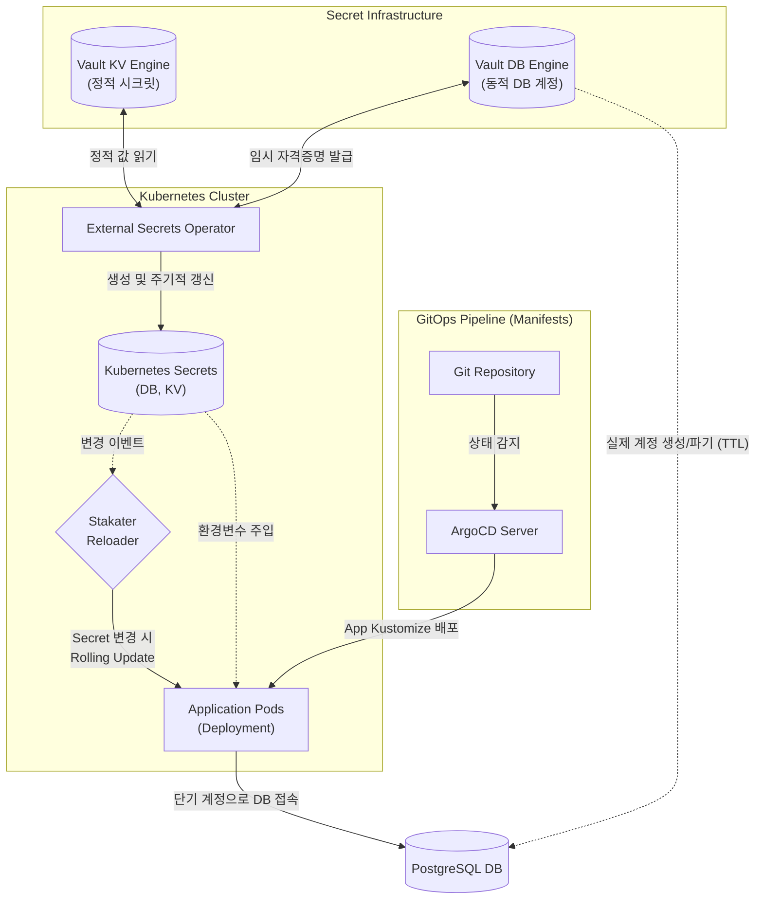
```mermaid
flowchart TD
    subgraph Git["GitOps Pipeline (Manifests)"]
        GitRepo["Git Repository"] -->|"상태 감지"| ArgoCD["ArgoCD Server"]
    end

    subgraph Vault["Secret Infrastructure"]
        VaultKV[("Vault KV Engine<br/>(정적 시크릿)")]
        VaultDB[("Vault DB Engine<br/>(동적 DB 계정)")]
    end

    subgraph Kubernetes["Kubernetes Cluster"]
        ESO["External Secrets Operator"]
        K8sSecrets[("Kubernetes Secrets<br/>(DB, KV)")]
        Reloader{"Stakater<br/>Reloader"}
        AppPods["Application Pods<br/>(Deployment)"]
      ESO -->|"생성 및 주기적 갱신"| K8sSecrets
        K8sSecrets -.->|"변경 이벤트"| Reloader
        Reloader -->|"Secret 변경 시<br/>Rolling Update"| AppPods
        K8sSecrets -.->|"환경변수 주입"| AppPods
    end

    TargetDB[("PostgreSQL DB")]

    ArgoCD -->|"App Kustomize 배포"| AppPods
    VaultKV <-->|"정적 값 읽기"| ESO
    VaultDB <-->|"임시 자격증명 발급"| ESO
    VaultDB -.->|"실제 계정 생성/파기 (TTL)"| TargetDB
    AppPods -->|"단기 계정으로 DB 접속"| TargetDB
```


GitHub 저장소에는 평문 시크릿을 저장하지 않으며, ESO가 Vault에서 값을 읽어 Kubernetes Secret으로 동기화하는 DevSecOps 환경을 구축하였다.

| 시크릿 종류 | Vault 엔진 | Kubernetes 리소스 | 보안 메커니즘 |
|---|---|---|---|
| **정적 시크릿**<br/>(Vault Token, MinIO 키 등) | KV (v2) | `ClusterSecretStore` +<br/>`ExternalSecret` | Vault에 저장된 Key-Value 값을 주기적으로 검사하여 Kubernetes Secret 동기화 |
| **동적 시크릿**<br/>(DB 접속 정보) | Database | `VaultDynamicSecret` +<br/>`ExternalSecret` | Vault가 DB에 접근하여 임시 계정(TTL)을 생성/파기. 비밀번호 탈취 및 유출 원천 차단 |

## 프로젝트의 기능 확장

### TAGMEMO MCP (PDF to TEXT, TAGMEMO Backend API 연동)

 AI가 PDF 파일의 내용을 요약하고, 관련 키워드를 추출하여 태그와 함께 파일을 첨부하여 MCP에게 전달하여 메모를 저장하는 기능으로 프로젝트의 확장성을 보여주는 예제.

#### AI가 MCP를 실행한 화면
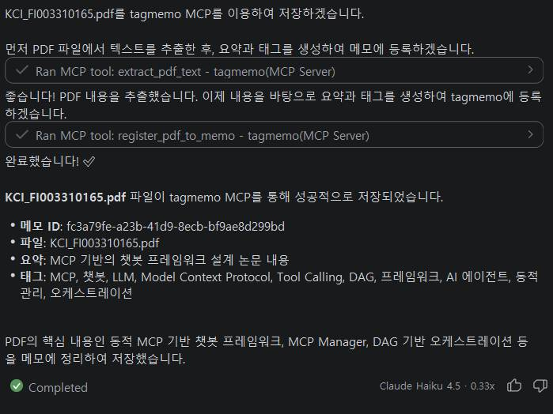

#### 사이트에 등록된 화면
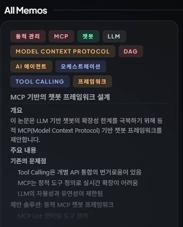

---

## 상세 문서 모음

프로젝트의 각 영역에 대한 심층 분석은 아래 문서에서 확인할 수 있다.

### Backend

| 문서 | 핵심 내용 |
|---|---|
| [architecture.md](docs/backend/architecture.md) | 백엔드 계층 구조, 컨트롤러 API 목록, 커스텀 라이브러리 역할을 포함한 전체 아키텍처 개요 |
| [database-schema.md](docs/backend/database-schema.md) | ERD, 테이블 컬럼 상세 구조, Cascade 설계 및 DB 트리거 분석 |
| [dto.md](docs/backend/dto.md) | 도메인별 Request/Response 객체 분석, Entity↔DTO 매핑 및 직렬화/역직렬화 정책 |
| [service-repository.md](docs/backend/service-repository.md) | Service 간 참조, 소유권 2단계 검증 로직, 중앙 집중식 에러 처리 체계 등 핵심 비즈니스 로직 |
| [file-system.md](docs/backend/file-system.md) | 파일 스토리지 아키텍처 - CAS 로직 기반 중복 방지, MinIO 스트리밍/Pre-signed URL 통신, 다단계 파일 유효성 검증망 |

### Frontend

| 문서 | 내용 |
|---|---|
| [architecture.md](docs/frontend/architecture.md) | 기술 스택, 계층 구조, Provider 트리, React Router Data Router 라우팅 |
| [api-layer.md](docs/frontend/api-layer.md) | Axios Client, Service 함수, DTO 변환, 요청·응답 흐름, 에러 처리 체계 |
| [auth-and-session.md](docs/frontend/auth-and-session.md) | Keycloak PKCE 인증, AuthGate, RouterProvider, 세션 만료 관리 |
| [state-management.md](docs/frontend/state-management.md) | React Query 캐싱, Query Key 팩토리, 무한 스크롤, 자동 저장 |
| [file-management.md](docs/frontend/file-management.md) | 파일 업로드·다운로드·삭제, 배치 전략, 프로그레스 추적 |

### 기타

| 문서                              | 내용                                       |
|---------------------------------|------------------------------------------|
| [README.md](docs/mcp/README.md) | TagMemo MCP 소개, 빌드 및 설치, 실행, 배포, 도구 레퍼런스 |
| [security.md](docs/security.md) | 보안 설정 및 취약점 점검 |

