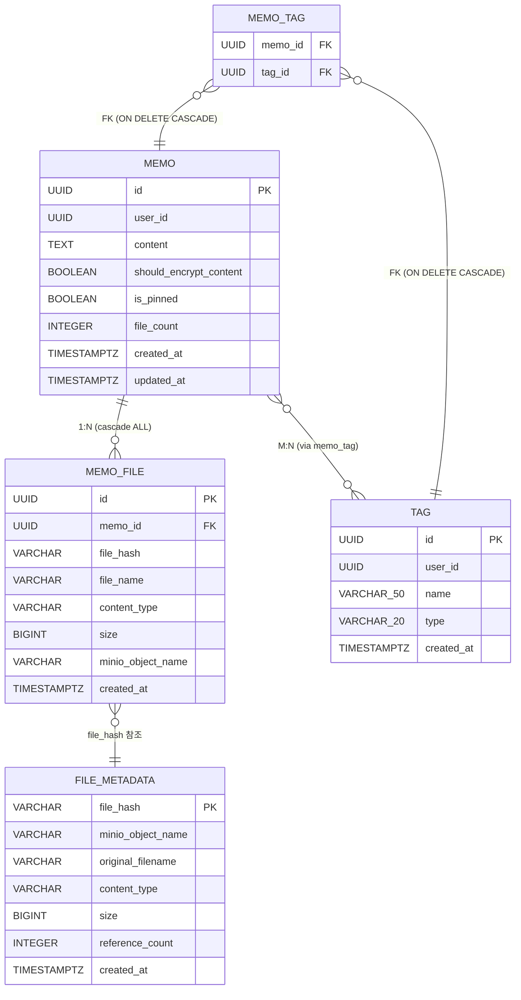
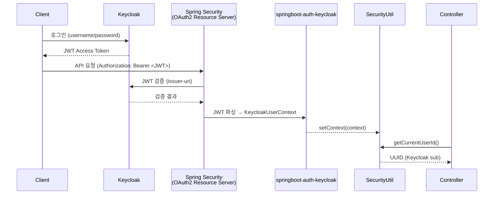
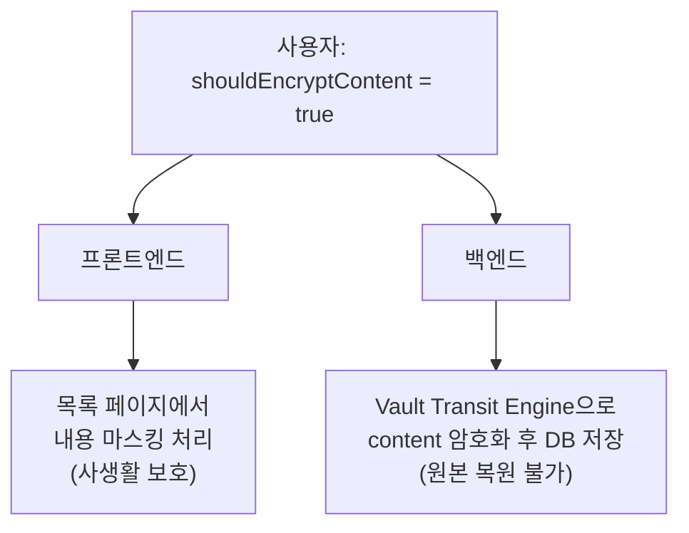
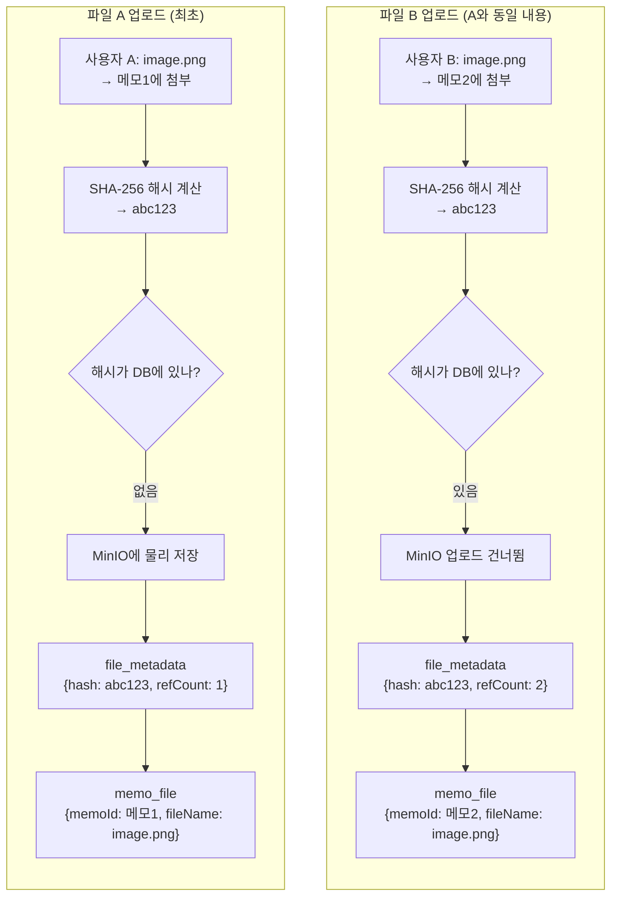
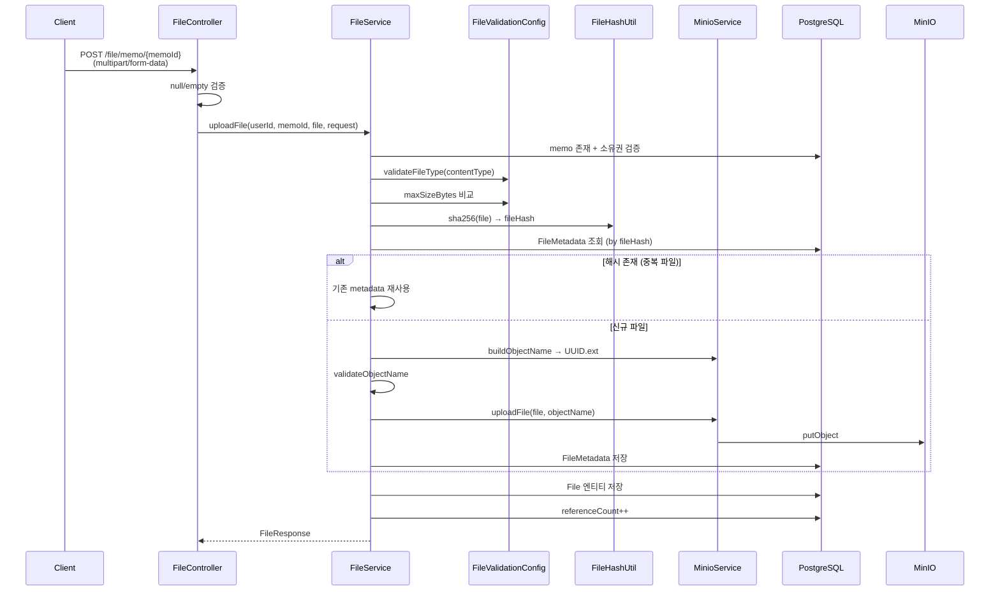
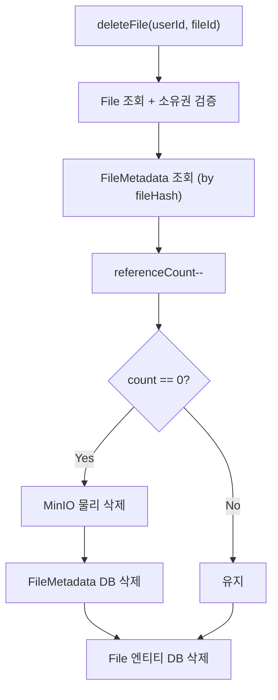
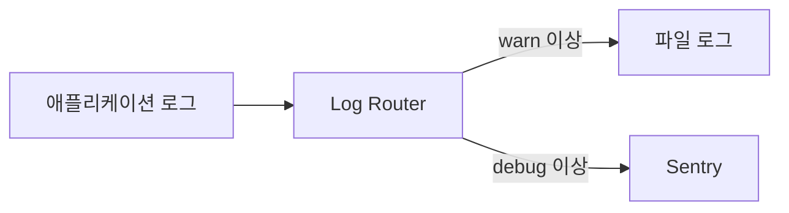
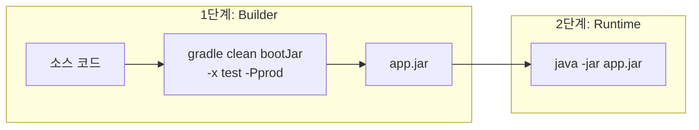
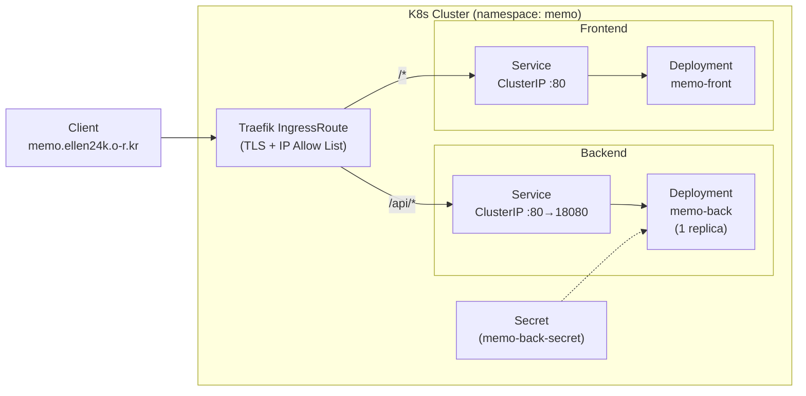

# 백엔드 아키텍처 상세

**Tag-Based Desktop Memo App Backend** — 태그 기반 메모 관리 REST API 서버.

---

<details>
<summary><b>목차</b></summary>

- [기술 스택](#기술-스택)
- [패키지 구조](#패키지-구조)
- [도메인 모델](#도메인-모델)
- [인증 아키텍처](#인증-아키텍처)
- [보안 및 암호화 설계](#보안-및-암호화-설계)
- [파일 스토리지 아키텍처](#파일-스토리지-아키텍처)
- [API 엔드포인트](#api-엔드포인트)
- [데이터 접근 계층](#데이터-접근-계층)
- [공통 환경 및 설정](#공통-환경-및-설정)
- [배포 아키텍처](#배포-아키텍처)
- [커스텀 라이브러리](#커스텀-라이브러리)

</details>

---

## 기술 스택


### 의존성 상세

| 카테고리 | 라이브러리 | 용도 |
|---|---|---|
| **Core** | `spring-boot-starter-web` | REST API |
| **인증** | `spring-boot-starter-oauth2-resource-server` | JWT 리소스 서버 |
| **인증** | `springboot-auth-keycloak` (커스텀) | Keycloak 컨텍스트 관리 |
| **영속성** | `spring-boot-starter-data-jpa` | ORM/Repository |
| **DB** | `postgresql` | 메인 데이터베이스 |
| **검증** | `spring-boot-starter-validation` | Bean Validation |
| **오브젝트 스토리지** | `minio:8.6.0` | 파일 업로드/다운로드 |
| **암호화** | `springboot-crypto-transit` (커스텀) | Vault Transit 기반 필드 암호화 |
| **로깅** | `springboot-log-router` (커스텀) | 로그 라우팅 (File/Sentry) |
| **모니터링** | `sentry-jvm-gradle:6.0.0` | 에러 트래킹 |
| **API 문서** | `springdoc-openapi:2.8.5` | Swagger UI |
| **직렬화** | `jackson-datatype-jsr310` | Java 8 Time 지원 |
| **개발** | `p6spy` (dev only) | SQL 쿼리 로깅 |
| **보일러플레이트** | `lombok` | 코드 간소화 |

---

## 패키지 구조

```
io.github.ellen24k.memo_back/
├── MemoBackApplication.java           # 진입점
├── config/                            # 설정 클래스 (6개)
│   ├── CorsConfig.java                # 프로필별 CORS
│   ├── FileValidationConfig.java      # 파일 타입/크기 검증
│   ├── JacksonConfig.java             # JSON 직렬화
│   ├── MinioConfig.java               # MinioClient Bean
│   ├── OpenApiConfig.java             # Swagger Bearer Auth
│   └── SecurityConfig.java            # Keycloak Context 바인딩
├── controller/                        # REST 컨트롤러 (3개)
│   ├── MemoController.java
│   ├── TagController.java
│   └── FileController.java
├── service/                           # 비즈니스 로직 (4개)
│   ├── MemoService.java
│   ├── TagService.java
│   ├── FileService.java
│   └── MinioService.java
├── repository/                        # 데이터 접근 (4개)
│   ├── MemoRepository.java
│   ├── TagRepository.java
│   ├── FileRepository.java
│   └── FileMetadataRepository.java
├── domain/                            # JPA 엔티티 (5개)
│   ├── Memo.java
│   ├── Tag.java
│   ├── File.java
│   ├── FileMetadata.java
│   └── TagType.java
├── dto/                               # 데이터 전송 객체 (12개)
│   ├── ApiBaseResponse.java
│   ├── ServiceResult.java
│   ├── MemoResponse.java
│   ├── CreateMemoRequest.java
│   ├── UpdateMemoRequest.java
│   ├── TagResponse.java
│   ├── CreateTagRequest.java
│   ├── UpdateTagRequest.java
│   ├── FileResponse.java
│   ├── FileListResponse.java
│   ├── UploadFileRequest.java
│   └── DownloadUrlResponse.java
├── exception/                         # 예외 처리 (15개)
│   └── (상세 구조는 에러처리 보고서 참고)
└── util/                              # 유틸리티 (2개)
    ├── SecurityUtil.java
    └── FileHashUtil.java
```

---

## 도메인 모델

### 엔티티 관계도



### 소유권 검증 로직

엔티티 자체가 `validateOwner(UUID)`를 소유하여 Service 계층에 인가 로직이 흩어지지 않도록 응집도를 높였다.

### 엔티티 상세

#### Memo

[Memo.java](https://github.com/ellen24k-memo/backend/blob/main/src/main/java/io/github/ellen24k/memo_back/domain/Memo.java)

| 필드 | 타입 | 특성 |
|---|---|---|
| `id` | UUID | `@GeneratedValue(UUID)` |
| `userId` | UUID | 소유자 (Keycloak sub) |
| `content` | TEXT | `@UseCryptoTransit` — Vault 암호화 대상 |
| `shouldEncryptContent` | Boolean | 암호화 활성화 플래그 |
| `isPinned` | Boolean | 고정 메모 여부 |
| `fileCount` | Integer | 첨부 파일 수 |
| `createdAt` | Instant | `@CreationTimestamp` |
| `updatedAt` | Instant | `@UpdateTimestamp` |
| `files` | List&lt;File&gt; | `@OneToMany(cascade=ALL, orphanRemoval=true)` |
| `tags` | Set&lt;Tag&gt; | `@ManyToMany` via `memo_tag` 조인 테이블 |

#### Tag

[Tag.java](https://github.com/ellen24k-memo/backend/blob/main/src/main/java/io/github/ellen24k/memo_back/domain/Tag.java)

| 필드 | 타입 | 특성 |
|---|---|---|
| `id` | UUID | PK |
| `userId` | UUID | 소유자 |
| `name` | VARCHAR(50) | `@UniqueConstraint(user_id, name)` |
| `type` | TagType | `NORMAL` / `FEATURED` (CHECK 제약) |
| `memos` | Set&lt;Memo&gt; | `@ManyToMany(mappedBy="tags")` 역방향 |

#### File (memo_file)

[File.java](https://github.com/ellen24k-memo/backend/blob/main/src/main/java/io/github/ellen24k/memo_back/domain/File.java)

| 필드 | 타입 | 특성 |
|---|---|---|
| `id` | UUID | PK |
| `memo` | Memo | `@ManyToOne(LAZY)`, `@OnDelete(CASCADE)` |
| `fileHash` | String | SHA-256 해시 (중복 검출) |
| `fileName` | String | 사용자 지정 원본 파일명 |
| `contentType` | String | MIME 타입 |
| `fileSize` | Long | 파일 크기 (bytes) |
| `minioObjectName` | String | MinIO 오브젝트 키 |

#### FileMetadata

[FileMetadata.java](https://github.com/ellen24k-memo/backend/blob/main/src/main/java/io/github/ellen24k/memo_back/domain/FileMetadata.java)

| 필드 | 타입 | 특성 |
|---|---|---|
| `fileHash` | String | **PK** (SHA-256) |
| `minioObjectName` | String | MinIO 오브젝트 키 |
| `originalFilename` | String | 최초 업로드 시 원본 파일명 |
| `contentType` | String | MIME 타입 |
| `size` | Long | 파일 크기 (bytes) |
| `referenceCount` | Integer | 참조 카운트 (0이면 물리 삭제) |
| `createdAt` | Instant | 최초 생성 시각 |

> [!IMPORTANT]
> `FileMetadata`는 **Content-Addressable Storage** 패턴을 구현한다. 동일 파일(해시 기준)은 MinIO에 한 번만 저장되고, 여러 `File` 엔티티가 같은 `fileHash`를 참조한다. `referenceCount`가 0이 되면 MinIO에서 물리적으로 삭제된다.

---

## 인증 아키텍처



### 구성 요소 및 JWT 처리

백엔드는 Keycloak이 발급한 JWT에서 `sub` 클레임을 추출해 내부 비즈니스 로직의 식별자(userId)로 사용한다.

```json
{
  "sub": "550e8400-e29b-41d4-a716-446655440000",
  "realm_access": { "roles": ["user"] },
  "preferred_username": "ellen24k"
}
```

| 컴포넌트 | 역할 |
|---|---|
| [SecurityConfig.java](https://github.com/ellen24k-memo/backend/blob/main/src/main/java/io/github/ellen24k/memo_back/config/SecurityConfig.java) | `@PostConstruct`에서 `KeycloakUserContext`를 `SecurityUtil`에 바인딩 |
| [SecurityUtil.java](https://github.com/ellen24k-memo/backend/blob/main/src/main/java/io/github/ellen24k/memo_back/util/SecurityUtil.java) | API 호출 시 `getCurrentUserId()`로 UUID 추출. |
| [OpenApiConfig.java](https://github.com/ellen24k-memo/backend/blob/main/src/main/java/io/github/ellen24k/memo_back/config/OpenApiConfig.java) | Swagger UI에 Bearer Auth 버튼 활성화 |

### 예외 및 Public 라우팅

| 상황 | HTTP 상태 | 처리 방식 |
|---|---|---|
| 토큰 누락 / 형식 체계 오류 | 401 | `auth.info.not.found` / `invalid.token.format` 응답 |
| 내 소유가 아닌 리소스 인가 실패 | 403 | `forbidden` 예외 |
| **Public Path** | — | dev 환경에서는 `/api-docs/**`, `/api/**`, `/swagger-ui/**` 허용 |

### 소유권 검증

모든 리소스 접근 시 **2단계 검증**:

```
1. SecurityUtil.getCurrentUserId() → 인증된 사용자 UUID 추출
2. entity.validateOwner(userId)    → 리소스 소유자 일치 확인
```

---

## 보안 및 암호화 설계

**사용자가 메모 별로 암호화 여부를 선택**하여 화면 노출과 DB 노출을 방어한다.



| 보호 레벨 | 방어 대상 | 구현 |
|---|---|---|
| **화면 보호** | 옆 사람, 공유 화면 | 프론트엔드에서 `shouldEncryptContent=true`인 메모의 내용을 목록에서 숨김(복호화 X, 사생활 보호) |
| **DB 보호** | DB 관리자, 해커 | HashiCorp Vault Transit Engine으로 서버 사이드 암호화 — DB에는 암호문만 저장 |

커스텀 라이브러리(`springboot-crypto-transit`)의 `@UseCryptoTransit` 어노테이션으로 별도의 비즈니스 로직 처리 없이 AOP가 암호화/복호화 처리:

| 적용 위치 | 대상 필드 | 동작 |
|---|---|---|
| `CreateMemoRequest` | `content` | 저장 시 암호화 |
| `UpdateMemoRequest` | `content` | 수정 시 암호화 |
| `MemoResponse` | `content` | 단일 메모 조회 시 복호화 |
| `MemoService` | `content` | @UseCryptoTransit 마커로 AOP 처리 |
| `Memo` (Entity) | `content` | JPA 레벨 암·복호화 |


---

## 파일 스토리지 아키텍처

### 중복 파일 방지 (CAS 패턴)

파일의 **내용(SHA-256 해시)** 을 주소로 사용하여, 동일한 파일은 MinIO에 한 번만 저장한다.



| 테이블 | 역할 |
|---|---|
| `memo_file` | 메모와 첨부 파일 간의 관계 (메모 ID, 파일명 등) |
| `file_metadata` | 파일의 물리적 실체 (해시, MinIO 오브젝트명, 참조 카운트) |


### 업로드 흐름



### 삭제 흐름 (참조 카운트 기반)



### 파일 검증 체계

[FileValidationConfig.java](https://github.com/ellen24k-memo/backend/blob/main/src/main/java/io/github/ellen24k/memo_back/config/FileValidationConfig.java)

- **최대 파일 크기**: 500MB (`file.max-size-bytes=524288000`)
- **MIME 매핑**: `config/file-formats.properties`에서 로드
- **화이트리스트**: `txt, doc, docx, pdf, xls, xlsx, ppt, pptx, jpg, jpeg, png, gif, zip, rar, md`

---

## API 엔드포인트

### Memo API (`/memo`)

| Method | Path | 설명 | 응답 코드 |
|---|---|---|---|
| POST | `/memo` | 메모 생성 | `memo.created` (201) |
| GET | `/memo/{id}` | 메모 상세 조회 | `memo.retrieved` (200) |
| PUT | `/memo/{id}` | 메모 수정 | `memo.updated` (200) |
| DELETE | `/memo/{id}` | 메모 삭제 (Hard Delete) | `memo.deleted` (200) |
| GET | `/memo?page=&size=&isPinned=` | 메모 목록 (페이징) | `memo.list.retrieved` (200) |

### Tag API (`/tag`)

| Method | Path | 설명 | 응답 코드 |
|---|---|---|---|
| POST | `/tag` | 태그 생성 (기존 태그 존재 시 반환, 예외 Catch로 멱등성 보장) | `tag.created` (201/200) |
| PUT | `/tag/{tagId}` | 태그 수정 | `tag.updated` (200) |
| GET | `/tag?type=` | 전체 태그 조회 | `tag.list.retrieved` (200) |
| GET | `/tag/search?name=` | 이름으로 태그 검색 | `tag.list.retrieved` (200) |
| POST | `/tag/memo/{memoId}/{tagId}` | 메모-태그 연결 | `tag.attached` (201/200) |
| DELETE | `/tag/memo/{memoId}/{tagId}` | 메모-태그 해제 | `tag.removed` (200) |
| GET | `/tag/{tagId}/memo?page=&size=` | 태그별 메모 조회 | `memos.by.tag.retrieved` (200) |
| GET | `/tag/memo/{memoId}` | 메모별 태그 조회 | `tag.list.retrieved` (200) |

### File API (`/file`)

| Method | Path | 설명 | 응답 코드 |
|---|---|---|---|
| GET | `/file/memo/{memoId}` | 메모의 파일 목록 | `file.retrieved` (200) |
| POST | `/file/memo/{memoId}` | 파일 업로드 (multipart) | `file.uploaded` (201) |
| GET | `/file/{fileId}/download-url?filename=` | Pre-signed 다운로드 URL | `download.url.created` (200) |
| DELETE | `/file/{fileId}` | 파일 삭제 | `references.decremented` (200) |

### 통합 응답 형식

모든 API가 동일한 `ApiBaseResponse<T>` 구조를 반환한다:

```json
{
  "code": "memo.created",
  "args": null,
  "data": { ... }
}
```

`BaseResponseCode.getCode()`가 Enum 상수명을 자동으로 dot-separated 코드로 변환하여 성공/실패 응답을 하나의 코드 체계로 통합한다.

---

## 데이터 접근 계층

### N+1 문제 해결

[MemoRepository.java](https://github.com/ellen24k-memo/backend/blob/main/src/main/java/io/github/ellen24k/memo_back/repository/MemoRepository.java)

`@EntityGraph(attributePaths = {"tags"})`를 모든 목록 조회 메서드에 적용하여 Memo 조회 시 태그를 한 번에 fetch한다.

### 배치 페칭

```properties
spring.jpa.properties.hibernate.default_batch_fetch_size=100
```

`@EntityGraph` 외의 LAZY 로딩 발생 시 한 번에 최대 100개 프록시를 초기화한다.

### 쿼리 모니터링

- **dev**: P6Spy 활성화 — 실행된 SQL과 소요 시간을 로그에 기록
- **prod**: P6Spy 미포함 (`-Pprod` 빌드 시 의존성 제외)

| 항목 | 값 |
|---|---|
| 빌드 조건 | `if (!project.hasProperty("prod"))` — prod 빌드 시 JAR에 아예 미포함 |
| 로그 형식 | SQL 본문 + 실행 시간(ms) + 카테고리 |
| 제외 카테고리 | `info`, `debug`, `result`, `commit`, `rollback` |

> [!NOTE]
> prod 빌드(`-Pprod`)에서는 P6Spy 의존성 자체가 JAR에 포함되지 않아 런타임 오버헤드가 0이다.

### 커스텀 쿼리

| Repository | 메서드 | 쿼리 방식 |
|---|---|---|
| `MemoRepository` | `findByTagIdAndUserId` | JPQL (`@Query`) + `@EntityGraph` |
| `TagRepository` | `findByMemoIdAndUserId` | JPQL (`@Query`) |
| 나머지 | Spring Data JPA 쿼리 메서드 | 메서드명 자동 파싱 |

---

> [!NOTE]
> 트랜잭션 관리 전략 개요는 README.md를 참조. 트랜잭션 경계 및 MinIO 보상 트랜잭션 미구현 상세는 [service-repository.md](./service-repository.md)를 참조.

---

## 공통 환경 및 설정

### 프로필 분기 전략

모든 민감 정보는 프로필에 따라 환경변수 또는 Secret으로 분리 주입된다.

| 파일/리소스 | 환경 | 역할 |
|---|---|---|
| `application.properties` | 공통 | 활성화 프로필(dev/prod) 결정 |
| `application-dev.properties` | 개발 | 로컬 환경 전체 설정 (P6Spy 활성화 등) |
| `application-prod.properties` | 운영 | 운영 공통 설정 |
| `configmap.yaml` / `secret.yaml` | 운영(K8s) | 운영 환경변수 및 보안 패스워드 주입 |

#### 환경변수 주입 대상

| 그룹 | 변수 |
|---|---|
| **DB** | `POSTGRES_HOST`, `POSTGRES_PORT`, `POSTGRES_DB`, `POSTGRES_USER`, `POSTGRES_PASSWORD` |
| **MinIO** | `MINIO_ACCESS_KEY`, `MINIO_SECRET_KEY`, `MINIO_BUCKET`, `MINIO_URL` |
| **Vault** | `VAULT_ADDR`, `VAULT_TOKEN`, `VAULT_TRANSIT_KEY` |
| **Sentry** | `SENTRY_AUTH_TOKEN`, `SENTRY_DSN` |
| **App** | `MODE`, `SERVER_PORT` |

---

### 직렬화 (Jackson)

[JacksonConfig.java](https://github.com/ellen24k-memo/backend/blob/main/src/main/java/io/github/ellen24k/memo_back/config/JacksonConfig.java)

| 설정 | 값 | 효과 |
|---|---|---|
| `JavaTimeModule` | 등록 | Instant 등 Java 8 Time 지원 |
| `WRITE_DATES_AS_TIMESTAMPS` | `false` | ISO-8601 문자열 출력 (`2026-02-25T02:00:00Z`) |
| `FAIL_ON_UNKNOWN_PROPERTIES` | `false` | 알 수 없는 JSON 필드 무시 |
| `ACCEPT_EMPTY_STRING_AS_NULL_OBJECT` | `true` | 빈 문자열 → null 변환 |

---

### 로깅 및 모니터링

### 로그 라우팅

커스텀 라이브러리 `springboot-log-router`로 로그를 File과 Sentry 두 채널로 분기한다.



| 채널 | 로그 레벨 | 용도 |
|---|---|---|
| 파일 | `warn` 이상 | 서버에 남기는 영구 기록 |
| Sentry | `debug` 이상 | 원격 모니터링 (대시보드에서 확인) |

| 설정 | dev | prod |
|---|---|---|
| `log-router.file-level` | `warn` | `warn` |
| `log-router.sentry-level` | `debug` | `debug` |
| `sentry.minimum-breadcrumb-level` | `debug` | `debug` |
| `sentry.minimum-event-level` | `debug` | `debug` |

`@UseLogRouter` 어노테이션을 달면 해당 클래스의 로그가 Log Router를 통해 File/Sentry로 분기된다.

### Sentry 설정

| 설정 | 값 |
|---|---|
| `sentry.dsn` | 환경변수 `${SENTRY_DSN}` |
| `sentry.send-default-pii` | `true` — 사용자 식별 정보 포함 |
| `minimum-breadcrumb-level` | `debug` — 에러 전후 맥락 수집 |
| `minimum-event-level` | `debug` — 에러 이벤트 전송 기준 |

### 커스텀 로그 토픽

```
logging.level.app=debug            # 애플리케이션 전체
logging.level.app.service=info     # 서비스 계층 (옵션)
logging.level.app.core=debug       # 코어 로직 (옵션)
logging.level.lib.log.log-router   # 로그 라우터 자체
logging.level.lib.security.*       # 보안 라이브러리
```

---

## 배포 아키텍처

### Docker 멀티스테이지 빌드

[Dockerfile](https://github.com/ellen24k-memo/backend/blob/main/Dockerfile) 배포 컨테이너 이미지를 최적화하기 위해 컴파일 환경과 실행 환경을 분리하였다.



| 스테이지 | 소스 이미지 | 동작 | 컨테이너 크기 |
|---|---|---|---|
| Builder | `gradle:9-jdk25` | 빌드 수행 (`gradle clean bootJar -x test -Pprod`) | ~800MB |
| Runtime | `eclipse-temurin:25-jre` | JAR 실행 (`java -jar app.jar`) | ~200MB 이하 |

### Kubernetes



### K8s 매니페스트 구성

| 파일 | 리소스 | 설명 |
|---|---|---|
| `namespace.yaml` | Namespace | `memo` 네임스페이스 |
| `secret.yaml` | Secret | DB, MinIO, Vault, Sentry 인증 정보 |
| `deployment.yaml` | Deployment | RollingUpdate, liveness/readiness probe, 리소스 제한 |
| `service.yaml` | Service | ClusterIP (80→18080) |
| `memo-ingress-route.yaml` | IngressRoute (Traefik) | 호스트 기반 라우팅, TLS |
| `memo-ip-allow-list.yaml` | Middleware (Traefik) | IP 화이트리스트 |

### Deployment 상세

| 항목 | 값 |
|---|---|
| 레플리카 | 1 |
| 이미지 | `nexus.ellen24k.r-e.kr/docker-release/memo-backend:latest` |
| 전략 | RollingUpdate (maxSurge=1, maxUnavailable=0) |
| Liveness Probe | GET `/api-docs` (30s delay, 10s interval) |
| Readiness Probe | GET `/api-docs` (10s delay, 5s interval) |
| 리소스 요청 | 512Mi / 250m CPU |
| 리소스 제한 | 1Gi / 500m CPU |
| Graceful Shutdown | `preStop: sleep 5` |

---

## 커스텀 라이브러리

본 프로젝트는 `io.github.ellen24k` 조직의 3개 커스텀 Spring Boot 라이브러리를 사용한다. `@ComponentScan(basePackages = "io.github.ellen24k")`으로 자동 스캔된다.

| 라이브러리 | 용도 | 주요 기능 |
|---|---|---|
| `springboot-auth-keycloak` | Keycloak 인증 통합 | `KeycloakUserContext` 제공, public path 설정, CORS 관리 |
| `springboot-log-router` | 로그 라우팅 | `@UseLogRouter`, `app.*` 토픽 기반 File/Sentry 분기 |
| `springboot-crypto-transit` | Vault Transit 암호화 | `@UseCryptoTransit` AOP 기반 필드 레벨 암호화/복호화 |

---

### CORS 설정

[CorsConfig.java](https://github.com/ellen24k-memo/backend/blob/main/src/main/java/io/github/ellen24k/memo_back/config/CorsConfig.java)

프로필에 따라 동적으로 Origin을 결정하며, 이중 CORS 설정(CorsConfig + Keycloak 라이브러리)이 존재한다.

| 메서드 | 허용 |
|---|---|
| GET, POST, PUT, DELETE, OPTIONS | ✓ |
| Credentials | ✓ |
| Headers | `*` (전체 허용) |

---

