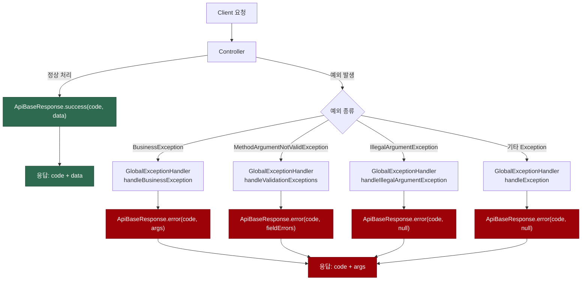
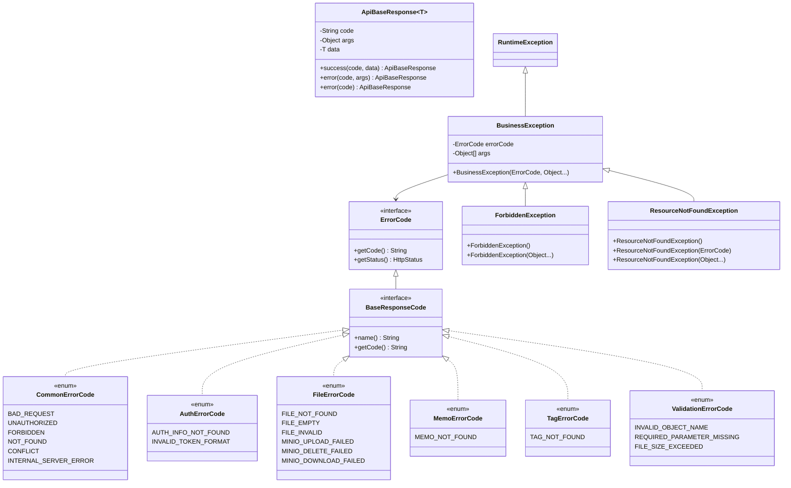
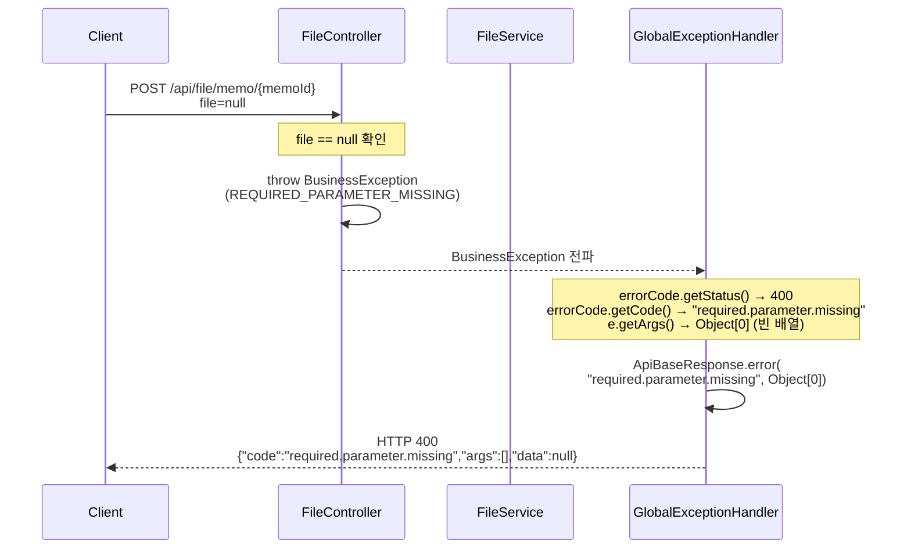

# Memo 백엔드 에러 처리 구조 매뉴얼

## 응답 포맷 개요

모든 API 응답은 `ApiBaseResponse<T>` 하나의 통일된 형식을 사용한다.

```json
{
  "code": "응답.코드",
  "args": null,
  "data": null
}
```

| 필드 | 타입 | 성공 시 | 에러 시 |
|------|------|---------|---------|
| **code** | `String` | 성공 코드 (e.g. `"memo.created"`) | 에러 코드 (e.g. `"file.not.found"`) |
| **args** | [Object](file:///c:/Users/kwb/IdeaProjects/prj/memo/backend/src/main/java/io/github/ellen24k/memo_back/service/FileService.java#61-88) | 항상 `null` | 에러 부가 정보 (nullable) |
| **data** | `T` | 응답 데이터 | 항상 `null` |

핵심 규칙: **`code`는 항상 존재**하고, **`args`와 `data`는 서로 배타적**이다.

---

## 전체 흐름 다이어그램



---

## 코드 생성 원리

모든 응답 코드는 Enum 이름에서 **자동 변환**된다. 직접 문자열을 작성하지 않는다.

[BaseResponseCode.java](file:///c:/Users/kwb/IdeaProjects/prj/memo/backend/src/main/java/io/github/ellen24k/memo_back/exception/code/BaseResponseCode.java)
```java
public interface BaseResponseCode extends ErrorCode {
    String name();

    @Override
    default String getCode() {
        return name().toLowerCase().replace("_", ".");
    }
}
```

| Enum 이름 | 변환된 code |
|-----------|-------------|
| `MEMO_CREATED` | `"memo.created"` |
| `FILE_NOT_FOUND` | `"file.not.found"` |
| `MINIO_UPLOAD_FAILED` | `"minio.upload.failed"` |
| `AUTH_INFO_NOT_FOUND` | `"auth.info.not.found"` |

---

## 클래스 구조 다이어그램



---

## code, args, data 실전 사용 예시

### 성공 응답 — `code` + `data` 사용

성공 시 `ApiBaseResponse.success(code, data)`를 호출한다. `args`는 항상 `null`.

#### 메모 생성 (data에 객체)

[MemoController.java](file:///c:/Users/kwb/IdeaProjects/prj/memo/backend/src/main/java/io/github/ellen24k/memo_back/controller/MemoController.java#L44-L49)
```java
MemoResponse response = memoService.createMemo(userId, request);
return ResponseEntity.status(HttpStatus.CREATED)
        .body(ApiBaseResponse.success(MemoSuccessCode.MEMO_CREATED.getCode(), response));
```

```json
{
  "code": "memo.created",
  "args": null,
  "data": {
    "id": "301aa98f-...",
    "title": "새 메모",
    "content": "내용...",
    "isPinned": false,
    "createdAt": "2026-03-03T...",
    "updatedAt": "2026-03-03T..."
  }
}
```

#### 메모 삭제 (data가 null)

[MemoController.java](file:///c:/Users/kwb/IdeaProjects/prj/memo/backend/src/main/java/io/github/ellen24k/memo_back/controller/MemoController.java#L80-L83)
```java
memoService.deleteMemo(SecurityUtil.getCurrentUserId(), id);
return ResponseEntity.ok(ApiBaseResponse.success(MemoSuccessCode.MEMO_DELETED.getCode(), null));
```

```json
{
  "code": "memo.deleted",
  "args": null,
  "data": null
}
```

#### 파일 업로드 (data에 객체)

[FileController.java](file:///c:/Users/kwb/IdeaProjects/prj/memo/backend/src/main/java/io/github/ellen24k/memo_back/controller/FileController.java#L92-L93)
```java
FileResponse response = fileService.uploadFile(SecurityUtil.getCurrentUserId(), memoId, request.getFile(), request);
return ResponseEntity.status(HttpStatus.CREATED)
        .body(ApiBaseResponse.success(FileSuccessCode.FILE_UPLOADED.getCode(), response));
```

```json
{
  "code": "file.uploaded",
  "args": null,
  "data": {
    "id": "a1b2c3d4-...",
    "fileName": "document.pdf",
    "fileSize": 204800,
    "contentType": "application/pdf"
  }
}
```

#### 태그 목록 조회 (data에 리스트)

[TagController.java](file:///c:/Users/kwb/IdeaProjects/prj/memo/backend/src/main/java/io/github/ellen24k/memo_back/controller/TagController.java#L62-L66)
```java
List<TagResponse> tags = tagService.getAllTags(SecurityUtil.getCurrentUserId(), type);
return ResponseEntity.ok(ApiBaseResponse.success(TagSuccessCode.TAG_LIST_RETRIEVED.getCode(), tags));
```

```json
{
  "code": "tag.list.retrieved",
  "args": null,
  "data": [
    { "id": "...", "name": "Spring", "type": "GENERAL" },
    { "id": "...", "name": "Java", "type": "GENERAL" }
  ]
}
```

---

### 에러 응답 — `code` + `args` 사용

에러 시 `ApiBaseResponse.error(code, args)`를 호출한다. `data`는 항상 `null`.

#### args가 null — 단순 에러 코드만 전달

대부분의 에러가 이 패턴이다. 에러의 종류만 알면 충분한 경우.

[SecurityUtil.java](file:///c:/Users/kwb/IdeaProjects/prj/memo/backend/src/main/java/io/github/ellen24k/memo_back/util/SecurityUtil.java#L22-L30)
```java
// 인증 정보 없음
if (context == null || context.getUserId() == null) {
    throw new BusinessException(AuthErrorCode.AUTH_INFO_NOT_FOUND);
}
// 토큰 형식 오류
try {
    return UUID.fromString(context.getUserId());
} catch (IllegalArgumentException e) {
    throw new BusinessException(AuthErrorCode.INVALID_TOKEN_FORMAT);
}
```

```json
{
  "code": "auth.info.not.found",
  "args": null,
  "data": null
}
```

[FileService.java](file:///c:/Users/kwb/IdeaProjects/prj/memo/backend/src/main/java/io/github/ellen24k/memo_back/service/FileService.java#L104-L106)
```java
// 허용되지 않는 파일 타입
if (!fileValidationConfig.validateFileType(contentType)) {
    throw new BusinessException(FileErrorCode.FILE_INVALID);
}
```

```json
{
  "code": "file.invalid",
  "args": null,
  "data": null
}
```

[FileController.java](file:///c:/Users/kwb/IdeaProjects/prj/memo/backend/src/main/java/io/github/ellen24k/memo_back/controller/FileController.java#L85-L89)
```java
// 필수 파라미터 누락 vs 빈 파일 구분
if (request.getFile() == null) {
    throw new BusinessException(ValidationErrorCode.REQUIRED_PARAMETER_MISSING);
}
if (request.getFile().isEmpty()) {
    throw new BusinessException(FileErrorCode.FILE_EMPTY);
}
```

```json
{
  "code": "required.parameter.missing",
  "args": null,
  "data": null
}
```

#### args에 Map 전달 — 디버깅용 부가 정보

에러 코드만으로 불충분할 때, `args`에 상세 컨텍스트를 담는다.

[FileService.java](file:///c:/Users/kwb/IdeaProjects/prj/memo/backend/src/main/java/io/github/ellen24k/memo_back/service/FileService.java#L206-L208)
```java
// 물리 파일 삭제 실패 시 fileHash를 args로 전달
try {
    minioService.deleteFile(metadata.getMinioObjectName());
    fileMetadataRepository.deleteById(fileHash);
} catch (Exception e) {
    throw new BusinessException(FileErrorCode.MINIO_DELETE_FAILED, Map.of("fileHash", fileHash));
}
```

```json
{
  "code": "minio.delete.failed",
  "args": [{ "fileHash": "a3f8c2..." }],
  "data": null
}
```

> [!NOTE]
> [BusinessException](file:///c:/Users/kwb/IdeaProjects/prj/memo/backend/src/main/java/io/github/ellen24k/memo_back/exception/BusinessException.java#7-18)의 `args`는 `Object...` (가변 인자)이므로 실제 JSON에서는 배열로 직렬화된다. 위 예시에서 `Map.of(...)`는 배열의 첫 번째 요소가 된다.

#### args에 fieldErrors Map 전달 — @Valid 검증 실패

`@Valid` 어노테이션으로 인한 Bean Validation 실패 시, 필드별 에러 메시지가 `args`에 담긴다.

[GlobalExceptionHandler.java](file:///c:/Users/kwb/IdeaProjects/prj/memo/backend/src/main/java/io/github/ellen24k/memo_back/exception/GlobalExceptionHandler.java#L37-L45)
```java
@ExceptionHandler(MethodArgumentNotValidException.class)
public ResponseEntity<ApiBaseResponse<Void>> handleValidationExceptions(MethodArgumentNotValidException e) {
    Map<String, String> fieldErrors = new HashMap<>();
    e.getBindingResult().getFieldErrors().forEach(error ->
            fieldErrors.put(error.getField(), error.getDefaultMessage())
    );
    return ResponseEntity.status(HttpStatus.BAD_REQUEST)
            .body(ApiBaseResponse.error(CommonErrorCode.BAD_REQUEST.getCode(), fieldErrors));
}
```

```json
{
  "code": "bad.request",
  "args": {
    "title": "must not be blank",
    "content": "size must be between 1 and 10000"
  },
  "data": null
}
```

#### 편의 예외 클래스 — ForbiddenException, ResourceNotFoundException

도메인 엔티티 내부에서 소유권 검증이나 리소스 존재 여부 확인에 사용한다.

[Memo.java](file:///c:/Users/kwb/IdeaProjects/prj/memo/backend/src/main/java/io/github/ellen24k/memo_back/domain/Memo.java#L71-L75)
```java
public void validateOwner(UUID userId) {
    if (!this.userId.equals(userId)) {
        throw new ForbiddenException();  // → code: "forbidden", args: null
    }
}
```

```json
{
  "code": "forbidden",
  "args": null,
  "data": null
}
```

[FileService.java](file:///c:/Users/kwb/IdeaProjects/prj/memo/backend/src/main/java/io/github/ellen24k/memo_back/service/FileService.java#L168-L169)
```java
File file = fileRepository.findById(fileId)
        .orElseThrow(() -> new ResourceNotFoundException(FileErrorCode.FILE_NOT_FOUND));
        // → code: "file.not.found", args: null
```

```json
{
  "code": "file.not.found",
  "args": null,
  "data": null
}
```

---

## 예외 처리 흐름 다이어그램

실제 파일 업로드 요청의 에러 처리 흐름을 추적한 예시:



---

## 전체 응답 코드 목록

### 성공 코드

| 도메인 | Enum | code | HttpStatus |
|--------|------|------|------------|
| Memo | `MEMO_CREATED` | `memo.created` | 201 |
| Memo | `MEMO_RETRIEVED` | `memo.retrieved` | 200 |
| Memo | `MEMO_UPDATED` | `memo.updated` | 200 |
| Memo | `MEMO_DELETED` | `memo.deleted` | 200 |
| Memo | `MEMO_LIST_RETRIEVED` | `memo.list.retrieved` | 200 |
| File | `FILE_UPLOADED` | `file.uploaded` | 200 |
| File | `FILE_RETRIEVED` | `file.retrieved` | 200 |
| File | `FILE_DELETED` | `file.deleted` | 200 |
| File | `REFERENCES_INCREMENTED` | `references.incremented` | 200 |
| File | `REFERENCES_DECREMENTED` | `references.decremented` | 200 |
| File | `DOWNLOAD_URL_CREATED` | `download.url.created` | 200 |
| Tag | `TAG_CREATED` | `tag.created` | 201 |
| Tag | `TAG_UPDATED` | `tag.updated` | 200 |
| Tag | `TAG_DELETED` | `tag.deleted` | 200 |
| Tag | `TAG_LIST_RETRIEVED` | `tag.list.retrieved` | 200 |
| Tag | `TAG_ATTACHED` | `tag.attached` | 200 |
| Tag | `TAG_REMOVED` | `tag.removed` | 200 |
| Tag | `MEMOS_BY_TAG_RETRIEVED` | `memos.by.tag.retrieved` | 200 |

### 에러 코드

| 도메인 | Enum | code | HttpStatus | args 사용 여부 |
|--------|------|------|------------|----------------|
| Common | `BAD_REQUEST` | `bad.request` | 400 | @Valid: fieldErrors Map |
| Common | `UNAUTHORIZED` | `unauthorized` | 401 | - |
| Common | `FORBIDDEN` | `forbidden` | 403 | - |
| Common | `NOT_FOUND` | `not.found` | 404 | - |
| Common | `CONFLICT` | `conflict` | 409 | - |
| Common | `INTERNAL_SERVER_ERROR` | `internal.server.error` | 500 | - |
| Auth | `AUTH_INFO_NOT_FOUND` | `auth.info.not.found` | 401 | - |
| Auth | `INVALID_TOKEN_FORMAT` | `invalid.token.format` | 401 | - |
| File | `FILE_NOT_FOUND` | `file.not.found` | 404 | - |
| File | `FILE_EMPTY` | `file.empty` | 400 | - |
| File | `FILE_INVALID` | `file.invalid` | 400 | - |
| File | `MINIO_UPLOAD_FAILED` | `minio.upload.failed` | 500 | - |
| File | `MINIO_DELETE_FAILED` | `minio.delete.failed` | 500 | Map (fileHash) |
| File | `MINIO_DOWNLOAD_FAILED` | `minio.download.failed` | 500 | - |
| Memo | `MEMO_NOT_FOUND` | `memo.not.found` | 404 | - |
| Tag | `TAG_NOT_FOUND` | `tag.not.found` | 404 | - |
| Validation | `INVALID_OBJECT_NAME` | `invalid.object.name` | 400 | - |
| Validation | `REQUIRED_PARAMETER_MISSING` | `required.parameter.missing` | 400 | - |
| Validation | `FILE_SIZE_EXCEEDED` | `file.size.exceeded` | 400 | - |

---

## 새 에러 코드 추가 방법

해당 도메인의 ErrorCode enum에 항목을 추가하면 `code` 문자열이 자동 생성된다.

```java
public enum MemoErrorCode implements BaseResponseCode {
    MEMO_NOT_FOUND {
        @Override
        public HttpStatus getStatus() { return HttpStatus.NOT_FOUND; }
    },
    // 새 에러 추가 → code: "memo.already.exists"
    MEMO_ALREADY_EXISTS {
        @Override
        public HttpStatus getStatus() { return HttpStatus.CONFLICT; }
    };
}
```

사용처에서 throw:

```java
// args 없이
throw new BusinessException(MemoErrorCode.MEMO_ALREADY_EXISTS);

// args와 함께 (디버깅 정보 전달)
throw new BusinessException(MemoErrorCode.MEMO_ALREADY_EXISTS, Map.of("title", title));
```
