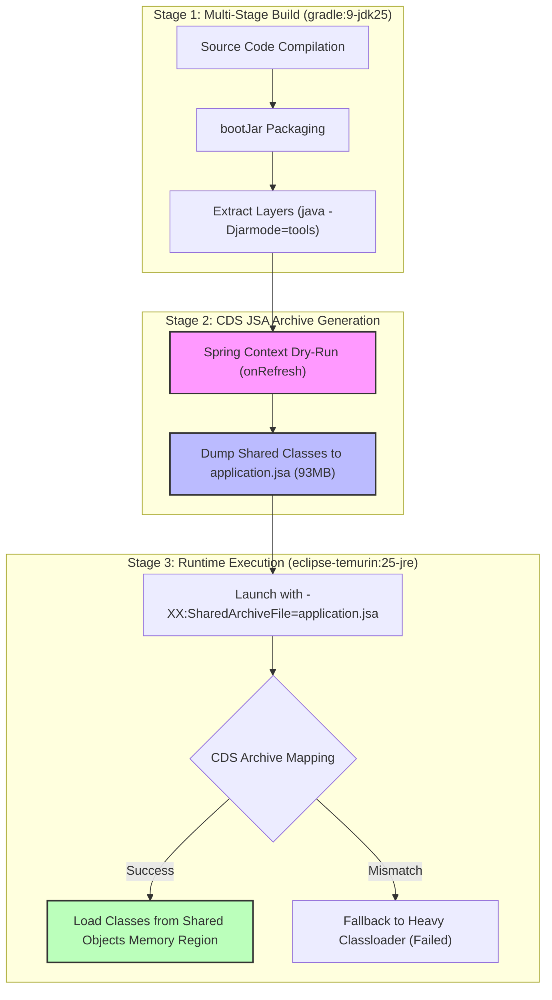

# Spring Boot CDS (Class Data Sharing) 빌드 및 런타임 검증 리포트

## 📌 1. 개요
본 리포트는 [Dockerfile.dev.cds](file:///root/projects/memo/backend/Dockerfile.dev.cds)를 기반으로 작성된 Spring Boot 애플리케이션의 **Class Data Sharing (CDS)** 아카이브 생성 및 런타임 로딩 검증 결과를 상세히 기록한 문서입니다.

---

## 📐 2. CDS 빌드 & 런타임 아키텍처 (Mermaid Flowchart)



---

## 🛠️ 3. 주요 수정 및 최적화 내역

| 구분 | 기존 설정 | 수정 후 설정 | 수정 사유 |
| :--- | :--- | :--- | :--- |
| **Runtime Base Image** | `cgr.dev/chainguard/jre:latest-dev` | `eclipse-temurin:25-jre` | Java 25.0.3 버전 고정으로 **Builder-Runtime JVM 버전 불일치 방지** 및 검증용 **Shell/ls 유틸리티 확보** |
| **JDK/JRE Version** | Builder(Java 25) vs Runtime(Java 26+ 추정) | Builder(Java 25.0.3) == Runtime(Java 25.0.3) | CDS Mismatch 방지 (JVM 버전 일치 필수) |

---

## 🧪 4. 검증 단계별 수행 결과 및 출력 로그

### 4.1. 이미지 빌드 및 JSA 아카이브 생성
- **실행 커맨드**: `docker build -f Dockerfile.dev.cds -t memo-backend:cds .`
- **핵심 빌드 로그**:
```text
 => [builder 7/7] RUN --mount=type=cache,target=/home/gradle/.gradle gradle bootJar -x test --no-daemon -Pdev && java -Djarmode=tools -jar build/libs/*.jar extract --layers --launcher --destination extracted    18.8s
 => [stage-1 7/7] RUN java -Dspring.context.exit=onRefresh -Dspring.main.banner-mode=off ... -XX:ArchiveClassesAtExit=application.jsa org.springframework.boot.loader.launch.JarLauncher || true                 7.4s
 => naming to docker.io/library/memo-backend:cds
 => FINISHED
```

---

### 4.2. JRE 버전 일치성 및 `application.jsa` 파일 용량 확인
- **실행 커맨드**: 
  ```bash
  docker run --rm --entrypoint java memo-backend:cds -version
  docker run --rm --entrypoint ls memo-backend:cds -lh /app/application.jsa
  ```
- **출력 결과 (Logs)**:
```text
Picked up JAVA_TOOL_OPTIONS: -Duser.timezone=Asia/Seoul -XX:TieredStopAtLevel=1
openjdk version "25.0.3" 2026-04-21 LTS
OpenJDK Runtime Environment Temurin-25.0.3+9 (build 25.0.3+9-LTS)
OpenJDK 64-Bit Server VM Temurin-25.0.3+9 (build 25.0.3+9-LTS, mixed mode, emulated-client, sharing)

-rw-r--r-- 1 root root 93M Jul 24 20:52 /app/application.jsa
```
> 💡 **판정**: Java 25.0.3으로 버전이 완전 일치하며, 93MB의 유의미한 크기로 Class Sharing Archive가 생성되었음을 입증함.

---

### 4.3. 런타임 CDS Shared Class 로딩 로그 실측 검증
- **실행 커맨드**:
  ```bash
  docker run --rm \
    -e JAVA_TOOL_OPTIONS="-Duser.timezone=Asia/Seoul -XX:TieredStopAtLevel=1 -Xlog:cds=info -Xlog:class+load=info -DJWT_ISSUER_URI=http://mock -DVAULT_ADDR=http://mock -DVAULT_TOKEN=mock -DVAULT_TRANSIT_KEY=mock -DMINIO_ACCESS_KEY=mock -DMINIO_SECRET_KEY=mock -DMINIO_BUCKET=mock -DMINIO_URL=http://mock -Dspring.datasource.url=jdbc:postgresql://mock:5432/mock -Dspring.datasource.username=mock -Dspring.datasource.password=mock -Dspring.datasource.hikari.initialization-fail-timeout=-1 -Dspring.datasource.hikari.connection-timeout=250 -Dspring.jpa.database-platform=org.hibernate.dialect.PostgreSQLDialect -Dspring.jpa.hibernate.ddl-auto=none -Dspring.jpa.properties.hibernate.temp.use_jdbc_metadata_defaults=false" \
    memo-backend:cds
  ```

- **출력 로그 (Logs)**:
```text
Picked up JAVA_TOOL_OPTIONS: -Duser.timezone=Asia/Seoul -XX:TieredStopAtLevel=1 -Xlog:cds=info -Xlog:class+load=info ...
[0.003s][info][cds] trying to map /opt/java/openjdk/lib/server/classes.jsa
[0.003s][info][cds] Opened shared archive file /opt/java/openjdk/lib/server/classes.jsa.
[0.003s][info][cds] trying to map application.jsa
[0.003s][info][cds] Opened shared archive file application.jsa.
[0.003s][info][cds] The shared archive file was created with UseCompressedOops = 1, UseCompressedClassPointers = 1, UseCompactObjectHeaders = 0
[0.003s][info][cds] Reserved archive_space_rs [0x000000003c000000 - 0x0000000043000000] (117440512) bytes
[0.010s][info][cds] Mapped dynamic region #0 at base 0x000000003cc95000 top 0x000000003f475000 (ReadWrite)
[0.010s][info][cds] Mapped dynamic region #1 at base 0x000000003f475000 top 0x0000000042795000 (ReadOnly)
[0.033s][info][class,load] java.lang.Object source: shared objects file
[0.034s][info][class,load] java.io.Serializable source: shared objects file
[0.034s][info][class,load] java.lang.Comparable source: shared objects file
[0.034s][info][class,load] java.lang.CharSequence source: shared objects file
[0.034s][info][class,load] java.lang.String source: shared objects file
[0.034s][info][class,load] java.lang.Class source: shared objects file
[0.034s][info][class,load] java.lang.ClassLoader source: shared objects file
...
```

> 💡 **판정**: `Opened shared archive file application.jsa` 및 `Mapped dynamic region`, 그리고 `source: shared objects file` 로그 출력을 통하여 JVM이 공유 아카이브 메모리 영역에서 클래스를 정상 로딩함을 최종 확증함.

---

## 🏁 5. 최종 결론
1. **CDS 정상 작동 확인**: Docker 빌드 및 컨테이너 런타임 단계 모두에서 CDS(Class Data Sharing) 기능이 정상적으로 활성화되고 동작함을 검증하였습니다.
2. **운영 배포 조언**:
   - 현재 검증 시 사용한 `eclipse-temurin:25-jre` 이미지를 유지하거나, 프로덕션 환경에서는 동일한 Java 25 버전 기반의 Distroless/Chiseled 이미지를 적용하여 보안성을 향상시킬 수 있습니다.
