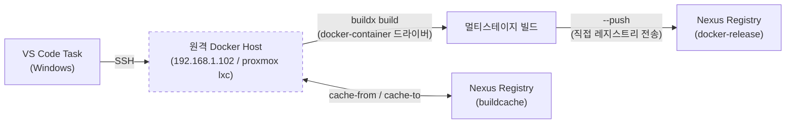
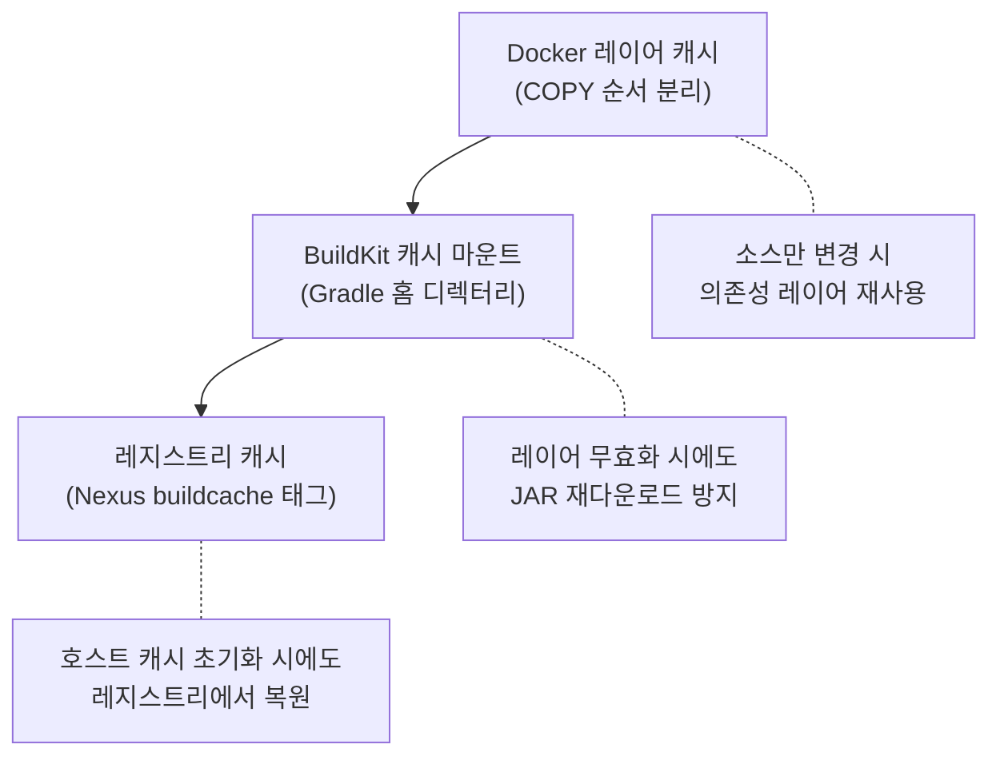

# Docker 원격 빌드 최적화

## 아키텍처 개요



로컬 Windows 환경에서 `DOCKER_HOST`를 SSH로 원격 서버에 연결하고, `buildx`를 통해 빌드·푸시·캐싱을 수행한다.

원격 호스트는 **Stateless Build Worker**로 동작한다 — `docker-container` 드라이버 + `--push` 조합으로 빌드된 이미지가 원격 호스트의 로컬 이미지 스토어에 저장되지 않고 **레지스트리로 직접 전송**된다. 빌드 호스트에는 캐시만 남고 최종 이미지는 존재하지 않는다.


---

## Dockerfile 레이어 캐싱 전략

Dockerfile

```dockerfile
FROM gradle:9-jdk25 AS builder

WORKDIR /app

COPY build.gradle settings.gradle ./
COPY gradle ./gradle

RUN --mount=type=cache,target=/home/gradle/.gradle \
    gradle dependencies -Pprod --no-daemon

COPY src ./src

RUN --mount=type=cache,target=/home/gradle/.gradle \
    gradle bootJar -x test -Pprod --no-daemon

FROM eclipse-temurin:25-jre

WORKDIR /app
COPY --from=builder /app/build/libs/backend-*.jar app.jar

EXPOSE 18080

ENTRYPOINT ["java", "-jar", "app.jar"]
```

### 적용된 최적화

**레이어 분리 (의존성 / 소스 분리)**

- `build.gradle`, `settings.gradle`, `gradle/`을 먼저 복사 → `gradle dependencies` 실행
- 이후 `src/`를 복사 → `gradle bootJar` 실행
- 소스만 변경 시 의존성 다운로드 레이어가 **캐시 히트**되어 빌드 시간 대폭 단축

**BuildKit 캐시 마운트 (`--mount=type=cache`)**

- Gradle 홈 디렉터리(`/home/gradle/.gradle`)를 캐시 마운트로 지정
- 빌드 간에 다운로드된 의존성 JAR을 **빌더 레벨에서 재사용**
- 레이어 캐시가 무효화되더라도 의존성 재다운로드를 방지

**멀티스테이지 빌드**

- builder 스테이지: `gradle:9-jdk25` (JDK + Gradle 전체)
- 런타임 스테이지: `eclipse-temurin:25-jre` (JRE만 포함)
- 최종 이미지에서 Gradle, 소스코드, 빌드 도구가 제외되어 **이미지 크기 최소화**

**기타**

| 항목 | 설명 |
|------|------|
| `--no-daemon` | 컨테이너 환경에서 불필요한 Gradle 데몬 방지, 메모리 절약 |
| `clean` 제거 | 새 컨테이너에서 빌드하므로 clean 대상이 없음 |
| `-x test` | 프로덕션 빌드 시 테스트 스킵 |
| `-Pprod` | P6Spy 등 dev 전용 의존성 제외 |

---

## 빌드 컨텍스트 최적화 (.dockerignore)

.dockerignore

```
*
!build.gradle
!settings.gradle
!gradle
!src
```

**화이트리스트 방식** — 전체를 제외(`*`)하고 Dockerfile이 필요로 하는 4개 항목만 허용한다. SSH로 원격 Docker에 빌드 컨텍스트를 전송할 때 불필요한 파일(`.git`, `.idea`, `build/`, `docs/` 등)이 제외되어 **전송 시간이 단축**된다.

---

## VS Code Task 구성

tasks.json

### 환경변수

| 변수 | 값 | 용도 |
|------|-----|------|
| `DOCKER_HOST` | `ssh://root@192.168.1.102` | 원격 Docker 호스트 연결 |
| `IMAGE_TAG` | `nexus.ellen24k.r-e.kr/docker-release/memo-backend:latest` | 이미지 태그 |

### Task: Remote Docker Build & Push

```shell
docker buildx build \
  --push \
  --progress=plain \
  --cache-from=type=registry,ref=...memo-backend:buildcache \
  --cache-to=type=registry,ref=...memo-backend:buildcache,mode=max \
  -t nexus.ellen24k.r-e.kr/docker-release/memo-backend:latest .
```

### buildx 옵션 설명

| 옵션 | 효과 |
|------|------|
| `--push` | 빌드 완료 후 레지스트리에 직접 push (로컬 이미지 저장 생략) |
| `--progress=plain` | 전체 빌드 로그 출력 (VS Code 터미널에서 Gradle 로그 확인 용이) |
| `--cache-from=type=registry` | Nexus 레지스트리의 `buildcache` 태그에서 캐시 레이어를 pull |
| `--cache-to=type=registry,mode=max` | 모든 중간 레이어를 레지스트리에 캐시로 push |

### 레지스트리 캐시 (`--cache-from` / `--cache-to`)

- 원격 호스트의 로컬 캐시가 초기화되더라도 **Nexus 레지스트리에 저장된 캐시**를 활용
- `mode=max`: 최종 이미지 레이어뿐 아니라 **모든 중간 빌드 레이어**를 캐시
- 별도의 `buildcache` 태그를 사용하여 실제 이미지(`latest`)에 영향 없음

---

## 캐싱 레이어 요약

빌드에 적용된 캐싱은 3단계로 동작한다:



| 캐싱 단계 | 저장 위치 | 무효화 조건 |
|-----------|-----------|-------------|
| Docker 레이어 | 원격 호스트 로컬 | `build.gradle` 변경 시 |
| BuildKit 캐시 마운트 | 원격 호스트 로컬 | 수동 삭제 시 |
| 레지스트리 캐시 | Nexus (`buildcache` 태그) | 수동 삭제 시 |

---

## 전제 조건

레지스트리 캐시(`--cache-to=type=registry`)를 사용하려면 buildx의 `docker-container` 드라이버가 필요하다. 기본 `docker` 드라이버에서는 동작하지 않으므로 원격 호스트에서 아래 명령을 한 번 실행해야 한다:

```bash
docker buildx create --use --name remote-builder
```
