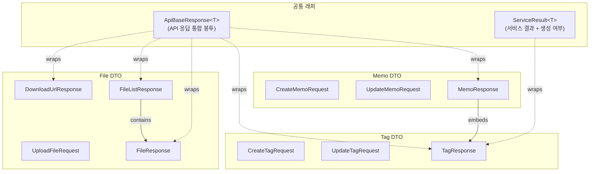
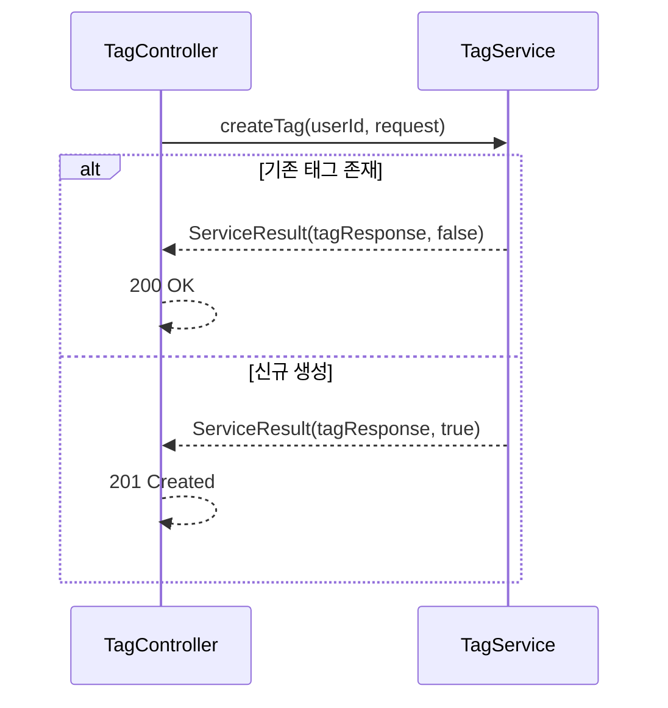
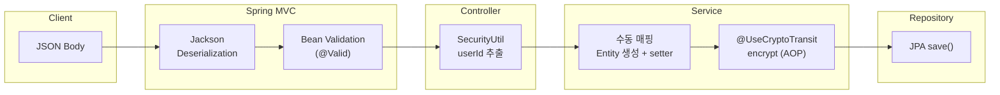
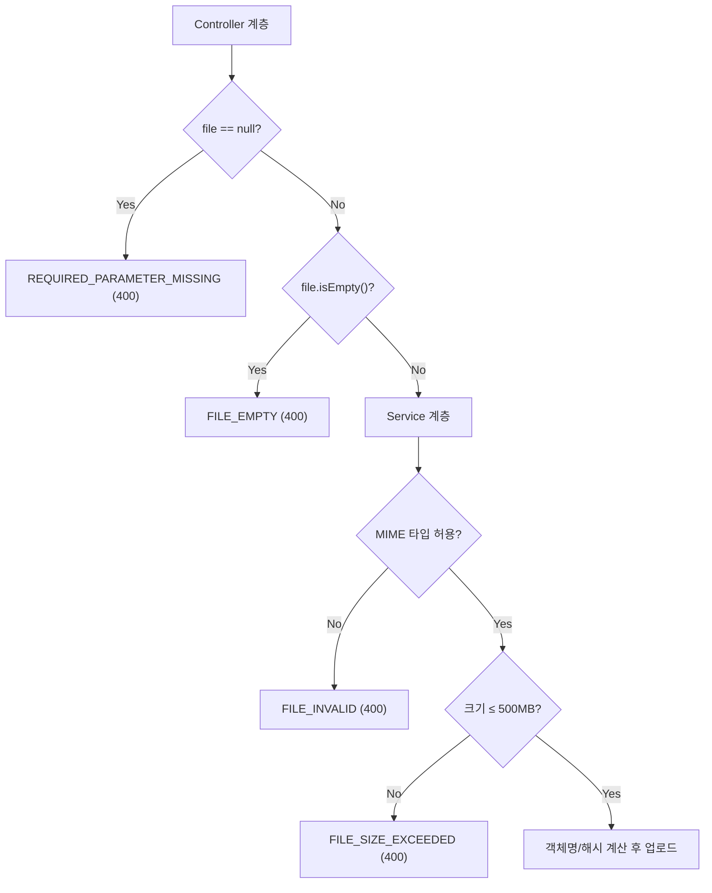
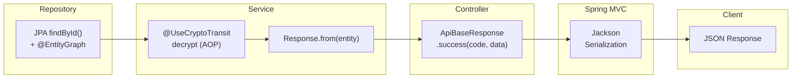

# DTO 설계 및 데이터 매핑 상세

<details>
<summary><b>목차</b></summary>

- [핵심 설계](#핵심-설계)
- [DTO 분류 체계](#dto-분류-체계)
- [공통 응답 규격 (Wrapper)](#공통-응답-규격-wrapper)
  - [ApiBaseResponse\<T\>](#apibaseresponset)
  - [ServiceResult\<T\>](#serviceresultt)
- [Request 및 유효성 검증](#request-및-유효성-검증)
  - [데이터 변환 흐름 (Request → Entity)](#데이터-변환-흐름-request--entity)
  - [데이터 바인딩 정책](#데이터-바인딩-정책)
  - [부분 업데이트 (Partial Update)](#부분-업데이트-partial-update)
  - [다단계 파일 검증 파이프라인](#다단계-파일-검증-파이프라인)
- [Response 및 직렬화](#response-및-직렬화)
  - [데이터 변환 흐름 (Entity → Response)](#데이터-변환-흐름-entity--response)
  - [Jackson 페이징 일관화](#jackson-페이징-일관화)
- [보안 아키텍처 연동](#보안-아키텍처-연동)
  - [사용자 식별자(userId) 은닉](#사용자-식별자userid-은닉)
  - [선택적 필드 암호화 (Crypto Transit)](#선택적-필드-암호화-crypto-transit)

</details>

---

## 핵심 설계

전체 컨트롤러 로직 간 통일성을 위해 **단일 응답 형식**를 도입하고, 데이터 맵핑 과정에 **AOP 기반 암호화 필터** 및 **다단계 Validation 검증망**을 내장시켜 데이터 흐름 상의 보안과 무결성을 확보한다.

---

## DTO 분류 체계



---

## 공통 응답 규격 (Wrapper)

### ApiBaseResponse\<T\>

모든 API 엔드포인트가 반환하는 **통합 응답 객체**이다. 클라이언트가 상태(Http Status)와 별개로 동일한 JSON 트리를 해석하여 에러 핸들링 및 데이터 바인딩을 예측 가능하게 돕는다.

```json
{
  "code": "memo.created", // 세분화된 비즈니스 상태 코드 규격화
  "args": null,           // 에러 발현 시 필드별 상세 예외 메시지 맵핑 구역
  "data": { ... }         // 성공 시 반환되는 실제 DTO
}
```

*   `GlobalExceptionHandler`에서 발생하는 모든 예외 또한 `ApiBaseResponse.error()` 정적 팩토리를 거쳐 동일한 규격의 JSON 에러 응답으로 일괄 변환된다.

[ApiBaseResponse.java](https://github.com/ellen24k-memo/backend/blob/main/src/main/java/io/github/ellen24k/memo_back/dto/ApiBaseResponse.java)

### ServiceResult\<T\>

API 외부가 아닌 **Service ➔ Controller 레이어** 간 통신용 래퍼 객체이다.
RESTful의 멱등 생성 규칙(Idempotent Create)을 준수하기 위해 설계되었다. <br/>
`TagService`에서 신규 생성 시 `true`, 기존 존재 자원 반환 시 `false` 플래그를 담아 반환하며, Controller가 이를 분기하여 각기 다른 HTTP 응답 코드(`201 Created` / `200 OK`)로 렌더링한다.



---

## Request 및 유효성 검증

### 데이터 변환 흐름 (Request → Entity)



### 데이터 바인딩 정책

*   **Bean Validation 강제**: 인바운드 DTO 계층에서 `@NotBlank`, `@Size`, `@NotNull` 제약을 컨트롤러 `@Valid`와 매핑해 유효하지 않은 포맷을 사전에 차단한다. 

### 부분 업데이트 (Partial Update)

`UpdateMemoRequest` 등의 변경 요청 객체는 모든 필드를 Nullable로 설계했으며, 값이 있는 필드만 선택적으로 덮어쓰기가 진행된다. 

### 다단계 파일 검증 파이프라인

`UploadFileRequest`의 경우, 파일 데이터 처리의 안전성을 확보하기 위해 Controller와 Service 계층 전반에 걸친 단계별 파일 검증 로직을 구현했다.



---

## Response 및 직렬화

### 데이터 변환 흐름 (Entity → Response)



### Jackson 페이징 일관화

**Spring Data `Page<T>` 직렬화**

커스텀 페이징 객체를 만드는 대신 `ApiBaseResponse<Page<T>>` 구조를 활용했다. 프론트엔드는 이를 통해 totalElements, totalPages, last 등의 페이징 속성을 통일되게 제공받도록 하였다.

**Jackson TimeModule**

`JavaTimeModule`을 등록하고 `WRITE_DATES_AS_TIMESTAMPS`를 끄면서, 모든 `Instant` 타입 날짜 생성/수정 시간이 `2026-02-25T02:00:00Z` 형태로 ISO-8601 스펙에 맞춰 글로벌 타임존 해석에 오류가 없도록 포맷팅한다.

---

## 보안 아키텍처 연동

### 사용자 식별자(userId) 은닉

모든 DTO는 **`user_id`를 JWT token으로 추출하여 주입한다.** 
인바운드 생성/수정 서비스 로직 실행 시 `SecurityUtil` 컨텍스트에서 서버사이드로 JWT의 Subject 값을 추출해 사용하므로, 위변조된 사용자 요청을 방어할 수 있다. 
동시에 프론트엔드에서는 불필요한 권한 식별자 중복 파싱을 피할 수 있다.

### 선택적 필드 암호화 (Crypto Transit)

커스텀 라이브러리 `springboot-crypto-transit`를 사용해 선택적 필드 암호화를 구현한다.

| DTO 방향 | 대상 객체 | 트리거 방식 | 동작 원리 |
|---|---|---|---|
| **Inbound** | `CreateMemoRequest`<br/>`UpdateMemoRequest` | `shouldEncryptContent`가 `true` 일 시 | 필드값인 `content` 평문을 Vault Transit을 통해 DB에 암호문으로 저장한다. |
| **Outbound** | `MemoResponse` | `shouldEncryptContent` 상태 검사 | DB에서 추출된 암호문을 평문으로 복호화한다. |
