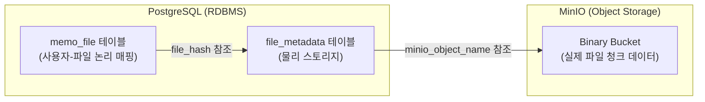
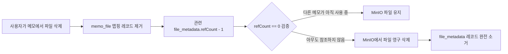
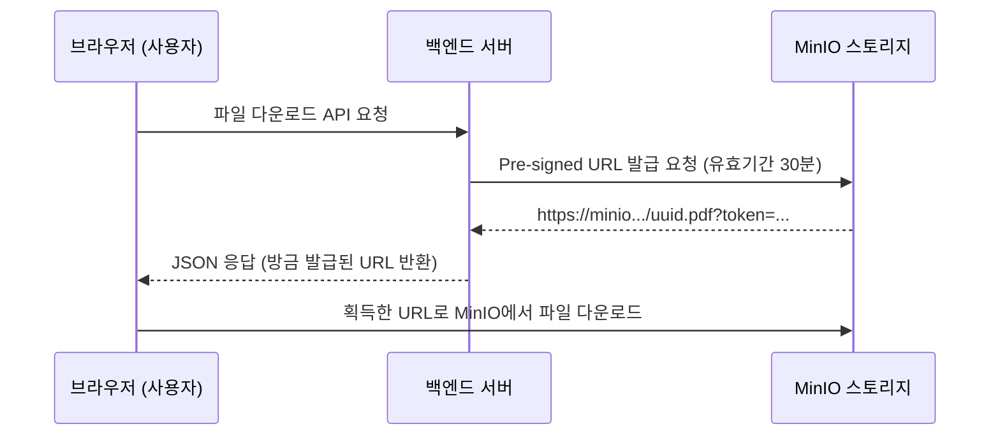

# 파일 처리 시스템 및 스토리지 아키텍처

<details>
<summary><b>목차</b></summary>

- [핵심 설계 방향](#핵심-설계-방향)
- [스토리지 아키텍처 개요](#스토리지-아키텍처-개요)
  - [데이터 분산 저장 구조](#데이터-분산-저장-구조)
- [중복 방지 스토리징 (CAS 패턴)](#중복-방지-스토리징-cas-패턴)
  - [SHA-256 기반 단일 진실 공급원(SSOT)](#sha-256-기반-단일-진실-공급원ssot)
  - [참조 카운트 기반 가비지 컬렉션](#참조-카운트-기반-가비지-컬렉션)
- [다단계 파일 검증 및 무결성 제어](#다단계-파일-검증-및-무결성-제어)
  - [유효성 검증 파이프라인 (FileValidationConfig)](#유효성-검증-파이프라인-filevalidationconfig)
  - [간접 소유권 검증 로직](#간접-소유권-검증-로직)
- [MinIO 오브젝트 관리 전략](#minio-오브젝트-관리-전략)
  - [객체명 식별자 보안 (UUID 맵핑)](#객체명-식별자-보안-uuid-맵핑)
  - [Pre-signed URL 다운로드 위임](#pre-signed-url-다운로드-위임)

</details>

---

## 핵심 설계

메모 서비스의 파일 처리 엔진은 **CAS(Content-Addressable Storage) 패턴을 통한 스토리지 용량 최적화**, **대용량 파일의 스트리밍 해시 처리**, 그리고  **Pre-signed URL 통신을 통한 백엔드 서버 부하 방어**를 목적으로 설계되었다.

---

## 스토리지 아키텍처 개요

### 데이터 분산 저장 구조

파일 데이터는 효율적인 관리와 보안을 위해 **세 곳**에 분산 저장된다.



| 스토리지 | 역할 | 데이터 예시 |
|---|---|---|
| **memo_file** | 사용자가 메모에 첨부한 파일 기록 | 메모 식별자, 사용자 지정 파일명 |
| **file_metadata** | 물리 파일의 제어 | 파일 해시, 참조 카운트(refCount) |
| **MinIO** | 오브젝트 스토리지 | 업로드된 파일의 바이너리 컨텐츠 |

---

## 중복 방지 스토리징 (CAS 패턴)

### SHA-256 해시 기반 중복 방지 처리

(`FileHashUtil`)
사용자가 파일을 업로드할 때, 파일명이 아닌 **바이너리 본문 자체를 SHA-256으로 해싱 계산**하여 64자리 16진수 문자열 주소로 삼는다. 

```
image1.pdf → 해싱 → "a1b2c3d4e5f6..." (신규 저장, refCount=1)
image2.pdf → 해싱 → "a1b2c3d4e5f6..." (동일 해시 발견! 물리 저장 생략, refCount=2)
```

### 참조 카운트 기반 가비지 컬렉션

파일의 삭제 시 **참조 카운트(refCount)** 를 검증하는 가비지 컬렉션 방식을 취한다.



---

## 다단계 파일 검증 및 무결성 제어

### 유효성 검증 파이프라인 (FileValidationConfig)

악의적인 스크립트 실행이나 서버 부하를 유발하는 비정상 파일 업로드를 방어하기 위해 업로드 진행 전 다단계 검증망을 거친다.

1. **용량 및 비어있음 1차 차단** (0 Byte ~ 500MB 리미트)
2. **MIME 타입 매핑 파싱** (`file-formats.properties` 화이트리스트 검사)
3. 확장자 위변조 시 폴백(`fallback`) 으로 트랜젝션 롤백

### 간접 소유권 검증 로직

서비스 계층의 복잡한 권한 쿼리 오버헤드를 줄이기 위해, `File` 엔티티 자체가 자신의 소유권을 검증하는 로직(`validateOwner`)을 갖는다.

```java
public void validateOwner(UUID userId) {
    if (this.memo == null || !this.memo.getUserId().equals(userId)) {
        throw new ForbiddenException();
    }
}
```
파일 테이블 자체에는 잉여 컬럼(`user_id`)을 두지 않고, 연관된 부모 `Memo`의 컨텍스트를 **간접 참조**하여 무결성과 보안을 강화했다.

---

## MinIO 오브젝트 관리

### 객체명 식별자 보안 (UUID 맵핑)

`MinioService.buildObjectName`
MinIO 버킷에 저장할 때 사용자의 원본 파일명을 그대로 쓰지 않고 **무작위 UUID 식별자**로 덮어씌운다.

### Pre-signed URL 다운로드 위임

파일을 내려받을 때, 백엔드 스프링 서버가 직접 I/O 스트림을 열어 중계하지 않고 **30분 유효기간의 임시 URL (Pre-signed URL)** 만 프론트엔드에 전달하여 백엔드 서버의 부하를 줄인다.


