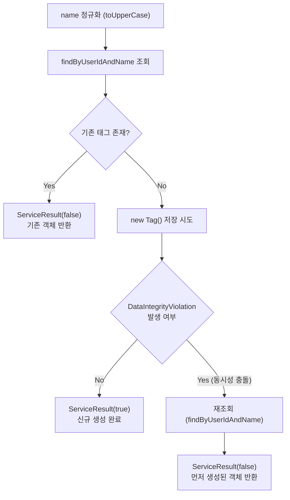
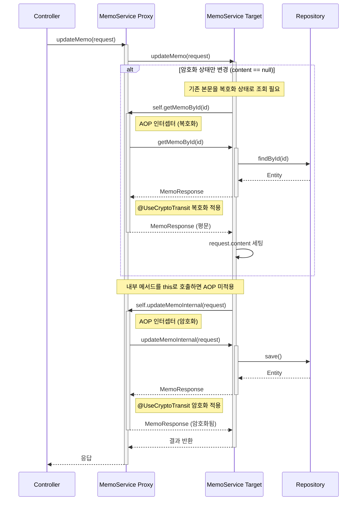
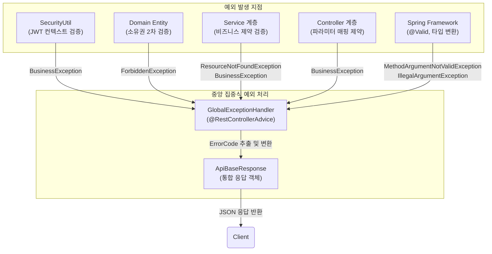
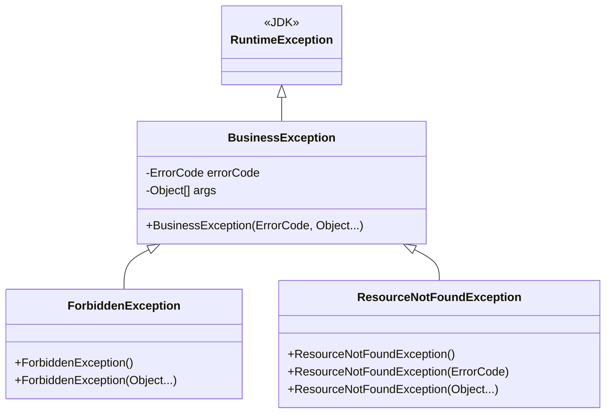
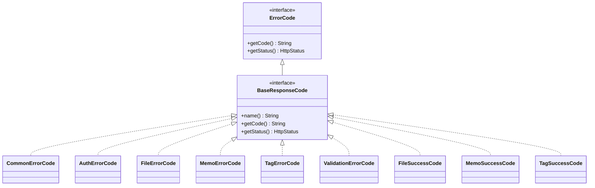

# 백엔드 비즈니스 로직 및 예외 처리 설계

<details>
<summary><b>목차</b></summary>

- [비즈니스 로직 (Service)](#비즈니스-로직-service)
  - [Tag 멱등성 생성 (동시성 제어)](#tag-멱등성-생성-동시성-제어)
  - [메모 상태 변경 및 AOP 프록시 호출 (Self-Injection)](#메모-상태-변경-및-aop-프록시-호출-self-injection)
- [트랜잭션 및 데이터 접근 (Repository)](#트랜잭션-및-데이터-접근-repository)
  - [읽기 전용 트랜잭션 최적화](#읽기-전용-트랜잭션-최적화)
  - [M:N 연관관계 JPQL 조회](#mn-연관관계-jpql-조회)
  - [외부 시스템 연동 시의 롤백 한계](#외부-시스템-연동-시의-롤백-한계)
- [에러 처리 체계](#에러-처리-체계)
  - [아키텍처 개요](#아키텍처-개요)
  - [예외 클래스 계층](#예외-클래스-계층)
  - [ErrorCode 계층 및 코드 변환](#errorcode-계층-및-코드-변환)
  - [GlobalExceptionHandler와 예외 전환](#globalexceptionhandler와-예외-전환)

</details>

---

## 비즈니스 로직 (Service)

### Tag 멱등성 생성 (동시성 제어)

동일한 이름의 태그 생성을 요청받을 때, 시스템은 중복 생성 없이 기존 태그를 반환하도록 다음의 로직을 구현하였다.



두 트랜잭션이 동일 태그를 동시에 생성 시도할 경우, DB Unique Constraint에 의해 후행 트랜잭션에서 `DataIntegrityViolationException`이 발생한다.<br/>
해당 예외를 Catch하여 선행 커밋된 태그를 재조회함으로써, 클라이언트에게 일관된 정상 응답을 반환한다.


### 메모 상태 변경 및 AOP 프록시 호출 (Self-Injection)

메모 수정(`updateMemo`)은 클라이언트가 전달한 필드만 반영하는 **Partial Update 방식**으로 처리한다.
이때 **암호화 여부(`shouldEncryptContent`)만 변경되고 본문(`content`)이 전달되지 않은 경우**,
기존 본문을 새로운 암호화 설정에 맞게 다시 암·복호화하여 저장해야 한다.

암·복호화 처리는 `springboot-crypto-transit` 라이브러리의 커스텀 어노테이션 `@UseCryptoTransit`을 통해 수행되며,
해당 어노테이션은 **Spring AOP 인터셉터**를 이용해 메서드 호출 전·후에 자동으로 암/복호화를 적용한다.

Spring AOP는 **프록시 기반**으로 동작하므로, 동일 클래스 내부에서 `this.method()` 형태로 메서드를 호출할 경우
프록시를 거치지 않아 AOP 인터셉터가 실행되지 않는 **Self-Invocation 문제**가 발생해 암호화/복호화가 적용되지 않는다.

이를 해결하기 위해 `MemoService` 내부에 `@Autowired @Lazy`를 사용해
자기 자신의 **프록시 객체(`self`)** 를 주입하고,
AOP가 필요한 내부 메서드 호출은 해당 프록시를 통해 수행하도록 구성하였다.

---

### 전체 처리 흐름



---

### 핵심 구현 코드

```java
@Autowired
@Lazy
private MemoService self;

@Transactional
public MemoResponse updateMemo(UUID userId, UUID id, UpdateMemoRequest request) {
    if (request.getContent() == null && request.getShouldEncryptContent() != null) {
        MemoResponse existing = self.getMemoById(userId, id);
        request.setContent(existing.getContent());
    }
    return self.updateMemoInternal(userId, id, request);
}

@UseCryptoTransit(enabledBy = "shouldEncryptContent")
public MemoResponse updateMemoInternal(UUID userId, UUID id, UpdateMemoRequest request) {
    // DB 업데이트 비즈니스 로직
}
```

* `self.getMemoById()`
  → 프록시를 통해 호출하여 기존 본문을 **복호화 상태로 안전하게 조회**
* `self.updateMemoInternal()`
  → 내부 호출에서도 프록시를 경유시켜 **변경된 암호화 설정이 정상 적용되도록 보장**

이 구조를 통해 **비즈니스 로직에 암·복호화 코드가 침투하지 않으면서**,
커스텀 라이브러리를 활용한 AOP 기반 암호화 처리를 안정적으로 유지할 수 있었다.

---

## 트랜잭션 및 데이터 접근 (Repository)

### 읽기 전용 트랜잭션 최적화

모든 조회 전용 메서드에는 `@Transactional(readOnly = true)`를 적용하였다.
- readOnly 트랜잭션은 영속성 컨텍스트에서 스냅샷 보관 및 Dirty Checking 과정을 생략하므로, 메모리 사용량과 CPU 처리 부하를 절감 가능
- 서비스 흐름 중 쓰기 작업이 발생하는 것을 트랜잭션 레벨에서 차단 가능

### M:N 연관관계 JPQL 조회

Spring Data JPA의 메서드명 파싱만으로 표현하기 어려운 다대다 관계의 역방향 탐색에는 커스텀 JPQL 쿼리를 작성하여 데이터 접근의 정확성을 높였다.

```sql
SELECT DISTINCT t FROM Tag t
JOIN t.memos m
WHERE m.id = :memoId AND t.userId = :userId
```

### 외부 시스템 연동 시의 롤백 한계

`MinioService`는 스프링 트랜잭션 컨텍스트 외부에서 동작하므로, MinIO 스토리지 업로드 이후 DB 메타데이터 저장 단계에서 장애가 발생할 경우,
DB 트랜잭션은 정상적으로 롤백되더라도 MinIO에는 고아 객체가 잔존할 수 있는 한계가 존재한다.

보상 트랜잭션을 통해 해결할 수 있으나, 시스템 복잡도 증가를 고려해 현재 아키텍처에서는 도입하지 않았다.<br/>
대신, 필요 시 비동기 배치 작업으로 DB 레코드와 스토리지 객체를 대조/정리하는 방식으로 대응 가능하도록 구현하였다.

---

## 에러 처리 체계

### 아키텍처 개요

모든 API 응답(성공/실패)이 동일한 `ApiBaseResponse<T>` 구조를 따르며, 응답 코드(`code`)로 결과를 식별한다. 예외는 `BusinessException` 계층으로 통일하고 `GlobalExceptionHandler`에서 중앙 집중식으로 처리한다.



### 예외 클래스 계층



### ErrorCode 계층 및 코드 변환

`BaseResponseCode.getCode()`가 Enum 상수명을 자동으로 응답 코드로 변환한다:

```
MEMO_NOT_FOUND      →  "memo.not.found"
MINIO_UPLOAD_FAILED →  "minio.upload.failed"
```

변환 로직: `name().toLowerCase().replace("_", ".")`


### GlobalExceptionHandler와 예외 전환

계층과 무관하게 발생하는 모든 예외는 `GlobalExceptionHandler` 컨트롤러를 통해 필터링되어 
일관된 응답 객체 형식인 `ApiBaseResponse<T>`로 변환된다.

**`ApiBaseResponse<T>` 응답 예시:**
```json
{
  "code": "memo.not.found",
  "args": null,
  "data": null
}
```

| 순위 | 예외 타입 | HTTP Status |
|---|---|---|
| 1 | `BusinessException` 및 하위 클래스 | 해당 에러 코드에 정의된 상태 (ex. 404, 400, 403) |
| 2 | `MethodArgumentNotValidException` | 400 (Bad Request) |
| 3 | `IllegalArgumentException` | 400 (Bad Request) |
| 4 | 기타 제어 불가 `Exception` | 500 (Internal Server Error) |


*[에러 코드](https://github.com/ellen24k-memo/backend/tree/main/src/main/java/io/github/ellen24k/memo_back/exception/code)*