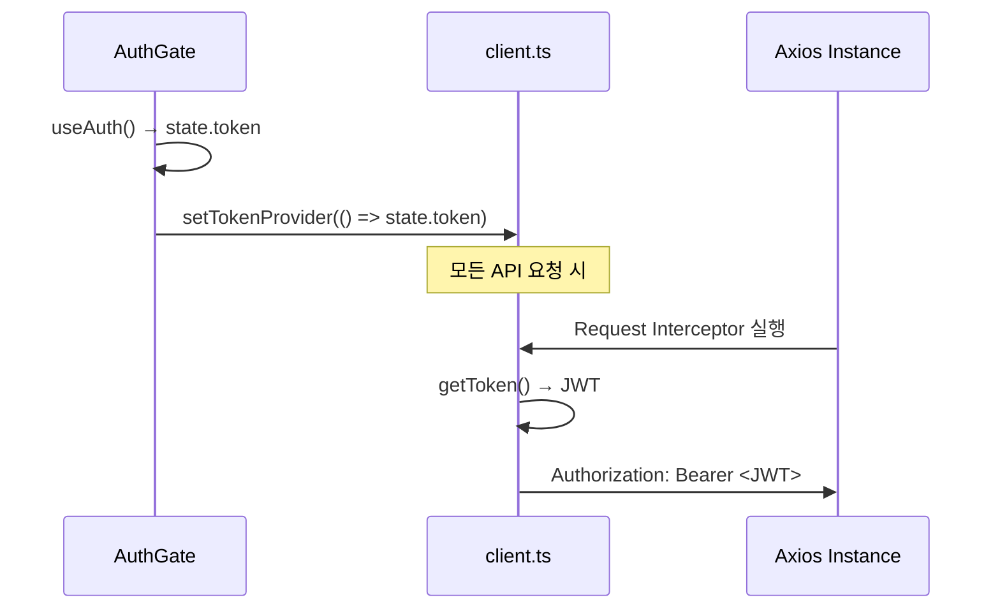

# 프론트엔드 API 계층 및 에러 처리

<details>
<summary><b>목차</b></summary>

- [개요](#개요)
- [Client 계층 (Axios)](#client-계층-axios)
  - [토큰 주입 메커니즘](#토큰-주입-메커니즘)
  - [Response Interceptor](#response-interceptor)
- [Service 계층 (DTO 변환)](#service-계층-dto-변환)
  - [타입 디커플링 패턴](#타입-디커플링-패턴)
  - [엔드포인트 예외 처리](#엔드포인트-예외-처리)
- [에러 핸들링 상세 설계](#에러-핸들링-상세-설계)
  - [에러 중앙 집중화 (AppError)](#에러-중앙-집중화-apperror)
  - [에러 처리 패키지 구조](#에러-처리-패키지-구조)

</details>

---

## 개요

API 통신 시스템은 **3단계 계층 구조**로 설계되었다.

- **Client Layer**: HTTP 통신, JWT 주입, 응답 및 에러 전처리 등 공통 인프라 로직을 전담한다.
- **Service Layer**: 엔드포인트 단위 API 함수를 모듈화하여, 백엔드 DTO를 프론트엔드 모델로 매핑하고 비즈니스 파편화 예외를 단일화하여 처리한다.
- **Hook Layer**: API 결괏값을 캐싱 및 관리하고 뷰(View)에 주입한다.

---

## Client 계층 (Axios)

[client.ts](../../src/services/api/client.ts)

### 토큰 주입 메커니즘



[AuthGate.tsx](../../src/components/AuthGate.tsx)

`AuthGate`가 인증 완료 시점에 클로저 함수 형태(`() => string`)로 토큰 공급자를 등록한다.<br/>
이후 모든 API 요청의 Request Interceptor에서 이 함수를 호출해 최신 토큰을 주입한다. 토큰이 갱신되더라도 클라이언트 설정을 재주입할 필요가 없다.

### Response Interceptor

Axios의 Response Interceptor가 전체 시스템에 대한 예외처리를 한 곳에서 일관성 있게 제어한다.

- **래핑 자동 해제**: 서버의 공통 응답 규격(`ApiBaseResponse<T>` : `{ code, args, data }`) 중 `data` 영역만 추출해 반환함으로써 Service 계층에서는 순수 비즈니스 로직에만 집중할 수 있다.
- **예외 중앙 집중화**: 어떠한 서버 오류라도 `AppError` 규격으로 강제 변환하여 전달해 에러 처리를 통일성 있게 처리할 수 있다.

---

## Service 계층 (DTO 변환)

### 타입 디커플링 패턴

백엔드의 응답 객체를 프론트엔드 UI 활용에 적합한 형태로 가공(캡슐화)하여<br/>백엔드 API 규격이 변경되더라도 코드 수정 범위를 최소화한다.

[memo.ts](../../src/types/memo.ts)

| Backend DTO (`MemoResponse`) | Frontend Model (`Memo`) | 변환 로직 |
|---|---|---|
| `tags: TagResponse[]` | `tags: string[]` | 화면 표시에 주로 나타나는 Tag 이름(name) 배열로 즉시 평탄화하여 컴포넌트 복잡도를 낮춤 |
| `createdAt`, `updatedAt` | `createdDate`, `updatedDate` | ISO 8601 문자열을 JS `Date` 인스턴스로 즉시 파싱 |
| `fileCount: number` | `fileCount`, `hasFile` | `fileCount > 0` 여부를 미리 계산하여 UI의 직관적인 렌더링 로직 지원 |
| (미존재) | `raw?: MemoResponse` | deep access가 필요할 특수한 비상 상황을 대비해 원본 응답 보존 |

- [tag.ts](../../src/types/tag.ts), [file.ts](../../src/types/file.ts)
  - `Tag`, `File` 모델은 백엔드 응답과 필드가 1:1로 동일하다.

### 엔드포인트 예외 처리

태그 검색(`lookupTagByName`)처럼 404 에러가 단순 "검색 결과 없음"을 의미하는 경우, 전역 에러 핸들러로 넘어가지 않도록 Service 함수 단에서 `try-catch`로 예외를 잡고 `null`을 반환한다. 이를 통해 컴포넌트는 복잡한 에러 캐칭 없이 `null` 여부만으로 렌더링 분기가 가능하다.

---

## 에러 핸들링 상세 설계

### 에러 중앙 집중화 (AppError)

분산된 다양한 형태의 표준 객체들(Axios Error, 일반 Runtime Error 등)을 단일 다형성 객체인 `AppError` 로 집중시킨다.

- **속성 중앙화**: `errorId`, `code`(로직 식별자), `statusCode`(HTTP 상태) 등 디버깅 및 분석에 필요한 정보를 한 객체 내부에 종합한다.
- **메시지 매핑 정책**: 사용자에게 노출될 메시지는 다음 우선순위를 통해 결정된다:
  1. 커스텀 UI 메시지
  2. 서버 `ErrorCode` 기반의 매핑된 메시지
  3. HTTP 상태 코드에 의한 기본 Fallback 메시지

### 에러 처리 패키지 구조

도메인 로직과 분리된 순수 유틸리티 형태의 폴더 아키텍처를 유지한다.

```
src/
├── util/error/
│   ├── AppError.ts             # 통합 에러 클래스
│   ├── ErrorCodes.ts           # 클라이언트 에러 코드 + HTTP 매핑
│   ├── errorId.ts              # 고유 에러 ID 생성기
│   └── handleMutationError.ts  # Mutation 전용 핸들러 (toast + log)
│
├── config/
│   ├── errorMessages.ts        # 서버 에러 코드 → 한국어 메시지 매핑
│   └── messages.ts             # 성공/UI 메시지 상수
│
└── components/shared/
    └── GlobalErrorBoundary.tsx  # 렌더링 에러 폴백 UI
```
