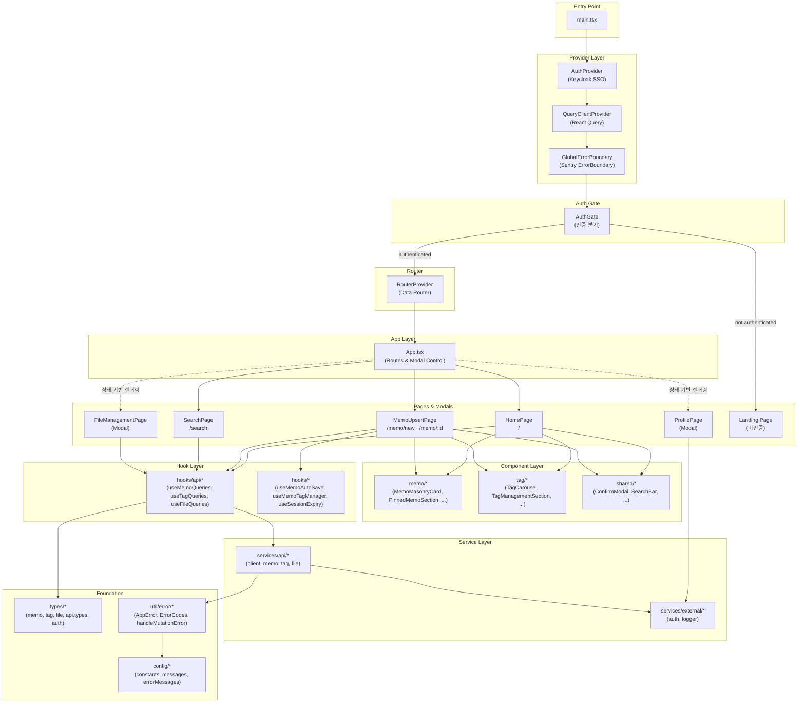
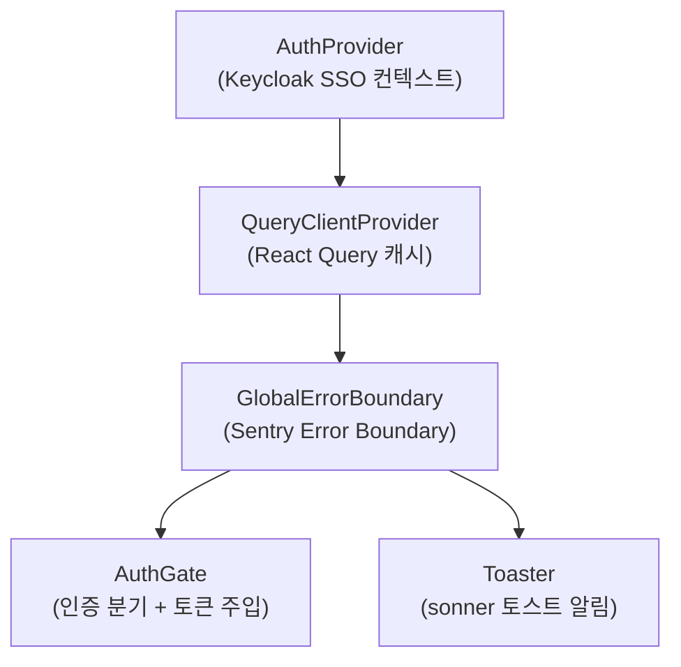
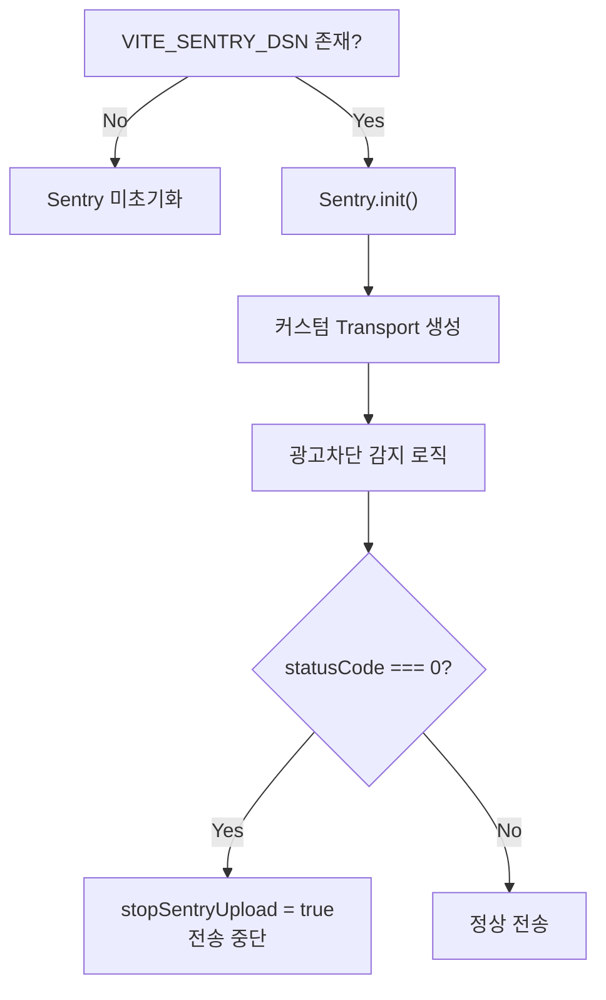

# 프론트엔드 아키텍처

<b>목차</b>

- [의존성](#의존성)
- [계층 구조](#계층-구조)
  - [계층별 역할](#계층별-역할)
- [Provider 트리](#provider-트리)
- [페이지 라우팅](#페이지-라우팅)
  - [라우터 구성](#라우터-구성)
  - [라우트 테이블](#라우트-테이블)
  - [네비게이션](#네비게이션)
  - [네비게이션 가드](#네비게이션-가드)
- [패키지 구조](#패키지-구조)
- [환경변수](#환경변수)
- [Sentry 초기화](#sentry-초기화)
- [Vite 빌드 설정](#vite-빌드-설정)

---

## 의존성

| 카테고리 | 라이브러리 | 용도 |
|---|---|---|
| **Core** | `react 19`, `react-dom 19` | UI 프레임워크 |
| **빌드** | `vite 6`, `@vitejs/plugin-react-swc` | SWC 기반 빌드 |
| **상태 관리** | `@tanstack/react-query 5` | 서버 상태 캐싱·동기화 |
| **HTTP** | `axios` | API 통신 |
| **라우팅** | `react-router-dom 6` | URL 기반 SPA 라우팅 (Data Router, useBlocker) |
| **인증** | `@io.github.ellen24k/react-auth-keycloak` | Keycloak OAuth2 PKCE |
| **에러 트래킹** | `@sentry/react` | 에러 수집·리플레이 |
| **마크다운** | `@uiw/react-md-editor` | 메모 에디터 |
| **토스트** | `sonner` | 사용자 알림 |
| **아이콘** | `lucide-react`, `@phosphor-icons/react` | 벡터 아이콘 |
| **애니메이션** | `motion` | 모션 애니메이션 |
| **UI 컴포넌트** | `radix-ui`, `class-variance-authority`, `clsx`, `tailwind-merge` | Radix UI 프리미티브, 스타일 유틸 |
| **폼** | `react-hook-form` | 폼 상태 관리 |
| **스타일** | `tailwindcss` 4, `@tailwindcss/vite` | CSS 유틸리티 |
| **3D/Effect** | `ogl`, `postprocessing` | WebGL 이펙트 (Landing Page 배경) |

---

## 계층 구조

### 계층별 역할

| 계층 | 위치 | 역할 |
|---|---|---|
| **Entry Point** | `main.tsx` | Provider 조합, Sentry 초기화, QueryClient 생성 |
| **Provider Layer** | `main.tsx` | AuthProvider → QueryClientProvider → GlobalErrorBoundary |
| **Auth Gate** | `AuthGate.tsx` | 인증 상태에 따라 RouterProvider / Landing Page 분기, 토큰 주입, Data Router 생성 |
| **Page Layer** | `pages/*` | 페이지 단위 UI 조합, 상태 관리 오케스트레이션 |
| **Component Layer** | `components/*` | 재사용 가능한 UI 컴포넌트 |
| **Hook Layer** | `hooks/*` | React Query 바인딩, 커스텀 비즈니스 로직 |
| **Service Layer** | `services/*` | Axios 기반 API 통신, 외부 서비스 연동 |
| **Foundation** | `types/`, `util/`, `config/` | 타입 정의, 에러 유틸, 상수·메시지 중앙화 |

---

## Provider 트리

[main.tsx](../../src/main.tsx)

| Provider | 라이브러리 | 역할 |
|---|---|---|
| `AuthProvider` | `react-auth-keycloak` | Keycloak 인증 상태 공급 (check-sso, PKCE S256) |
| `QueryClientProvider` | `@tanstack/react-query` | 전역 캐시 및 기본 옵션 (retry: 1, staleTime: 5분) |
| `GlobalErrorBoundary` | `@sentry/react` | 렌더링 에러 포착 → AppError 변환 → Sentry 전송 |
| `Toaster` | `sonner` | 전역 토스트 알림 (richColors, top-center) |

`AuthProvider` → `QueryClientProvider` → `GlobalErrorBoundary` 순서로 중첩하여 인증 → 캐시 → 에러 경계의 의존 순서를 보장한다.

---

## 페이지 라우팅

`AuthGate`가 인증 성공 시 `RouterProvider`를 렌더링하고, `App.tsx`에서 `<Routes>` / `<Route>`로 URL 기반 페이지 전환을 수행한다.

### 라우터 구성

| 파일 | 역할 |
|---|---|
| [router.tsx](../../src/config/router.tsx) | `createBrowserRouter` — Data Router 생성 (`useBlocker` 등 훅 활성화) |
| [AuthGate.tsx](../../src/components/AuthGate.tsx) | 인증 성공 시 `<RouterProvider router={router} />` 렌더링, `useMemo`로 라우터 인스턴스 메모이제이션 |
| [App.tsx](../../src/App.tsx) | `<Routes>` / `<Route>`로 URL ↔ 페이지 매핑, `useNavigate`로 페이지 전환 및 모달 상태 공유 |

`useBlocker` 같은 고급 훅이 Data Router 컨텍스트에서만 동작하기 때문에 `react-router-dom`의 `createBrowserRouter`를 사용하였다.

### 라우트 테이블

[App.tsx](../../src/App.tsx)

| Path | Component | 핵심 기능 |
|---|---|---|
| `/` | `HomePage` | 고정 메모, 전체 메모 Infinite Scroll, 태그 캐러셀 |
| `/search` | `SearchPage` | 태그 이름 검색 → 태그 ID 조회 → 메모 목록 |
| `/memo/new` | `MemoUpsertPage` (create) | 새 메모 작성 후 저장 → `/memo/:id`로 navigate |
| `/memo/:id` | `MemoUpsertPage` (update) | 마크다운 에디터, 자동 저장, 태그·핀·암호화 토글 (`useParams`로 memoId 추출) |
| — | `FileManagementPage` | 파일 업로드·다운로드·삭제 |
| — | `ProfilePage` | 사용자 정보, 토큰 갱신, 에디터 설정 |
| — | `Landing Page` | 미인증 시 AuthGate 분기 — 로그인 유도 랜딩 페이지 |

> `ProfilePage` 및 `FileManagementPage`는 URL 기반 라우팅과 별개로, `App.tsx`에서 컴포넌트 내부 상태(`showProfile`, `showFileManagement`)에 따라 모달 형태로 조건부 렌더링된다.

### 네비게이션

| 핸들러 | 동작 |
|---|---|
| `navigateToHome` | `navigate("/")` |
| `navigateToSearch(tag?)` | `navigate(tag ? "/search?tag=${tag}" : "/search")` |
| `navigateToMemoView(id)` | `navigate(`/memo/${id}`)` |
| `navigateToNewMemo` | `navigate("/memo/new")` |
| `navigateToProfile` | `showProfile = true` (boolean 토글) |

### 네비게이션 가드

`MemoUpsertPage`에서 `useBlocker`를 사용하여 미저장 변경이 있는 상태에서 페이지를 떠나려 할 때 자동 저장 후 이동한다. 브라우저의 뒤로/앞으로 버튼도 동일하게 동작한다.

> [!NOTE]
> `FileManagementPage`와 `ProfilePage`는 URL 라우트와 독립적인 boolean 토글(`showFileManagement`, `showProfile`)로 제어된다. URL을 변경하지 않고 기존 페이지 위에 오버레이된다.

---

## 환경변수

[vite.config.ts](../../vite.config.ts)

`VITE_` 접두사 환경변수만 빌드 시 클라이언트 번들에 포함된다 (`import.meta.env`).

| 환경변수 | 용도 |
|---|---|
| `VITE_API_BASE_URL` | Backend API 베이스 URL |
| `VITE_KEYCLOAK_URL` | Keycloak 서버 주소 |
| `VITE_KEYCLOAK_REALM` | Keycloak Realm 이름 |
| `VITE_KEYCLOAK_CLIENT_ID` | Keycloak Client ID |
| `VITE_SENTRY_DSN` | Sentry DSN (에러 트래킹, 선택) |
| `VITE_BROWSER_OPEN_URL` | 개발 서버 자동 오픈 URL |

---

## Sentry 초기화

[main.tsx](../../src/main.tsx)

| 설정 | dev | prod |
|---|---|---|
| `tracesSampleRate` | 1.0 (전수) | 0.1 (10%) |
| `replaysSessionSampleRate` | 1.0 | 0.1 |
| `replaysOnErrorSampleRate` | 1.0 | 1.0 |
| `maskAllText` | `false` | `true` |
| `blockAllMedia` | `false` | `true` |

> [!IMPORTANT]
> 커스텀 `createMinimalTransport`는 광고차단기 대응 로직을 포함한다. Sentry 전송이 차단(statusCode=0)되면 `stopSentryUpload` 플래그를 설정하여 이후 모든 전송을 건너뛴다. 차단 환경에서 불필요한 네트워크 요청과 콘솔 에러를 방지하기 위한 처리이다.

---

## Vite 빌드 설정

[vite.config.ts](../../vite.config.ts)

| 설정 | 값 | 효과 |
|---|---|---|
| `plugins` | `react()` (SWC), `tailwindcss()` | SWC 기반 JSX 변환 |
| `resolve.alias` | `@` → `./src` | `@/` 절대 경로 임포트 |
| `build.target` | `esnext` | 최신 JS 문법 유지 |
| `server.port` | 3000 | 개발 서버 포트 |
| `server.allowedHosts` | `150.ellen24k.kro.kr`, `155.ellen24k.kro.kr` | 외부 접근 허용 호스트 |
