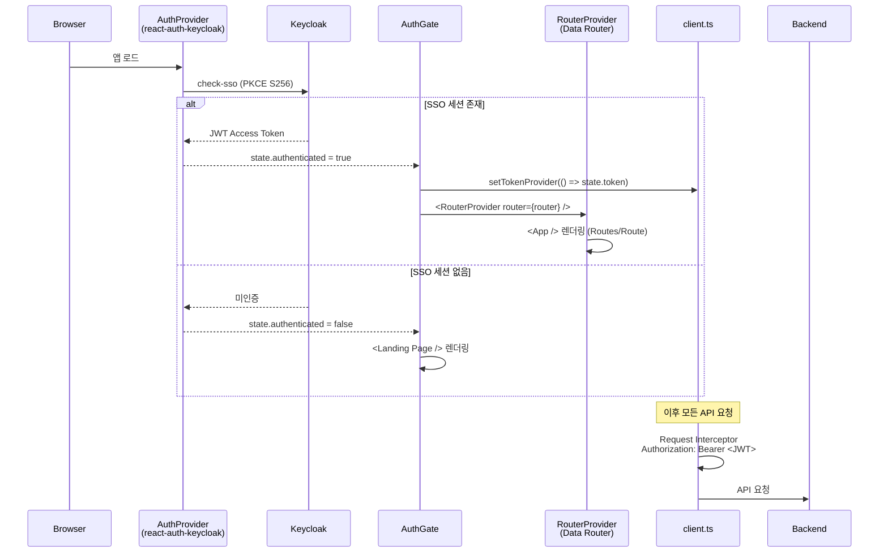
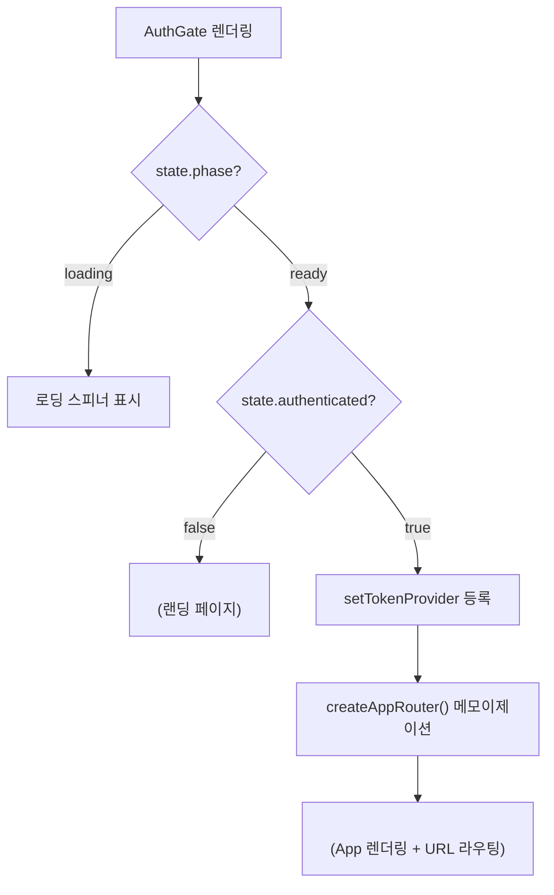
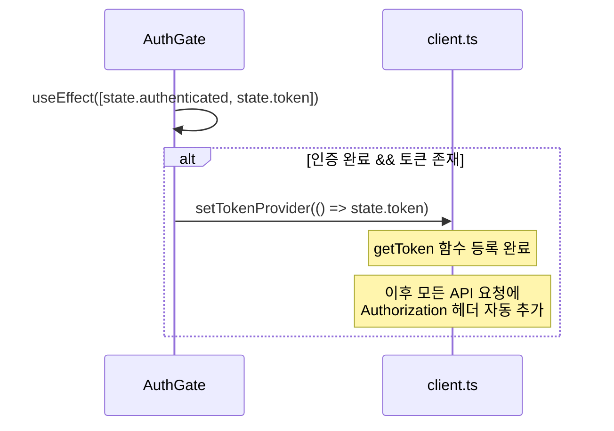
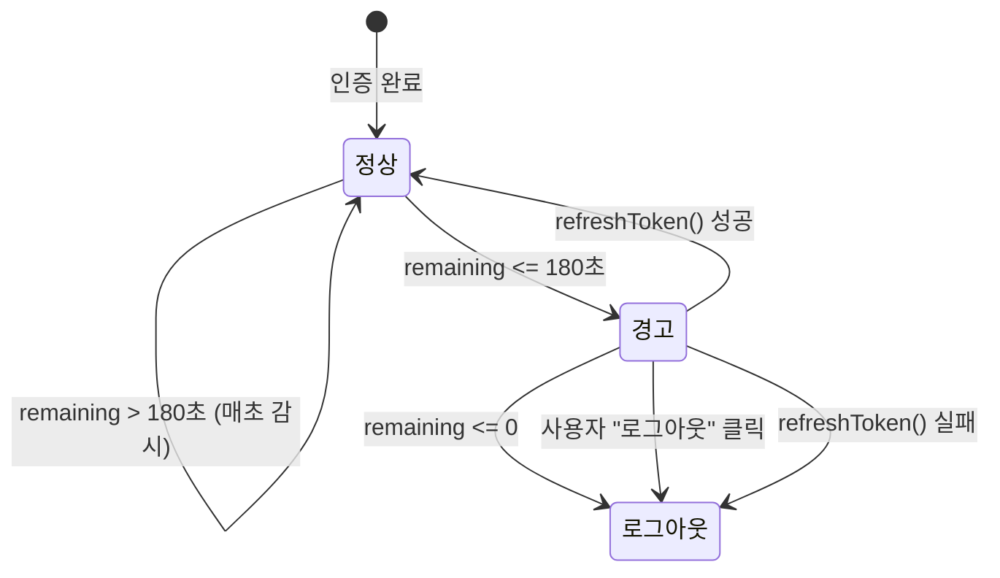
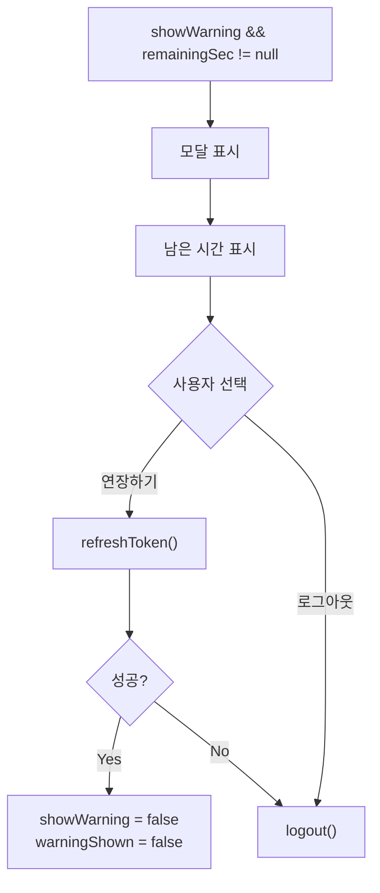

# 프론트엔드 인증 및 세션 관리

<details>
<summary><b>목차</b></summary>

- [인증 구조 개요](#인증-구조-개요)
- [Keycloak 설정](#keycloak-설정)
- [AuthProvider](#authprovider)
  - [useAuth 상태](#useauth-상태)
  - [KeycloakTokenParsed](#keycloaktokenparsed)
- [AuthGate — 인증 분기](#authgate--인증-분기)
  - [토큰 주입](#토큰-주입)
- [세션 만료 관리](#세션-만료-관리)
  - [useSessionExpiry Hook](#usesessionexpiry-hook)
  - [타이머 동작](#타이머-동작)
  - [SessionExpiryModal](#sessionexpirymodal)
- [소유권 검증 (프론트엔드 관점)](#소유권-검증-프론트엔드-관점)

</details>

---

## 인증 구조 개요

커스텀 라이브러리 `react-auth-keycloak`이 Keycloak과의 통신을 추상화하고, 프론트엔드는 `AuthProvider` → `AuthGate` → `setTokenProvider` 패턴으로 인증 상태를 관리한다.



| 컴포넌트 | 역할 |
|---|---|
| `AuthProvider` | Keycloak 초기화, SSO 세션 확인, 토큰 상태 보유 |
| `AuthGate` | 인증 여부에 따라 `RouterProvider` 또는 `Landing Page` 분기 |
| `setTokenProvider` | Axios 인스턴스에 JWT 공급 함수 등록 |
| `useSessionExpiry` | JWT `exp` 클레임 감시, 만료 경고 및 자동 로그아웃 |

---

## Keycloak 설정

[main.tsx](../../src/main.tsx)

```typescript
const authConfig = {
  keycloak: {
    url: import.meta.env.VITE_KEYCLOAK_URL,
    realm: import.meta.env.VITE_KEYCLOAK_REALM,
    clientId: import.meta.env.VITE_KEYCLOAK_CLIENT_ID,
  },
  init: {
    onLoad: "check-sso",
    pkceMethod: "S256",
    checkLoginIframe: false,
  },
};
```

| 설정 | 값 | 효과 |
|---|---|---|
| `onLoad` | `check-sso` | 페이지 로드 시 기존 SSO 세션 확인 (자동 로그인 시도) |
| `pkceMethod` | `S256` | PKCE Challenge Method (Authorization Code + Code Verifier) |
| `checkLoginIframe` | `false` | Keycloak iframe 기반 세션 체크 비활성화 (CORS 이슈 방지) |

> [!IMPORTANT]
> `check-sso`는 `login-required`와 달리 **로그인 페이지로 자동 리다이렉트하지 않는다**. SSO 세션이 없으면 미인증 상태를 유지하여 `Landing Page`(랜딩 페이지)를 표시하고, 사용자가 명시적으로 로그인 버튼을 클릭해야 Keycloak 로그인 페이지로 이동한다.

---

## AuthProvider

커스텀 라이브러리 `@io.github.ellen24k/react-auth-keycloak/react`에서 제공하는 React Context Provider.

[auth.ts](../../src/services/external/auth.ts)

```typescript
export { useAuth, useRoles } from '@io.github.ellen24k/react-auth-keycloak/react'
```

### useAuth 상태

| 필드 | 타입 | 설명 |
|---|---|---|
| `state.phase` | `string` | `"loading"` / `"ready"` |
| `state.authenticated` | `boolean` | 인증 완료 여부 |
| `state.token` | `string` | JWT Access Token |
| `state.tokenParsed` | `object` | 디코딩된 JWT Payload |
| `logout()` | `function` | Keycloak 로그아웃 |
| `refreshToken()` | `function` | 토큰 갱신 요청 |

### KeycloakTokenParsed

[auth.ts](../../src/types/auth.ts)

```typescript
interface KeycloakTokenParsed {
  sub: string;                // 사용자 UUID (Keycloak 고유 ID)
  name?: string;              // 표시 이름
  preferred_username?: string; // 로그인 ID
  email?: string;             // 이메일
  iss?: string;               // 토큰 발급자 (Keycloak URL)
  exp?: number;               // 만료 시각 (Unix timestamp)
  iat?: number;               // 발급 시각 (Unix timestamp)
}
```

> [!NOTE]
> `sub` 필드가 백엔드의 `SecurityUtil.getCurrentUserId()`에서 반환하는 UUID와 동일하다. 프론트엔드에서는 `state.tokenParsed.sub`를 `userId`로 사용한다.

---

## AuthGate — 인증 분기

[AuthGate.tsx](../../src/components/AuthGate.tsx)



### 토큰 주입



`AuthGate`는 세 가지 역할을 수행한다:
- **컴포넌트 분기**: 인증 여부에 따라 `RouterProvider` 또는 `Landing Page` 렌더링
- **토큰 주입**: 인증 성공 시 `setTokenProvider`를 호출하여 Axios 인스턴스에 토큰 공급
- **라우터 생성**: `useMemo`로 `createAppRouter()`를 메모이제이션하여 Data Router 인스턴스를 한 번만 생성

---

## 세션 만료 관리

### useSessionExpiry Hook

[useSessionExpiry.ts](../../src/hooks/useSessionExpiry.ts)

JWT 토큰의 `exp` 클레임을 매초 감시하여 세션 만료를 감지한다.



### 타이머 동작

| 이벤트 | 동작 |
|---|---|
| 인증 완료 | `setInterval(tick, 1000)` 시작 |
| 매 tick | `exp - Date.now()/1000` 계산 → `remainingSec` 갱신 |
| `remaining <= 180` | `showWarning = true` (1회만, `warningShownRef`로 중복 방지) |
| `remaining <= 0` | `clearInterval` + `logout()` 자동 실행 |
| 인증 해제 | `clearInterval`, 상태 초기화 |

### SessionExpiryModal

[SessionExpiryModal.tsx](../../src/components/shared/SessionExpiryModal.tsx)



| 버튼 | 동작 |
|---|---|
| 연장하기 | `refreshToken()` → 성공 시 경고 해제, 실패 시 로그아웃 |
| 로그아웃 | 즉시 `logout()` 호출 |

---

## 소유권 검증

프론트엔드에서 `userId`(`state.tokenParsed.sub`)는 React Query Hook의 `enabled` 조건 및 인자로만 사용되며, 실제 소유권 검증은 백엔드에서 수행된다.
- 모든 API 요청에 JWT가 포함되므로, 백엔드의 `SecurityUtil.getCurrentUserId()` + `entity.validateOwner(userId)` 패턴이 소유권을 보장한다. 타인의 리소스 접근 시 백엔드가 403 `FORBIDDEN` 에러를 반환하고, 프론트엔드의 에러 처리 체계가 "접근 권한이 없습니다." 토스트를 표시한다.

| 사용 위치 | 파일 | 용도 |
|---|---|---|
| `App.tsx` | `state.tokenParsed.sub` | 메모/태그 Hook의 `userId` 인자 |
| `useMemoTagManager.ts` | `state.tokenParsed.sub` | 태그 동기화 시 userId 전달 |
| `ProfilePage.tsx` | `state.tokenParsed` | 사용자 정보 표시 |

