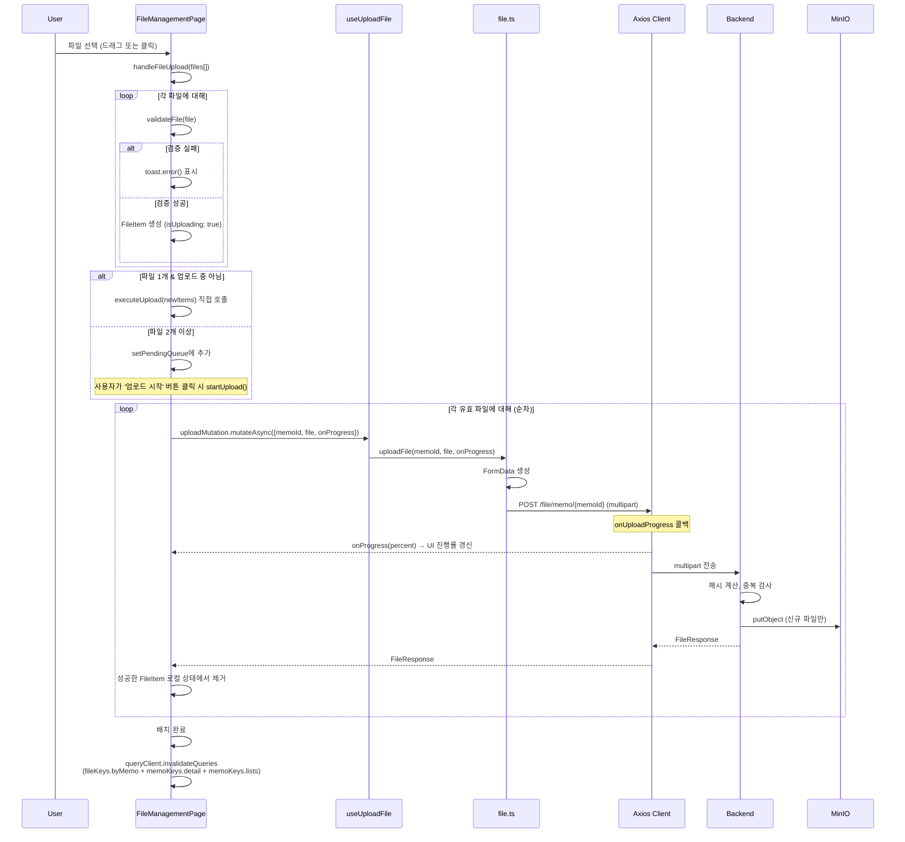
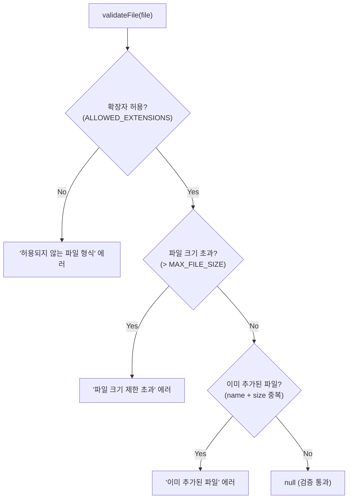
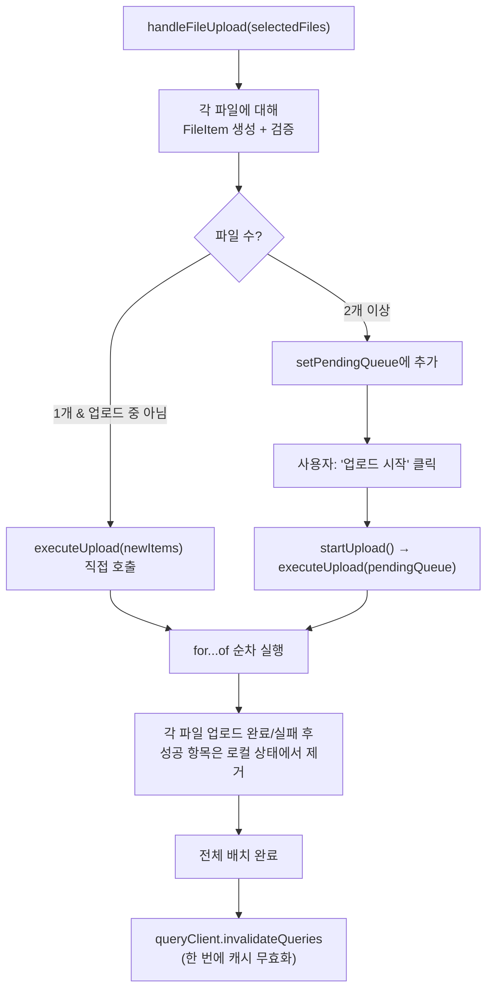
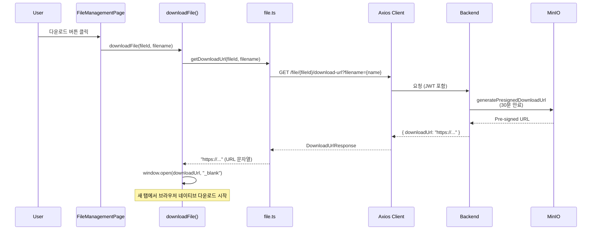
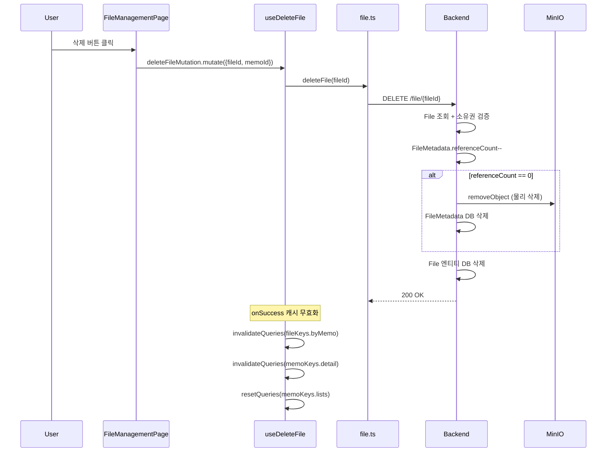
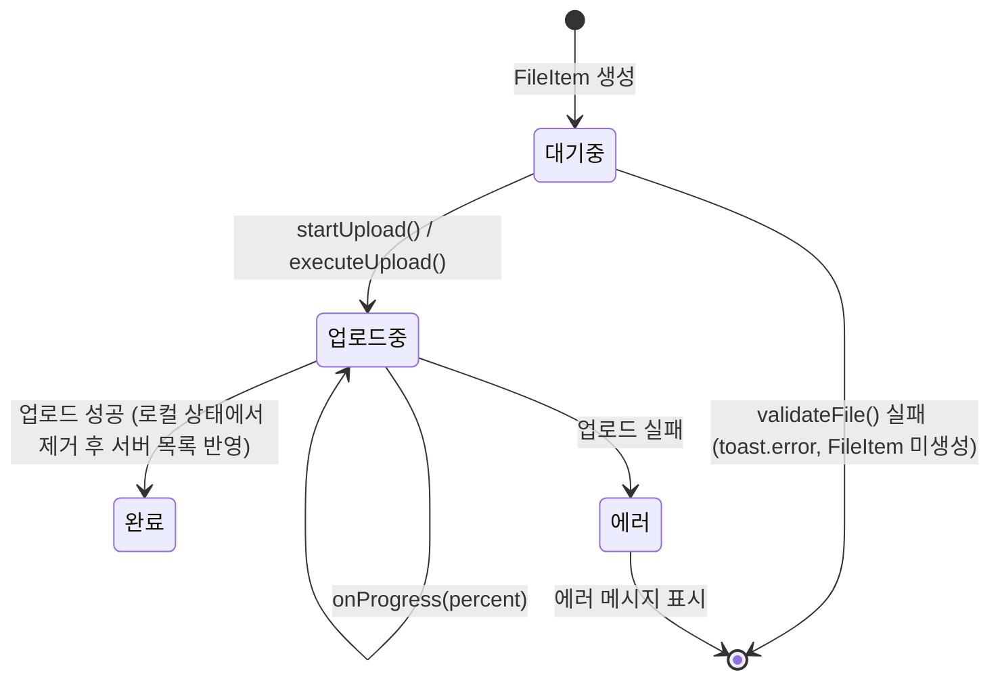

# 파일 관리 상세

<details>
<summary><b>목차</b></summary>

- [파일 타입 정의](#파일-타입-정의)
  - [서버 응답 타입](#서버-응답-타입)
  - [UI 상태 타입](#ui-상태-타입)
  - [파일 제약 조건](#파일-제약-조건)
- [파일 업로드](#파일-업로드)
  - [전체 흐름](#전체-흐름)
  - [클라이언트 검증](#클라이언트-검증)
  - [배치 업로드 전략](#배치-업로드-전략)
  - [업로드 프로그레스 추적](#업로드-프로그레스-추적)
- [파일 다운로드](#파일-다운로드)
- [파일 삭제](#파일-삭제)
  - [삭제 후 캐시 무효화 (3단 갱신)](#삭제-후-캐시-무효화-3단-갱신)
- [FileManagementPage UI 로직](#filemanagementpage-ui-로직)
  - [파일 상태 관리](#파일-상태-관리)
  - [주요 핸들러](#주요-핸들러)
  - [유틸리티 함수](#유틸리티-함수)

</details>

---

## 파일 타입 정의

[file.ts](../../src/types/file.ts)

### 서버 응답 타입

| 인터페이스 | 필드 | 설명 |
|---|---|---|
| `FileResponse` | `id`, `memoId`, `fileName`, `minioObjectName`, `fileHash`, `fileSize`, `contentType`, `createdAt` | 서버에서 반환하는 파일 메타데이터 |
| `FileListResponse` | `files: FileResponse[]`, `totalCount` | 파일 목록 래퍼 |
| `DownloadUrlResponse` | `downloadUrl: string` | Pre-signed 다운로드 URL |

### UI 상태 타입

```typescript
interface FileItem {
  id: string;              // 클라이언트 생성 고유 ID
  name: string;            // 파일명
  size: number;            // 파일 크기 (bytes)
  type?: string;           // MIME 타입
  uploadProgress?: number; // 업로드 진행률 (0~100)
  isUploading?: boolean;   // 업로드 중 여부
  error?: string;          // 에러 메시지
  backendId?: string;      // 서버 File ID
  minioObjectName?: string; // MinIO 오브젝트 키
}
```

`FileItem`은 업로드 전·중·후·실패 상태를 하나의 타입으로 표현한다. `backendId`가 없으면 서버에 아직 저장되지 않은 로컬 상태를 의미한다.

### 파일 제약 조건

[file.ts](../../src/types/file.ts)

| 상수 | 값 |
|---|---|
| `MAX_FILE_SIZE` | 500MB |
| `ALLOWED_EXTENSIONS` | txt, doc, docx, pdf, xls, xlsx, ppt, pptx, jpg, jpeg, png, gif, zip, rar |

---

## 파일 업로드

### 전체 흐름



### 클라이언트 검증

[FileManagementPage.tsx](../../src/pages/FileManagementPage.tsx)



검증 실패 시 해당 파일에 대한 `toast.error()`만 표시하고, 나머지 유효한 파일은 계속 처리한다.

### 배치 업로드 전략



> [!IMPORTANT]
> 파일 업로드는 **순차 실행**된다. 파일 업로드가 끝날 때마다 무효화하면 배치 도중 파일 목록이 반복 refetch되기 때문에 `useUploadFile`의 `onSuccess`에는 캐시 무효화를 두지 않는다. 캐시 무효화는 `executeUpload`가 전체 배치를 완료한 뒤 한 번에 수행된다.

### 업로드 프로그레스 추적


---

## 파일 다운로드

[useFileQueries.ts](../../src/hooks/api/useFileQueries.ts)

`downloadFile` 함수는 Hook이 아닌 **독립 함수**로 구현되어 있다. 다운로드는 캐싱이 필요 없는 일회성 동작이기 때문이다.



| 단계 | 설명 |
|---|---|
| Pre-signed URL 요청 | 백엔드가 MinIO에서 30분 유효 Pre-signed URL 생성 |
| 브라우저 다운로드 | `window.open`으로 새 탭에서 URL 오픈 → `Content-Disposition`에 의해 자동 다운로드 |

---

## 파일 삭제



### 삭제 후 캐시 무효화 (3단 갱신)

| 대상 | 전략 | 이유 |
|---|---|---|
| `fileKeys.byMemo(memoId)` | `invalidateQueries` | 해당 메모의 파일 목록 갱신 |
| `memoKeys.detail(memoId)` | `invalidateQueries` | 메모 상세의 `fileCount` 갱신 |
| `memoKeys.lists()` | `resetQueries` | 메모 목록 카드의 파일 아이콘 갱신 |

업로드와 달리 삭제는 단건 요청이므로, `useDeleteFile`의 `onSuccess`에서 즉시 무효화한다.

---

## FileManagementPage UI 로직

[FileManagementPage.tsx](../../src/pages/FileManagementPage.tsx)

### 파일 상태 관리



### 주요 핸들러

| 핸들러 | 동작 |
|---|---|
| `handleFileSelect` | `<input type="file">` onChange → `handleFileUpload`에 파일 배열 전달 |
| `handleFileUpload` | 파일 검증 → FileItem 생성 → 1개면 `executeUpload` 직접 호출, 2개 이상이면 `pendingQueue`에 추가 |
| `startUpload` | `pendingQueue` 전체를 `executeUpload`에 전달 (업로드 시작 버튼) |
| `executeUpload` | 순차 업로드 → 완료 후 캐시 무효화 |
| `handleFileDelete` | `backendId` 존재 시 `deleteFileMutation.mutate`, 없으면 로컬 상태 및 `pendingQueue`에서 제거 |
| `handleClearAll` | 업로드 중(`isUploading`)이면 실행하지 않음. `backendId`가 있는 파일(서버에 저장된 파일)만 `deleteFileMutation` 호출 |

### 유틸리티 함수

| 함수 | 동작 |
|---|---|
| `formatFileSize(bytes)` | `bytes` → 사람이 읽을 수 있는 형식 (`B`, `KB`, `MB`) |
| `getFileIcon(fileName)` | 확장자 기반 아이콘 컴포넌트 반환 (phosphor-icons) |
| `validateFile(file)` | 확장자·크기·중복 검증 → 에러 메시지 또는 `null` |
