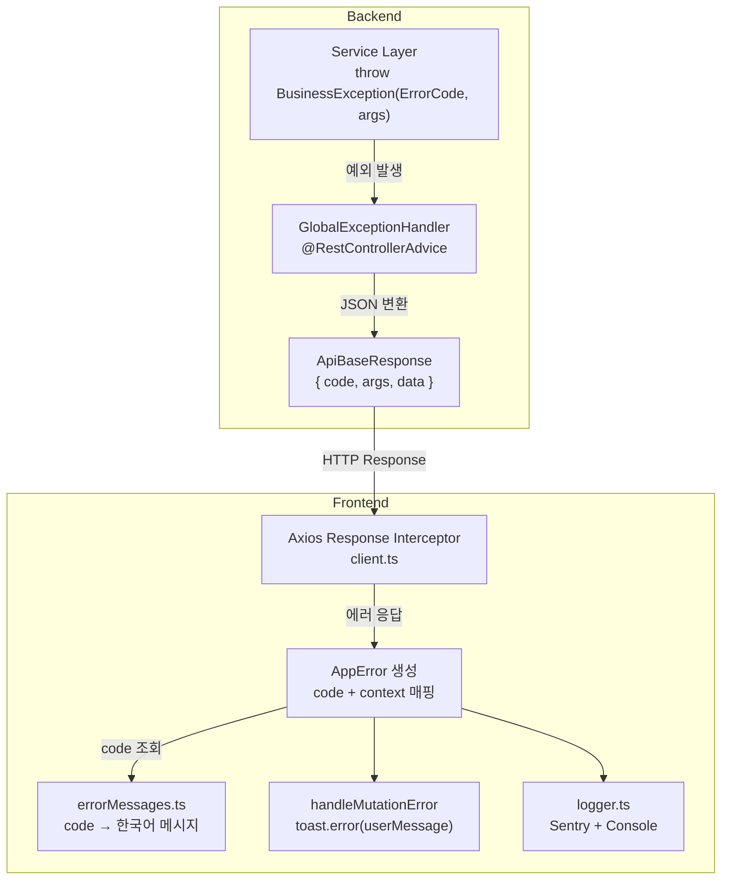
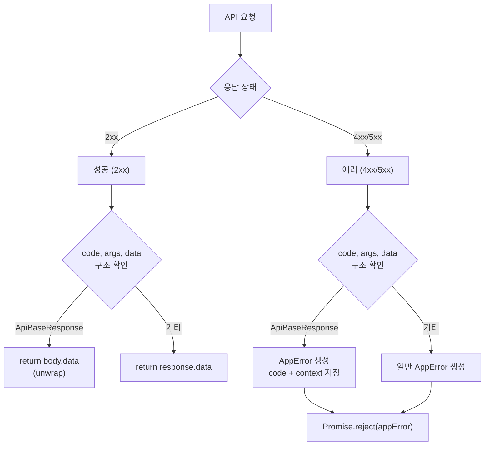
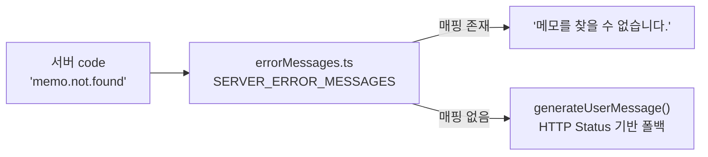
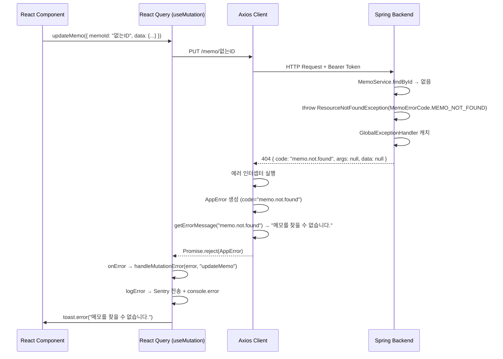
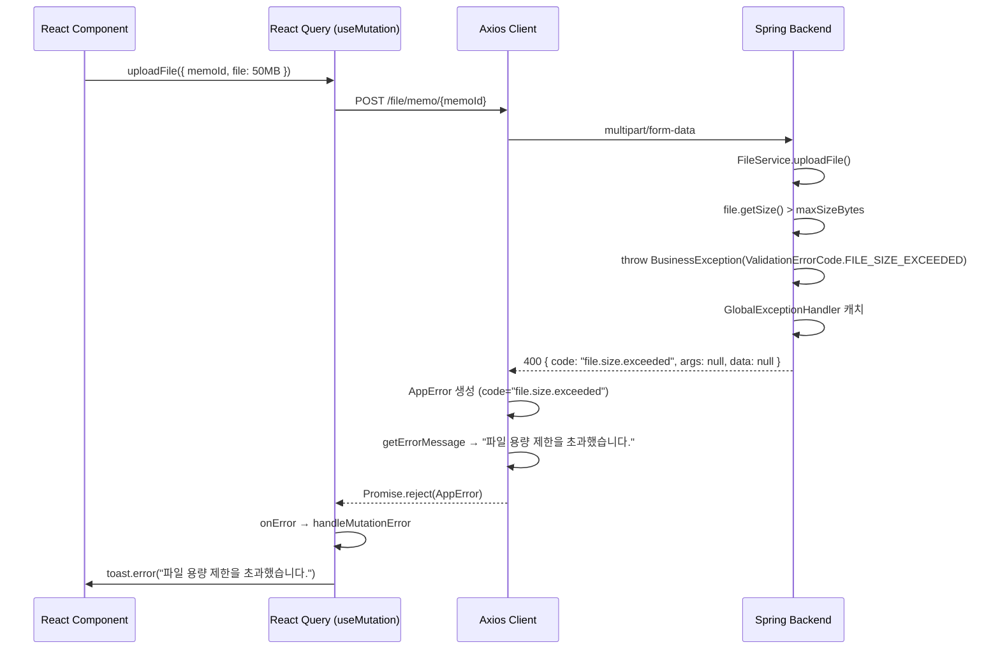
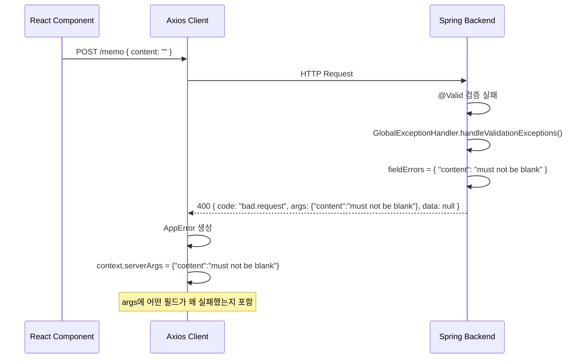

# Memo 에러 처리 구조 매뉴얼

## 전체 흐름



## ApiBaseResponse 구조

백엔드의 모든 API 응답은 다음 구조를 따른다.

[ApiBaseResponse.java](file:///c:/Users/kwb/IdeaProjects/prj/memo/backend/src/main/java/io/github/ellen24k/memo_back/dto/ApiBaseResponse.java)
```java
public class ApiBaseResponse<T> {
    private String code;   // 응답 코드 (성공/에러 공통)
    private Object args;   // 에러 시 부가 정보, 성공 시 null
    private T data;        // 성공 시 응답 데이터, 에러 시 null
}
```

| 필드 | 성공 시 | 에러 시 |
|------|---------|---------|
| `code` | `"memo.created"`, `"tag.list.retrieved"` 등 | `"memo.not.found"`, `"file.invalid"` 등 |
| `args` | `null` | 에러 부가 정보 (검증 실패 필드, 컨텍스트 Map 등) |
| `data` | 실제 응답 데이터 | `null` |

---

## code 필드 상세

`code`는 백엔드 enum의 [name()](file:///c:/Users/kwb/IdeaProjects/prj/memo/backend/src/main/java/io/github/ellen24k/memo_back/exception/code/BaseResponseCode.java#7-8)을 소문자 + `.` 구분으로 변환한 값이다.

[BaseResponseCode.java](file:///c:/Users/kwb/IdeaProjects/prj/memo/backend/src/main/java/io/github/ellen24k/memo_back/exception/code/BaseResponseCode.java)
```java
public interface BaseResponseCode extends ErrorCode {
    @Override
    default String getCode() {
        return name().toLowerCase().replace("_", ".");
    }
}
```

### 에러 코드 전체 목록

| enum | code 값 | HTTP Status | 설명 |
|------|---------|-------------|------|
| `CommonErrorCode.BAD_REQUEST` | `bad.request` | 400 | 잘못된 요청 |
| `CommonErrorCode.UNAUTHORIZED` | `unauthorized` | 401 | 인증 필요 |
| `CommonErrorCode.FORBIDDEN` | `forbidden` | 403 | 접근 거부 |
| `CommonErrorCode.NOT_FOUND` | `not.found` | 404 | 리소스 없음 |
| `CommonErrorCode.CONFLICT` | `conflict` | 409 | 데이터 충돌 |
| `CommonErrorCode.INTERNAL_SERVER_ERROR` | `internal.server.error` | 500 | 서버 오류 |
| `AuthErrorCode.AUTH_INFO_NOT_FOUND` | `auth.info.not.found` | 401 | 인증 정보 없음 |
| `AuthErrorCode.INVALID_TOKEN_FORMAT` | `invalid.token.format` | 401 | 토큰 형식 오류 |
| `MemoErrorCode.MEMO_NOT_FOUND` | `memo.not.found` | 404 | 메모 없음 |
| `TagErrorCode.TAG_NOT_FOUND` | `tag.not.found` | 404 | 태그 없음 |
| `FileErrorCode.FILE_NOT_FOUND` | `file.not.found` | 404 | 파일 없음 |
| `FileErrorCode.FILE_EMPTY` | `file.empty` | 400 | 빈 파일 |
| `FileErrorCode.FILE_INVALID` | `file.invalid` | 400 | 유효하지 않은 파일 |
| `FileErrorCode.MINIO_UPLOAD_FAILED` | `minio.upload.failed` | 500 | 업로드 실패 |
| `FileErrorCode.MINIO_DELETE_FAILED` | `minio.delete.failed` | 500 | 삭제 실패 |
| `FileErrorCode.MINIO_DOWNLOAD_FAILED` | `minio.download.failed` | 500 | 다운로드 실패 |
| `ValidationErrorCode.INVALID_OBJECT_NAME` | `invalid.object.name` | 400 | 유효하지 않은 이름 |
| `ValidationErrorCode.REQUIRED_PARAMETER_MISSING` | `required.parameter.missing` | 400 | 필수 항목 누락 |
| `ValidationErrorCode.FILE_SIZE_EXCEEDED` | `file.size.exceeded` | 400 | 파일 크기 초과 |

---

## args 필드 상세

`args`는 에러 발생 시 프론트엔드에 전달되는 **부가적인 컨텍스트 정보**다. 상황에 따라 다른 타입이 들어간다.

### 실제 사용 사례

**사례 — `@Valid` 검증 실패 (`Map<String, String>`)**

[GlobalExceptionHandler.java](file:///c:/Users/kwb/IdeaProjects/prj/memo/backend/src/main/java/io/github/ellen24k/memo_back/exception/GlobalExceptionHandler.java)
```java
@ExceptionHandler(MethodArgumentNotValidException.class)
public ResponseEntity<ApiBaseResponse<Void>> handleValidationExceptions(MethodArgumentNotValidException e) {
    Map<String, String> fieldErrors = new HashMap<>();
    e.getBindingResult().getFieldErrors().forEach(error ->
            fieldErrors.put(error.getField(), error.getDefaultMessage())
    );
    return ResponseEntity.status(HttpStatus.BAD_REQUEST)
             .body(ApiBaseResponse.error(CommonErrorCode.BAD_REQUEST.getCode(), fieldErrors));
}
```

```json
{
  "code": "bad.request",
  "args": {
    "content": "내용은 필수입니다",
    "title": "제목은 50자 이내여야 합니다"
  },
  "data": null
}
```

**사례 — 파일 삭제 실패 시 컨텍스트 전달 (`Map<String, String>`)**

[FileService.java#L208](file:///c:/Users/kwb/IdeaProjects/prj/memo/backend/src/main/java/io/github/ellen24k/memo_back/service/FileService.java#L208)
```java
throw new BusinessException(FileErrorCode.MINIO_DELETE_FAILED, Map.of("fileHash", fileHash));
```

```json
{
  "code": "minio.delete.failed",
  "args": [{ "fileHash": "a3f2e1..." }],
  "data": null
}
```

> [!NOTE]
> [BusinessException](file:///c:/Users/kwb/IdeaProjects/prj/memo/backend/src/main/java/io/github/ellen24k/memo_back/exception/BusinessException.java#7-18)의 `args`는 `Object... args` (가변 인자)이므로, [GlobalExceptionHandler](file:///c:/Users/kwb/IdeaProjects/prj/memo/backend/src/main/java/io/github/ellen24k/memo_back/exception/GlobalExceptionHandler.java#19-60)에서 `e.getArgs()`로 배열로 전달된다.

**사례 — args가 없는 일반 에러 (`null`)**

대부분의 비즈니스 예외는 `args` 없이 에러 코드만 전달한다.

```java
throw new ResourceNotFoundException(MemoErrorCode.MEMO_NOT_FOUND);
throw new BusinessException(FileErrorCode.FILE_INVALID);
throw new BusinessException(ValidationErrorCode.FILE_SIZE_EXCEEDED);
```

```json
{
  "code": "memo.not.found",
  "args": null,
  "data": null
}
```

---

## data 필드 상세

**성공 응답**에서만 값이 들어간다. 에러 응답에서는 항상 `null`.

**사례 — 메모 생성 성공**

```json
{
  "code": "memo.created",
  "args": null,
  "data": {
    "id": "550e8400-e29b-41d4-a716-446655440000",
    "content": "새 메모 내용",
    "isPinned": false,
    "createdAt": "2026-03-03T07:00:00Z"
  }
}
```

**사례 — 태그 목록 조회 성공**

```json
{
  "code": "tag.list.retrieved",
  "args": null,
  "data": [
    { "id": "...", "name": "Spring", "type": "GENERAL" },
    { "id": "...", "name": "React", "type": "FEATURED" }
  ]
}
```

---

## 프론트엔드 처리 흐름 상세

### Axios Interceptor — 성공/에러 분기

[client.ts](file:///c:/Users/kwb/IdeaProjects/prj/memo/frontend/src/services/api/client.ts)



**성공 응답 처리**: [ApiBaseResponse](file:///c:/Users/kwb/IdeaProjects/prj/memo/backend/src/main/java/io/github/ellen24k/memo_back/dto/ApiBaseResponse.java#7-39) 구조면 `body.data`만 추출하여 반환 → 서비스 레이어에서는 `data` 안쪽 내용만 직접 받게 된다.

```typescript
// client.ts - 성공 인터셉터
if (body && typeof body === 'object' && 'code' in body && 'args' in body && 'data' in body) {
  return body.data;  // ← ApiBaseResponse를 벗겨냄
}
```

**에러 응답 처리**: `code`와 `args`를 [AppError](file:///c:/Users/kwb/IdeaProjects/prj/memo/frontend/src/util/error/AppError.ts#22-111)의 `context`에 저장한다.

```typescript
// client.ts - 에러 인터셉터
const appError = new AppError(error, {
  code: serverResponse.code,         // ← "memo.not.found" 등
  context: {
    serverCode: serverResponse.code,
    serverArgs: serverResponse.args,  // ← 검증 에러 필드 등
  },
});
```

### AppError — code를 한국어 메시지로 변환

[AppError.ts](file:///c:/Users/kwb/IdeaProjects/prj/memo/frontend/src/util/error/AppError.ts)



```typescript
// AppError 생성자 내부
this.code = options.code || code;                              // "memo.not.found"
const mappedMessage = getErrorMessage(this.code);              // "메모를 찾을 수 없습니다."
this.userMessage = options.userMessage || mappedMessage || this.generateUserMessage(statusCode);
```

[errorMessages.ts](file:///c:/Users/kwb/IdeaProjects/prj/memo/frontend/src/config/errorMessages.ts) — 서버 code와 프론트엔드 메시지 매핑

```typescript
export const SERVER_ERROR_MESSAGES: Record<string, string> = {
  'memo.not.found': '메모를 찾을 수 없습니다.',
  'tag.not.found': '태그를 찾을 수 없습니다.',
  'file.not.found': '파일을 찾을 수 없습니다.',
  'file.invalid': '유효하지 않은 파일입니다.',
  'minio.upload.failed': '파일 업로드 중 오류가 발생했습니다.',
  'file.size.exceeded': '파일 용량 제한을 초과했습니다.',
  // ...
};
```

### handleMutationError — Toast로 사용자에게 표시

[handleMutationError.ts](file:///c:/Users/kwb/IdeaProjects/prj/memo/frontend/src/util/error/handleMutationError.ts)

```typescript
export const handleMutationError = (error: unknown, operation: string) => {
  const appError = error instanceof AppError ? error : new AppError(error);
  logError(appError, { operation });
  toast.error(appError.userMessage);
};
```

React Query의 [onError](file:///c:/Users/kwb/IdeaProjects/prj/memo/frontend/src/hooks/api/useFileQueries.ts#53-54)에서 일괄 사용:

[useMemoQueries.ts](file:///c:/Users/kwb/IdeaProjects/prj/memo/frontend/src/hooks/api/useMemoQueries.ts)
```typescript
export const useCreateMemo = () => {
  return useMutation({
    mutationFn: memoService.createMemo,
    onError: (error: unknown) => handleMutationError(error, "createMemo"),
  });
};
```

---

## 전체 실행 예시 — 존재하지 않는 메모 수정 시도



## 전체 실행 예시 — 파일 업로드 시 크기 초과



## 전체 실행 예시 — `@Valid` 검증 실패 (args 활용)



---

## 파일 구조 요약

```
backend/
└── exception/
    ├── ErrorCode.java              ← 인터페이스 (getCode, getStatus)
    ├── BusinessException.java      ← ErrorCode + args를 감싸는 RuntimeException
    ├── ResourceNotFoundException   ← BusinessException 파생
    ├── GlobalExceptionHandler.java ← @RestControllerAdvice, 모든 예외를 ApiBaseResponse로 변환
    └── code/
        ├── BaseResponseCode.java   ← name()을 code로 자동 변환하는 기본 구현
        ├── common/CommonErrorCode  ← BAD_REQUEST, UNAUTHORIZED, ...
        ├── auth/AuthErrorCode      ← AUTH_INFO_NOT_FOUND, INVALID_TOKEN_FORMAT
        ├── memo/MemoErrorCode      ← MEMO_NOT_FOUND
        ├── tag/TagErrorCode        ← TAG_NOT_FOUND
        ├── file/FileErrorCode      ← FILE_NOT_FOUND, MINIO_UPLOAD_FAILED, ...
        └── validation/ValidationErrorCode ← INVALID_OBJECT_NAME, FILE_SIZE_EXCEEDED

frontend/
├── services/api/client.ts         ← Axios 인터셉터, ApiBaseResponse 파싱
├── types/api.types.ts              ← ApiBaseResponse<T> 타입 정의
├── util/error/
│   ├── AppError.ts                 ← 프론트 통합 에러 클래스
│   ├── ErrorCodes.ts               ← 프론트 전용 에러 코드 상수
│   ├── errorId.ts                  ← 에러 추적용 ID 생성
│   └── handleMutationError.ts      ← useMutation onError 공통 핸들러
├── config/
│   ├── errorMessages.ts            ← 서버 code → 한국어 메시지 매핑
│   └── messages.ts                 ← 성공/실패 토스트 메시지 상수
└── services/external/logger.ts     ← Sentry + 콘솔 로깅
```
