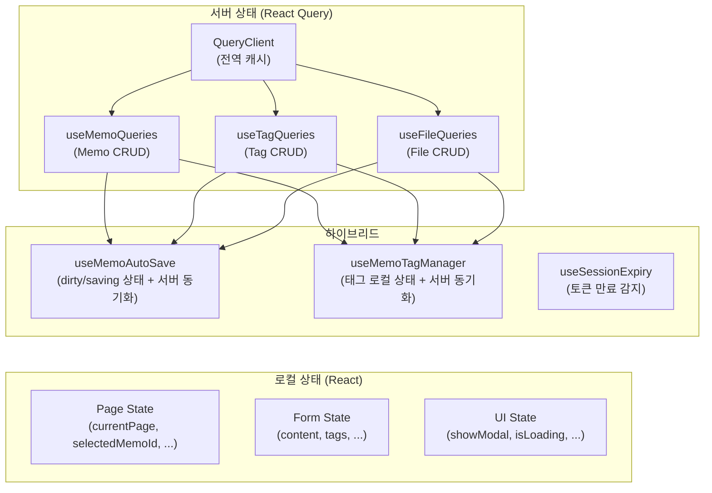
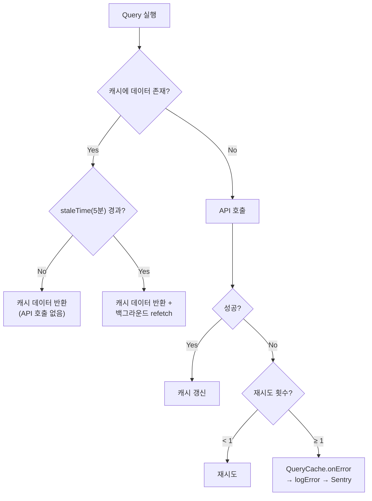
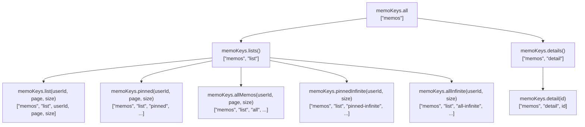
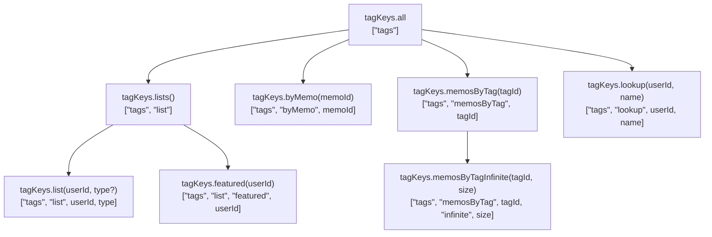
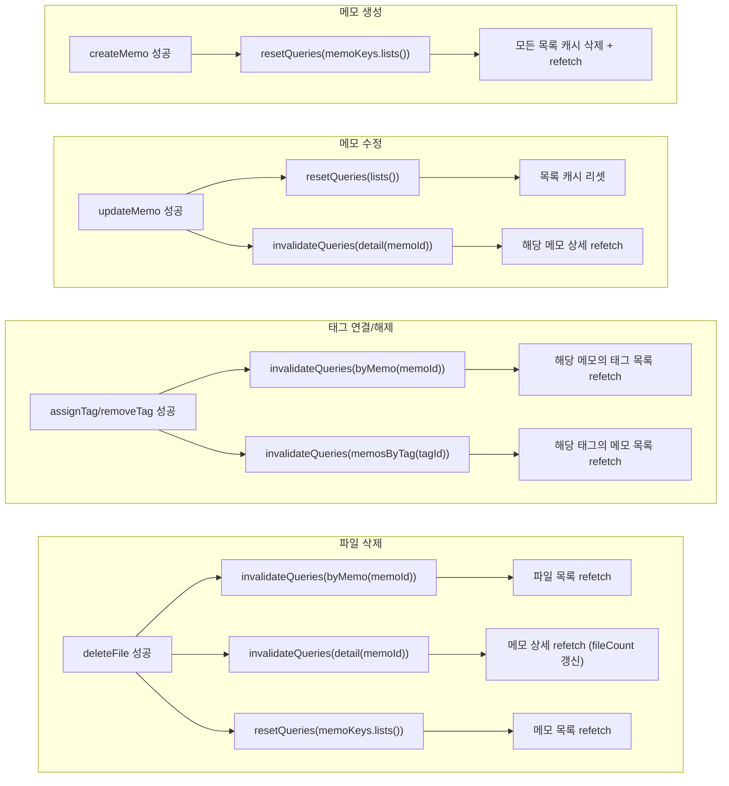
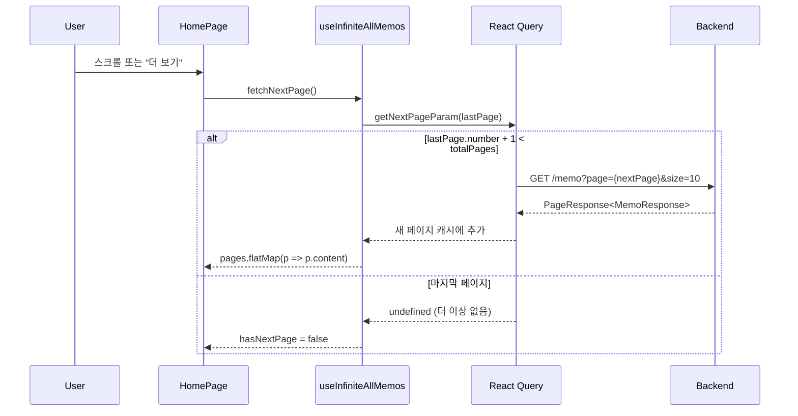
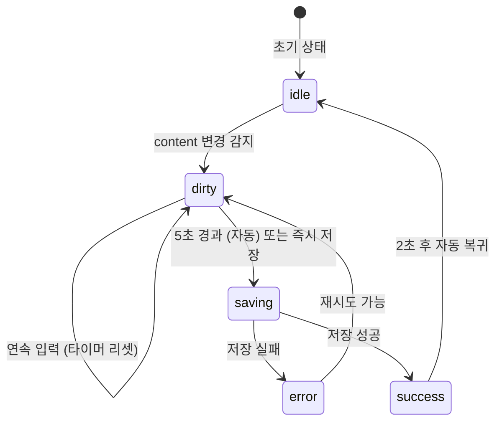
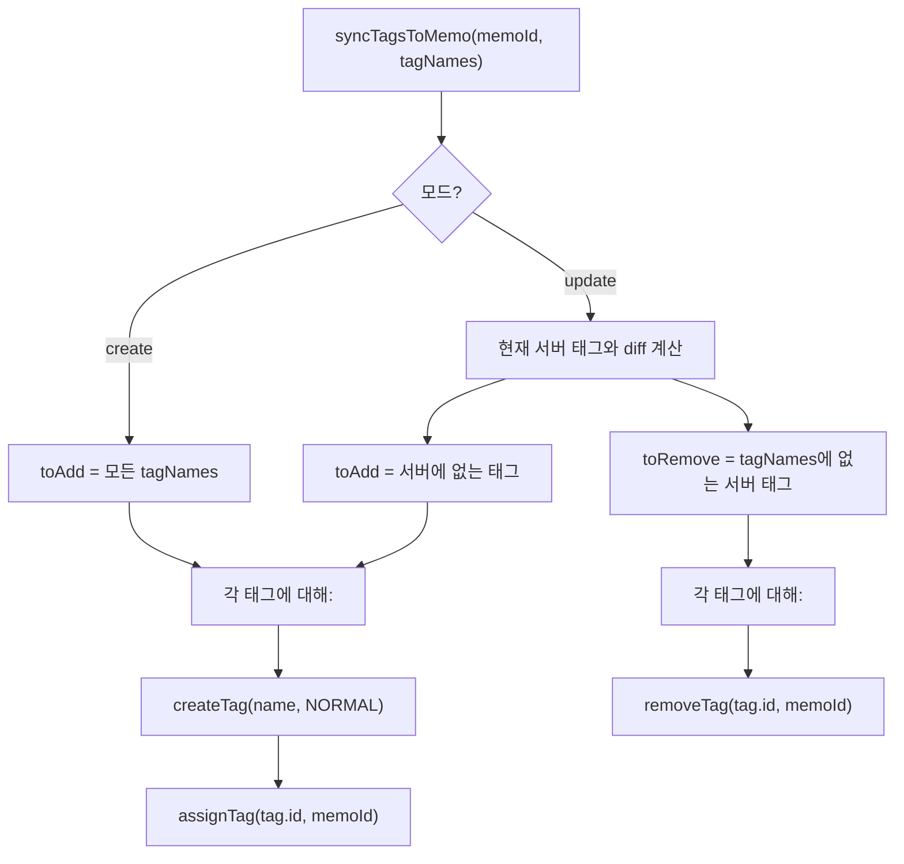
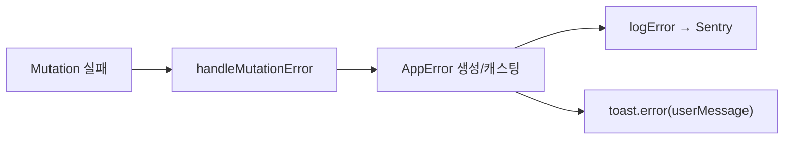

# 프론트엔드 상태 관리 및 캐싱 전략

<details>
<summary><b>목차</b></summary>

- [개요](#개요)
- [QueryClient 설정](#queryclient-설정)
- [Query Key 팩토리](#query-key-팩토리)
  - [memoKeys](#memokeys)
  - [tagKeys](#tagkeys)
  - [fileKeys](#filekeys)
- [Query Hook 전체 목록](#query-hook-전체-목록)
  - [Memo Queries](#memo-queries)
  - [Memo Mutations](#memo-mutations)
  - [Tag Queries](#tag-queries)
  - [Tag Mutations](#tag-mutations)
  - [File Queries & Mutations](#file-queries--mutations)
- [캐시 무효화 전략](#캐시-무효화-전략)
  - [시나리오별 무효화 흐름](#시나리오별-무효화-흐름)
- [Infinite Query 패턴](#infinite-query-패턴)
  - [getNextPageParam 로직](#getnextpageparam-로직)
  - [사용처](#사용처)
- [Custom Hooks](#custom-hooks)
  - [useMemoAutoSave — 자동 저장](#usememoautosave--자동-저장)
  - [useMemoTagManager — 태그 동기화](#usememotagmanager--태그-동기화)
- [에러 처리 통합](#에러-처리-통합)

</details>

---

## 개요

서버 상태는 TanStack React Query가 캐싱·동기화·무효화를 담당하고, 로컬 상태는 React의 `useState`/`useRef`로 관리한다.



---

## QueryClient 설정

[main.tsx](../../src/main.tsx)

| 설정 | 값 | 효과 |
|---|---|---|
| `retry` | 1 | 실패 시 1회만 재시도 |
| `staleTime` | 5분 (300,000ms) | 5분 이내 캐시는 refetch 없이 그대로 반환 |
| `QueryCache.onError` | `logError(appError)` | 모든 쿼리 에러를 Sentry에 자동 보고 |



---

## Query Key 팩토리

각 도메인별 키 객체가 계층 구조를 형성하여, 부모 키를 기준으로 하위 캐시를 일괄 무효화할 수 있다.

### memoKeys

[useMemoQueries.ts](../../src/hooks/api/useMemoQueries.ts)



### tagKeys

[useTagQueries.ts](../../src/hooks/api/useTagQueries.ts)



### fileKeys

[useFileQueries.ts](../../src/hooks/api/useFileQueries.ts)

| Key | 구조 |
|---|---|
| `fileKeys.all` | `["files"]` |
| `fileKeys.byMemo(memoId)` | `["files", "memo", memoId]` |

---

## Query Hook 전체 목록

### Memo Queries

[useMemoQueries.ts](../../src/hooks/api/useMemoQueries.ts)

| Hook | 타입 | Query Key | enabled 조건 | 특이사항 |
|---|---|---|---|---|
| `useGetMemos` | `useQuery` | `list(userId, page, size)` | `!!userId` | 기본 페이징 |
| `useGetPinnedMemos` | `useQuery` | `pinned(userId, page, size)` | `!!userId` | `isPinned=true` |
| `useGetAllMemos` | `useQuery` | `allMemos(userId, page, size)` | `!!userId` | 전체 메모 |
| `useInfinitePinnedMemos` | `useInfiniteQuery` | `pinnedInfinite(userId, size)` | `!!userId && options?.enabled !== false` | 무한 스크롤 |
| `useInfiniteAllMemos` | `useInfiniteQuery` | `allInfinite(userId, size)` | `!!userId` | 무한 스크롤 |
| `useGetMemoById` | `useQuery` | `detail(id)` | `!!memoId` | `refetchOnMount: true` |

### Memo Mutations

| Hook | 타입 | Service 함수 | onSuccess 캐시 전략 |
|---|---|---|---|
| `useCreateMemo` | `useMutation` | `createMemo` | `resetQueries(lists())` |
| `useUpdateMemo` | `useMutation` | `updateMemo` | `resetQueries(lists())` + `invalidateQueries(detail(id))` |
| `useDeleteMemo` | `useMutation` | `deleteMemo` | `resetQueries(lists())` |

### Tag Queries

[useTagQueries.ts](../../src/hooks/api/useTagQueries.ts)

| Hook | 타입 | Query Key | enabled 조건 | staleTime |
|---|---|---|---|---|
| `useGetTags` | `useQuery` | `list(userId)` | `!!userId` | 10초 |
| `useGetFeaturedTags` | `useQuery` | `featured(userId)` | `!!userId` | 5분 |
| `useGetTagsByMemo` | `useQuery` | `byMemo(memoId)` | `!!memoId && !!userId` | 기본(5분) |
| `useLookupTagByName` | `useQuery` | `lookup(userId, name)` | `!!userId && !!name` | 1분 |
| `useInfiniteMemosByTag` | `useInfiniteQuery` | `memosByTagInfinite(tagId, size)` | `!!tagId && !!userId` | 기본(5분) |

### Tag Mutations

| Hook | onSuccess 캐시 전략 |
|---|---|
| `useCreateTag` | `invalidateQueries(lists())` |
| `useUpdateTag` | `invalidateQueries(lists())` |
| `useAssignTag` | `invalidateQueries(byMemo(memoId))` + `invalidateQueries(memosByTag(tagId))` |
| `useRemoveTag` | `invalidateQueries(byMemo(memoId))` + `invalidateQueries(memosByTag(tagId))` |

### File Queries & Mutations

[useFileQueries.ts](../../src/hooks/api/useFileQueries.ts)

| Hook | 타입 | onSuccess 캐시 전략 |
|---|---|---|
| `useGetFilesByMemo` | `useQuery` | — |
| `useUploadFile` | `useMutation` | 없음 (배치 완료 후 Page에서 수동 무효화) |
| `useDeleteFile` | `useMutation` | `invalidateQueries(byMemo)` + `invalidateQueries(detail)` + `resetQueries(lists)` |

> [!IMPORTANT]
> `useUploadFile`의 `onSuccess`에는 캐시 무효화가 없다. 배치 업로드 시 파일마다 무효화하면 중복 API 호출이 발생하므로, `FileManagementPage`에서 배치 완료 후 한 번만 수동으로 무효화한다.

---

## 캐시 무효화 전략

- `resetQueries`: 캐시를 **완전히 삭제**하고 처음부터 다시 fetch. 목록 전체를 새로 불러와야 할 때 (생성/삭제 후) 사용.
- `invalidateQueries`: 캐시를 **stale로 표시**하고, 해당 쿼리가 관찰 중이면 refetch. 특정 항목만 갱신하면 충분할 때 (수정 후) 사용.

### 시나리오별 무효화 흐름



---

## Infinite Query 패턴

[useMemoQueries.ts](../../src/hooks/api/useMemoQueries.ts)

`HomePage`의 고정 메모와 전체 메모 목록은 **무한 스크롤**로 구현된다.



### getNextPageParam 로직

```typescript
getNextPageParam: (lastPage) => {
  const nextPage = lastPage.number + 1;
  return nextPage < lastPage.totalPages ? nextPage : undefined;
}
```

| 식 | 의미 |
|---|---|
| `lastPage.number` | 현재 페이지 (0-indexed) |
| `lastPage.totalPages` | 전체 페이지 수 |
| `nextPage < totalPages` | 다음 페이지가 존재하면 `nextPage` 반환, 아니면 `undefined` (종료) |

### 사용처

| Hook | Page | 페이지 크기 |
|---|---|---|
| `useInfinitePinnedMemos` | `HomePage` | `PINNED_PAGE_SIZE` (3) |
| `useInfiniteAllMemos` | `HomePage` | `MEMO_PAGE_SIZE` (10) |
| `useInfiniteMemosByTag` | `SearchPage` | 20 |

---

## Custom Hooks

### useMemoAutoSave — 자동 저장

[useMemoAutoSave.ts](../../src/hooks/useMemoAutoSave.ts)



| 상태 | 의미 |
|---|---|
| `idle` | 변경 사항 없음 |
| `dirty` | 변경 감지됨, 저장 대기 중 |
| `saving` | 서버에 저장 요청 중 |
| `success` | 저장 성공 (2초간 표시 후 idle) |
| `error` | 저장 실패 |

- `content`가 `initialContent`와 달라지면 `markDirty()` 호출
- `markDirty()`는 5초 `setTimeout` 설정 (이전 타이머는 취소)
- 5초 내 추가 입력 시 타이머 리셋 (디바운스)
- `onSave` 콜백은 `useRef`로 최신 참조를 유지하여, `handleSave`의 `useCallback` 의존성을 제거

### useMemoTagManager — 태그 동기화

[useMemoTagManager.ts](../../src/hooks/useMemoTagManager.ts)

메모의 태그 CRUD를 관리하며, 서버와의 동기화 로직을 담당한다.



**`NO-TAG` 처리:**

| 상황 | 동작 |
|---|---|
| 태그 배열이 비어있을 때 | `["NO-TAG"]`으로 대체 |
| 실제 태그가 추가될 때 | `NO-TAG` 자동 제거 |
| 모든 실제 태그가 제거될 때 | `["NO-TAG"]`으로 복귀 |

> [!NOTE]
> `NO-TAG`은 태그가 없는 메모를 식별하기 위한 **마커 태그**이다. 백엔드에 실제 태그로 저장되며, 메모에 최소 1개 태그가 항상 존재하도록 보장한다.


---

## 에러 처리 통합

모든 Mutation Hook은 동일한 패턴으로 에러를 처리한다:

```typescript
onError: (error: unknown) => handleMutationError(error, "operationName")
```

[handleMutationError.ts](../../src/util/error/handleMutationError.ts)


