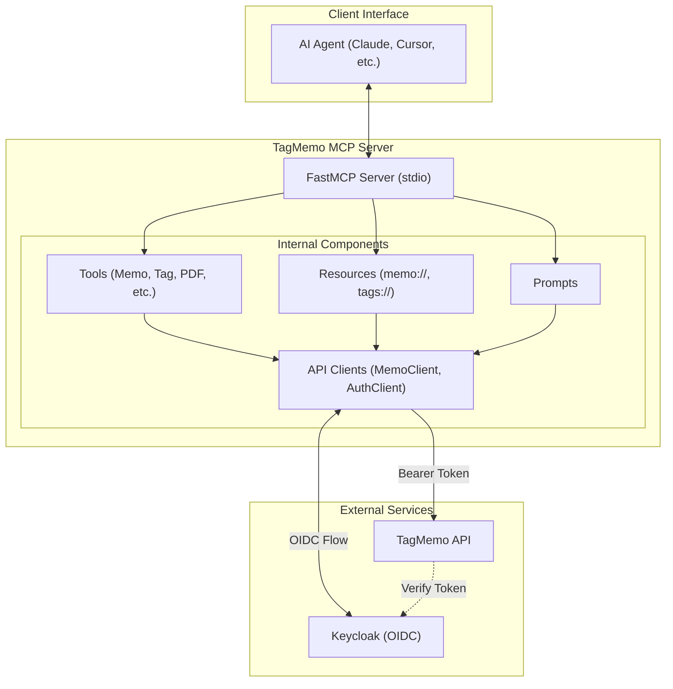
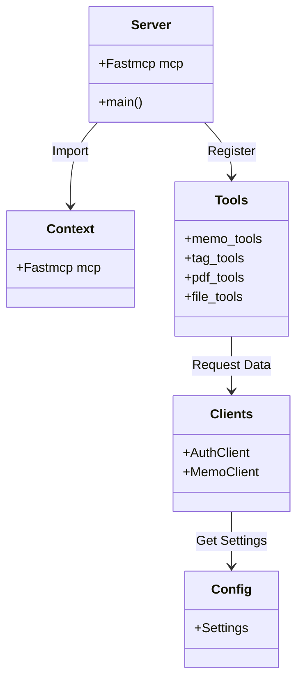

# TagMemo MCP Server

TagMemo 백엔드 API를 MCP(Model Context Protocol)로 노출하는 서버입니다. AI 에이전트(Claude, Copilot, Cursor 등)가 이 서버를 통해 메모, 태그, 파일 및 PDF
지식 기반을 직접 탐색하고 관리할 수 있도록 합니다.

---

## 주요 기술 스택 및 라이브러리

프로젝트의 안정성과 효율성을 위해 다음과 같은 핵심 라이브러리를 활용합니다.

- **[FastMCP](https://github.com/jlowin/fastmcp)**: MCP(Model Context Protocol) 서버를 쉽고 빠르게 구축할 수 있게 도와주는 프레임워크입니다.
  Python의 `@mcp.tool()` 같은 데코레이터 스타일로 도구(Tools)와 리소스(Resources)를 정의하며, 인증(Lifespan) 및 STDIO/SSE 연결 관리를 단순화합니다.
- **[PyInstaller](https://pyinstaller.org/)**: 작성된 Python 스크립트를 독립적인 실행 파일(`.exe`, `.bin`)로 패키징하는 도구입니다. 사용자가 별도의 Python
  환경이나 의존성을 설치하지 않고도 즉시 서버를 실행할 수 있도록 배포용 바이너리를 생성하는 데 사용됩니다.
- **[HTTPX](https://www.python-httpx.org/)**: 차세대 HTTP 클라이언트로, 비동기(async) 통신을 지원하여 TagMemo API와의 연동 시 높은 성능을 제공합니다.
- **[Pydantic](https://docs.pydantic.dev/)**: 데이터 검증 및 설정 관리를 위한 라이브러리입니다. 환경 변수와 API 응답 데이터의 유효성을 엄격하게 체크하여 런타임 오류를 사전에
  방지합니다.
- **[pyPDF](https://pypdf.readthedocs.io/)**: PDF 파일에서 텍스트를 추출하고 분석하는 기능을 담당하며, AI 에이전트가 문서를 읽어 메모에 자동으로 등록할 수 있도록 돕습니다.
- **[python-dotenv](https://github.com/theskumar/python-dotenv)**: `.env` 파일에 기록된 민감한 설정 정보를 안전하게 로드하여 프로젝트 전체에 적용합니다.

---

## 아키텍처 및 시스템 구조

### 시스템 구성도 (System Architecture)

AI 에이전트와 TagMemo API 사이에서 브릿지 역할을 수행하며, OIDC 기반 사용자 인증과 암호화 메모의 명시적 열람 워크플로우를 제공합니다.



### 프로그램 내부 모듈 구조 (Internal Module Structure)

컴포넌트 간의 책임 분리와 재사용성을 고려하여 설계되었습니다.



### 상호작용 시퀀스

- **도구 호출**: AI가 도구를 호출하면 서버는 `AuthClient`를 통해 유효한 액세스 토큰을 확보합니다.
- **인증 시도**: 토큰이 없거나 만료된 경우 `Password Grant` 또는 `Browser Login(PKCE)`을 순차적으로 시도합니다.
- **API 요청**: 확보된 토큰을 Bearer 헤더에 담아 `MemoClient`가 실제 API를 호출하고 결과를 반환합니다.

---

## 사용 설정 (Configuration)

### 설정 방식 (Configuration Methods)

TagMemo MCP 서버는 크게 3가지 방식으로 인증 환경을 설정할 수 있습니다.

#### ① .env 파일 (바이너리와 동일 경로)

실행 파일(`.exe`)과 같은 위치에 `.env` 파일을 생성하여 관리합니다.

```env
MEMO_USER=id
MEMO_PASS=pass
```

#### ② MCP 클라이언트 설정 (`env` 섹션)

Claude Desktop이나 Cursor 등 클라이언트의 설정 파일(`mcp_config.json`)에 직접 환경 변수를 등록합니다.

```json
{
  "mcpServers": {
    "TagMemo": {
      "type": "stdio",
      "command": "C:/path/to/tagmemo-mcp.exe",
      "env": {
        "MEMO_USER": "id",
        "MEMO_PASS": "pass"
      }
    }
  }
}
```

#### ③ 브라우저 기반 대화형 로그인

환경 변수(`MEMO_USER/PASS`)가 설정되지 않은 경우, 서버가 자동으로 로컬 인증 서버를 가동하고 기본 브라우저를 엽니다. 사용자는 브라우저에서 TagMemo 계정으로 로그인하여 인증을 완료할 수
있습니다.

---

### 환경 변수 상세 가이드

대부분의 설정값이 `config.py`에 내장되어 있어 일반적인 운영 환경에서는 위에서 설명한 2가지 값(`MEMO_USER/PASS`)만 설정하면 즉시 동작합니다.

- **인증 설정 (Authentication)**
  - `MEMO_USER`: TagMemo 사용자 계정(이메일)
  - `MEMO_PASS`: 사용자 비밀번호
  - `BROWSER_LOGIN_TIMEOUT_SECONDS`: 로그인 유효 시간 (초, 기본: 30)

- **API 및 인프라 설정 (Optional/Advanced)**
  - `API_BASE_URL`: 백엔드 서버 주소 (기본: https://memo.ellen24k.kro.kr/api)
  - `KEYCLOAK_URL`: 인증 서버 주소 (기본: https://keycloak.ellen24k.kro.kr)
  - `KEYCLOAK_REALM`: 인증 렐름 (기본: memo-app)
  - `KEYCLOAK_CLIENT_ID`: 클라이언트 ID (기본: memo-client)
  - `KEYCLOAK_REDIRECT_URI`: 브라우저 로그인 콜백 URL (기본: http://127.0.0.1:32241/callback)
  - `KEYCLOAK_SCOPE`: 인증 범위 (기본: openid profile email)

### 하이브리드 인증 메커니즘

- 서버는 먼저 `MEMO_USER/PASS`가 존재하는지 확인하여 자동 로그인을 수행합니다.
- 정보가 부족한 경우 로컬 HTTP 서버(Redirect URI 포트)를 가동한 뒤 기본 브라우저를 열어 OIDC 인증을 요청합니다.
- 인증 완료 시 액세스 토큰과 리프레시 토큰을 메모리에 캐시하여 이후 호출의 지연시간을 줄입니다.

---

## MCP 인터페이스 레퍼런스

### 도구 (Tools)

AI가 직접 호출하며 매개변수를 통해 지능적으로 조작하는 핵심 기능입니다.

#### 메모 (Memo)

- `create_memo(content, tags?, is_pinned?, should_encrypt?)`: 새로운 메모를 생성합니다. (태그 동시 지정 가능)
- `get_memo(memo_id)`: 메모 상세 정보를 조회합니다. 암호화된 메모는 본문이 마스킹 처리됩니다.
- `read_encrypted_memo(memo_id, confirm=True)`: 마스킹된 메모의 원문을 복호화합니다. 명시적 동의 필수.
- `update_memo(memo_id, content, is_pinned?, should_encrypt?)`: 기존 메모를 수정합니다.
- `delete_memo(memo_id)`: 메모를 삭제합니다.
- `list_memos(is_pinned?, page?, size?)`: 페이지네이션 기반으로 메모 목록을 탐색합니다.

#### 태그 및 파일 (Tag & File)

- `create_tag(name)`: 태그를 생성하거나 기존 태그 정보를 반환합니다.
- `list_tags(tag_type?)`: 전체 태그 목록을 조회합니다.
- `assign_tag(memo_id, tag_id)` / `remove_tag(memo_id, tag_id)`: 연결 관계를 관리합니다.
- `search_memos_by_tag(tag_id, page?, size?)`: 특정 주제의 태그로 메모를 검색합니다.
- `upload_file(memo_id, file_path)`: 메모에 로컬 파일을 첨부합니다.

#### PDF 및 텍스트 처리 (PDF & Text)

- `extract_pdf_text(file_path)`: PDF 문서의 내용을 텍스트로 추출하여 반환합니다.
- `register_pdf_to_memo(file_name, summary, tags)`: PDF 분석 결과(요약, 태그)를 메모로 정식 등록합니다.

### 리소스 (Resources)

AI가 문서를 열람하듯 데이터에 정적으로 접근하는 엔드포인트입니다.

- `memo://{memo_id}`: 선택한 메모의 모든 정보(본문, 고정 여부, 생성일 등)를 마크다운 형식으로 텍스트 상자에 제공합니다.
- `tags://list`: 현재 시스템에 정의된 모든 태그 목록을 실시간으로 가져옵니다.

### 프롬프트 (Prompts)

특정 작업의 워크플로우를 AI 에이전트에게 가이드하는 지침 세트입니다.

- `smart_memo_save`: 입력값 분석 → 요약/태그 생성 → 도구 호출로 이어지는 최적의 저장 경로를 안내합니다.
- `analyze_pdf_and_register`: PDF 추출 로직부터 최종 메모 등록까지의 데이터 파이프라인 단계를 명시합니다.
- `memo_search_expert`: 사용자의 질의로부터 최적의 태그 검색 및 결과 취합 절차를 유도합니다.

---

## 빌드 및 설치 운영

### 개발 환경 구성 (uv 및 pip)

프로젝트는 Python 3.10 이상을 지원합니다.

```bash
# 1. 의존성 설치 (uv 권장)
uv pip install -e .
# 또는 pip 사용 시
pip install -v -e .

# 2. 실행
python -m tagmemo_mcp.server  # 서버 수동 시작
```

### Windows 바이너리 빌드 (PyInstaller)

실행 환경에 Python 설치가 불필요한 단일 실행 파일(`.exe`)을 만드는 과정입니다.

설치/준비가 필요한 경우:

`failed to remove .venv\\lib64 (os error 5)`가 발생하면 먼저 기존 `.venv`를 정리한 뒤 다시 생성하십시오.

```cmd
set UV_PROJECT_ENVIRONMENT=.venv
rmdir /s /q .venv
uv venv --python 3.14
```

```powershell
$env:UV_PROJECT_ENVIRONMENT = ".venv"
Remove-Item -Recurse -Force .venv
uv venv --python 3.14
```

```bash
export UV_PROJECT_ENVIRONMENT=.venv
rm -rf .venv
uv venv --python 3.14
```

```cmd
REM Windows 전용 가상환경 사용 (.venv-wsl과 분리)
set UV_PROJECT_ENVIRONMENT=.venv

REM 가상환경 및 의존성 준비
uv venv --python 3.14
uv sync
uv pip install --python .\.venv\Scripts\python.exe pyinstaller
```

```powershell
# Windows 전용 가상환경 사용 (.venv-wsl과 분리)
$env:UV_PROJECT_ENVIRONMENT = ".venv"

# 가상환경 및 의존성 준비
uv venv --python 3.14
uv sync
uv pip install --python .\.venv\Scripts\python.exe pyinstaller
```

```bash
# Windows Git Bash 전용 가상환경 사용 (.venv-wsl과 분리)
export UV_PROJECT_ENVIRONMENT=.venv

# 가상환경 및 의존성 준비
uv venv --python 3.14
uv sync
uv pip install --python ./.venv/Scripts/python.exe pyinstaller
```

컴파일(빌드)만 실행할 경우:

```cmd
set UV_PROJECT_ENVIRONMENT=.venv

REM 빌드 실행
uv run --python .\.venv\Scripts\python.exe pyinstaller --onefile --name tagmemo-mcp --copy-metadata fastmcp src/tagmemo_mcp/server.py
```

```powershell
$env:UV_PROJECT_ENVIRONMENT = ".venv"

# 빌드 실행
uv run --python .\.venv\Scripts\python.exe pyinstaller --onefile --name tagmemo-mcp --copy-metadata fastmcp src/tagmemo_mcp/server.py
```

```bash
export UV_PROJECT_ENVIRONMENT=.venv

# 빌드 실행
uv run --python ./.venv/Scripts/python.exe pyinstaller --onefile --name tagmemo-mcp --copy-metadata fastmcp src/tagmemo_mcp/server.py
```

빌드 결과물은 `dist/tagmemo-mcp.exe`에 생성됩니다.

### Linux/WSL2 빌드 가이드

Windows 가상환경과의 파일 시스템 충돌을 방지하기 위해 반드시 독립된 환경을 구축하십시오.

설치/준비가 필요한 경우:

```bash
# 필수 빌드 도구 설치
sudo apt update && sudo apt install -y build-essential python3-venv

# WSL 전용 가상환경 사용 (.venv와 분리)
export UV_PROJECT_ENVIRONMENT=.venv-wsl

# 독립 가상환경 구축 및 활성화
deactivate 2>/dev/null || true
unset VIRTUAL_ENV
uv venv --python 3.14
source .venv-wsl/bin/activate

# 가상환경 및 의존성 준비
uv sync
uv pip install --python ./.venv-wsl/bin/python pyinstaller
```

컴파일(빌드)만 실행할 경우:

```bash
export UV_PROJECT_ENVIRONMENT=.venv-wsl

# 빌드 실행
uv run --python ./.venv-wsl/bin/python pyinstaller --onefile --name tagmemo-mcp --copy-metadata fastmcp src/tagmemo_mcp/server.py
```

---

## 보안 및 암호화 메모 열람 지침

TagMemo는 민감한 정보를 보호하기 위해 개별 메모리에 대한 암호화 기능을 지원합니다.

- **마스킹 정책**: `get_memo`나 리소스 조회 시 암호화된 메모는 보안 문구로 즉시 치환됩니다.
- **명시적 승인 절차**: AI는 암호화 데이터를 탐지하면 사용자에게 "복호화하여 내용을 열람하시겠습니까?"라고 명시적으로 확인해야 하며, 사용자가 `confirm=true`를 전달할 경우에만
  `read_encrypted_memo` 도구를 가동합니다.
- **데이터 비영구성**: 복호화된 결과는 AI 에이전트의 대화 요약, 장기 메모리, 이후 컨텍스트 창에 저장하지 말 것을 AI에게 강제 지시합니다.

---

## 운영 트러블슈팅

| 현상                                              | 원인                          | 해결 방법                                                                                                                                                        |
|-------------------------------------------------|-----------------------------|--------------------------------------------------------------------------------------------------------------------------------------------------------------|
| 도구 목록 누락                                        | 설정 파싱 오류                    | `mcp_config.json` 등 설정 파일의 JSON 주석(//)을 모두 제거하십시오.                                                                                                           |
| 통신 끊김 (stdio)                                   | stdout 오염                   | `server.py`에서 `mcp.run(show_banner=False)`을 사용하고 있는지 확인하십시오.                                                                                                 |
| 인증 오류 (401)                                     | 토큰 만료/잘못된 계정                | `.env`의 `MEMO_USER/PASS`를 재확인하고, 필요한 경우 캐시를 초기화하십시오.                                                                                                         |
| Windows 빌드 실패 (`failed to remove .venv\\lib64`) | WSL에서 생성된 `.venv` 흔적과 권한 충돌 | Windows 셸에서 `.venv`를 완전히 삭제(`rmdir /s /q .venv` 또는 `Remove-Item -Recurse -Force .venv`) 후 `UV_PROJECT_ENVIRONMENT=.venv`로 재생성하십시오. WSL은 `.venv-wsl`만 사용하십시오. |
| WSL 빌드 실패                                       | 가상환경 충돌                     | WSL에서는 `.venv-wsl`만 사용하고, Windows용 `.venv`는 재사용하지 마십시오.                                                                                                      |

---

## 개발자 확장 가이드 (Playbook)

새로운 MCP 도구를 추가하거나 서버 기능을 확장할 때 권장되는 표준 워크플로우입니다.

1. **API 클라이언트 확장**: `src/tagmemo_mcp/clients/memo_client.py`에 필요한 백엔드 호출 로직을 먼저 추가합니다.
2. **도구 모듈 구현**: `src/tagmemo_mcp/tools/` 하위에 새로운 도메인 파일을 만들거나 기존 파일에 `@mcp.tool()` 데코레이터를 이용해 함수를 작성합니다.
3. **리소스/프롬프트 정의**: 반복 조회 데이터는 `resources`에, AI 가이드가 필요한 긴 작업 흐름은 `prompts`에 등록합니다.
4. **서버 조립**: `src/tagmemo_mcp/server.py`에서 새로 만든 모듈을 `import`하여 FastMCP 인스턴스에 최종 등록합니다.
5. **바이너리 검증**: 빌드 전 `fastmcp dev` 모드로 도구 동작을 충분히 테스트하십시오.
